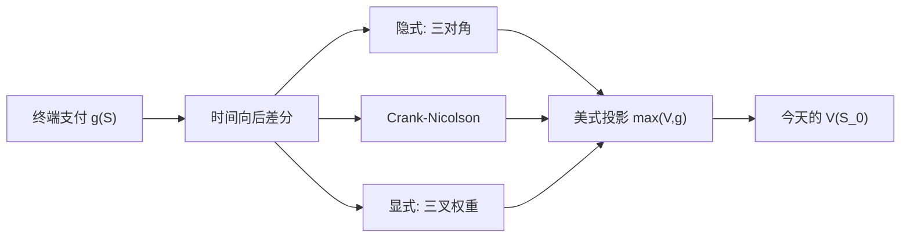

# PDE 与有限差分

    
或有索取权在无套利下满足抛物方程；把时间与标的离散成网格，用显式、隐式或 Crank-Nicolson 差分，即可在低维上计算欧式、美式与障碍。

    <footer>—— Brennan and Schwartz, Finite Difference Methods and Jump Processes Arising in the Pricing of Contingent Claims, Journal of Financial and Quantitative Analysis, 1978</footer>

[上一课](/quant/mc-variance-reduction)在保持 $\mathbb{E}[Y']=V$ 的前提下减小模拟方差：对偶、控制变量、重要性采样都不消除测度错误与时间离散偏差。缺口是低维上要整张 $V(S,t)$ 与美式不等式：无套利给出抛物 PDE，有限差分一次求解得曲面，希腊值来自空间差分。显式格式与三叉树同族，受 CFL 约束。本课写差分与自由边界，不重写 VR 估计器。高维、强路径依赖应转回模拟；局部波动见 [Dupire](/quant/dupire)。

## 问题

欧式价格 $V(S,t)$ 满足

$$
V_t + (r-q)S V_S + \tfrac12\sigma^2 S^2 V_{SS} - r V = 0,\qquad V(S,T)=g(S).
$$

$\sigma$ 可以是常数、$\sigma(S,t)$ 局部波动、或再引入因子 $v$ 变成二维。问题是在有限区域 $S\in[S_{\min},S_{\max}]$、$t\in[0,T]$ 上求数值解，使截断、离散与代数求解的误差可控。美式把方程改成不等式，障碍把空间某点变成 Dirichlet。自变量变换 $x=\ln S$ 把对流-扩散的变系数变得常系数一些，但边界在对数空间的含义要重写。利率衍生品换成期限结构 PDE，本篇以股票期权为网格原型。

稳定性是问题的另一半。显式差分对时间步有 CFL 限制：$\Delta t$ 太大则振荡、负价格。隐式无条件稳定但每步解线性系统。Crank-Nicolson 平均显隐，精度对时间二阶，却可能对不连续支付产生振荡，需要 Rannacher 起步（先做几步全隐式）。

### 从热方程到变系数

$x=\ln S$，$\tau=T-t$，Black-Scholes 变成常系数对流扩散（$\sigma$ 为常数时）。有限差分在 $x$ 上取二阶中心差分逼近 $V_{xx}$，一阶中心或迎风逼近 $V_x$。变系数 $\sigma(S,t)$ 时，应保证离散最大模原理或至少矩阵为 M-矩阵，否则会出现负的风险中性权重——与树的负概率是同一件事。局部波动校准后若曲面不光滑，二阶导噪声会直接进系数，网格要把输入先光滑。

PDE 用的是定价函数 $V(S,t)$，不是单条路径。一次求解给出从边界到今天的整张曲面，$\Delta$、$\Gamma$ 是空间差分。这与 MC 每换一个 $S_0$ 就要重抽路径相反。

## 方法

均匀网格：$S_j=j\Delta S$，$t_n=n\Delta t$。显式：用 $t_n$ 的空间差分推进到 $t_{n-1}$（注意期权 PDE 常向后做时间）。权若对应三叉概率，则与重组树同族。隐式：未知层的空间差分构成三对角系统，Thomas 算法 $O(J)$ 求解。Crank-Nicolson 取两层平均。美式：每个时间步后把 $V$ 投影到 $g$ 之上（Brennan-Schwartz 的扫描在看跌上等价于对自由边界的处理），或用罚函数把不等式变成非线性方程。障碍：敲出在障碍上 $V=0$ 或返款，网格应把障碍放在节点上，否则插值误差大于差分阶。

边界：$S=0$ 时看涨为零、看跌为 $K e^{-r(T-t)}$（欧式）；$S\to\infty$ 用线性渐近 $V\sim S e^{-q\tau}-K e^{-r\tau}$ 或 Neumann $V_{SS}=0$。截断太近会污染内部。远场可用变换把无穷域映到有限区间。二维 Heston 在 $v=0$ 的边界要按 Feller 条件选 Dirichlet 或零流，选错会导致方差吸收或假反射。

### 精度、希腊值与坐标系

空间二阶、时间一阶（显/隐）或二阶（CN）。不连续支付在到期附近使 $\Gamma$ 像 delta 函数，差分会振荡，实践上对数字期权做光滑化或从香草数值微分。$\Delta$、$\Gamma$ 用内部节点的差分，比 MC 稳定，但边界层附近不可信。对数网格在低 $S$ 处密、适合看跌执行边界；等距 $S$ 网格对看涨远场更直观。自适应网格把节点堆到自由边界与障碍，但实现成本接近换一种方法。

跳跃扩散在 PDE 上变成偏积分微分方程（PIDE），积分项要在空间上卷积，Brennan-Schwartz 已讨论跳跃合成；今天常用 FFT 或快速 Gauss 变换加速非局部项。那已不是三对角一解到底。

## 机制

差分是把无穷小生成元换成矩阵生成元：风险中性下 $V$ 沿时间的变化等于生成元作用在 $V$ 上再减 $rV$。矩阵的行若可写成概率权重减贴现，数值方案就是一棵（可能不重组、变系数的）树。负权重破坏套利界：数值价格可以掉到支付凸包之外。因此「稳定」在金融里不仅是不爆炸，还是保持单调性与凸性（离散比较原理）。CN 在 $L^2$ 稳定，却可能破坏最大值原理，这是对不连续支付要 Rannacher 的原因。

美式投影每步把解拉回可行集，相当于在执行区域改方程。罚方法让 PDE 在 $V<g$ 时出现大源项。两种都应在加密网格时收敛到互补问题。与 LSMC 比：PDE 给的是全局最优（在离散化意义下），没有策略回归偏差，但维数过二通常不可行。

Crank-Nicolson 的时间二阶是对光滑解而言。到期支付的折角让高阶精度名存实亡。先全隐式平滑几步再 CN，是为了恢复光滑后再用二阶，不是为了「看起来更高级」。

### 对数坐标、远场与二维因子

$x=\ln S$ 把几何布朗变成常系数对流扩散，节点在低价区更密，适合看跌执行边界；换回 $S$ 网格则远场看涨的线性渐近更好写。无论哪种，截断边界必须足够远，或用变换把无穷域映到有限区间，否则误差从边界渗入 $\Delta$。Heston 等二维因子在 $v=0$ 的边界按 Feller 条件选择吸收或反射，选错会使方差贴在零上或假弹回。二维隐式要用 ADI 或稀疏直接解，已不是单条三对角。跳跃则把方程变成 PIDE，积分项要另做卷积，差分内核不再局部。

## 边界

三维以上 PDE 网格爆炸，应改 MC 或稀疏网格、径向基，但那些已不是标准差分。局部波动 $\sigma(S,t)$ 若来自对市场价的数值二阶导，噪声会被 PDE 放大，需要光滑或参数化曲面。交易成本、离散对冲会改方程（非线性 Leland 型），差分仍可用，但比较原理要重证。美式在多因子下自由边界是面，投影法仍工作，显示边界更难。

实现上，单位要一致：一年计息、交易日网格、除权日对齐。把日历 $\Delta t$ 与波动年化混用会系统性错价。测试应包括：欧式复现 Black-Scholes、看跌-看涨平价、美式不低于欧式、障碍在远离障碍时退回香草。Brennan-Schwartz 1978 不包含随机波动二维；Heston PDE 是后来的标准考题。

有限差分是数值分析，不是定价理论。引用 Brennan-Schwartz 是为了金融里的早期系统应用；Crank-Nicolson 本身是 1947 年热传导的格式。不要把格式发明年写成期权论文年。

## 小结

- 无套利给出抛物 PDE；有限差分在低维计算欧式、美式与障碍。
- 显式格式与三叉树同族，受 CFL 约束；隐式稳定，CN 时间二阶但对折角支付会振荡。
- 美式用投影或罚函数处理互补不等式；障碍应对齐节点。
- 一次求解得整张 $V(S,t)$，希腊值来自空间差分，适合做市扫描。
- 离散方案应尽量保持正权重与比较原理，以免数值套利。
- 高维、强路径依赖让网格失效，应转向模拟；局部波动与 Dupire 仍常在 PDE 上走。
- 出处：Brennan and Schwartz, *JFQA*, 1978；Black-Scholes PDE 见 Black and Scholes, *JPE*, 1973 与 Merton, *Bell Journal*, 1973；CN 格式见 Crank and Nicolson, 1947。
