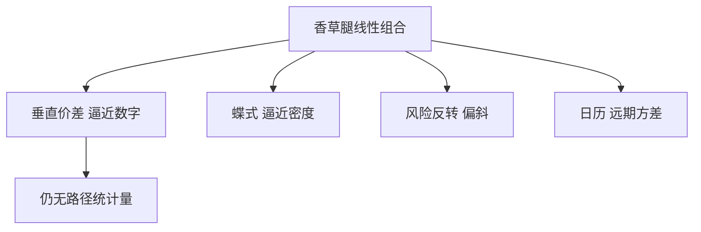

# 期权组合策略

价差、跨式、风险反转是香草的线性组合；它们改的是支付的分段斜率，不是新的路径统计量。

<footer>—— Natenberg, Option Volatility and Pricing；对照 McMillan 对价差组合的经典分类</footer>

[上一课](/quant/compound-chooser)还在「期权上的期权」。本课把已经会的香草**拼成簿**：垂直价差、日历、跨式跨式、蝶式、风险反转、领口。缺口是工程而不是新闭式——支付图、希腊值如何相消、以及哪些组合其实已经是数字或偏斜仓。后课权证与结构票据会把这些组合嵌进零售包装。

## 问题

奇异课序写到这里，容易把一切都当路径依赖。市场里最大量的「结构」仍是香草线性组合：牛市价差 $=$ 买低 $K$ 看涨、卖高 $K$ 看涨，支付有界，净 Vega 与净 Gamma 比裸期权小。问题是：组合的**报价惯例**（按净权利金、按借/贷、按隐波差）与**风险报告**（按腿加总还是按组合再取曲面）经常不一致。把蝶式当三个独立 Vega 去对冲，会在执行价网格上把流动性最差的那条腿放最大。

日历价差吃的是期限结构与远期波动，不是同一到期的偏斜；风险反转吃的是偏斜，不是水平。对象已经在 [Skew](/quant/vol-skew) 与 [隐波曲面](/quant/vol-surface) 里，本课只把组合语言接上，不重校准曲面。

### 垂直价差的极限是数字

相邻执行价的看涨价差，除以 $\Delta K$，就是 [数字](/quant/digital-options) 的复制。蝶式除以 $(\Delta K)^2$ 逼近密度。因此「策略」与「奇异」之间没有形而上学的边界：足够密的香草组合就是静态复制。实务网格稀疏、买卖价差宽，复制有残差，这才需要真正的奇异合约。

领口（collar）= 长标的 + 买跌 + 卖涨，常被当成「保值」。卖出的看涨是融资，不是免费保险。结构票据里的保本仓往往是零息债加看涨，与领口的资金来源不同。

## 方法

先画到期支付：每条腿的斜率 $\pm1$ 或 $0$，组合斜率是整数。再在同一曲面模型下对腿求和得到价值与希腊值；允许净 Delta 用期货对冲，使组合变成纯波动/偏斜仓。日历必须用同一标的、注意分红与提前行权（美式日历不是欧式日历）。报价：指数期权常用隐波点差；股票期权常用权利金。转换时不要把 Black 隐波差当成权利金差的线性。

对冲频率按组合 Gamma 的寿命：蝶式 Gamma 集中在中间 $K$ 附近且随到期收缩；日历在近月到期日有 pin 风险，见 [Pin risk](/quant/pin-risk)。

## 机制

线性组合不产生新的路径依赖：价值对路径的依赖仍只通过 $S_T$（欧式）或提前行权停时（美式）。它产生的是**分段线性支付**，从而把风险从「水平波动」拨到「斜率（偏斜）」或「凸性（密度）」。卖方簿若全是零售领口，聚合起来就是卖出上侧、买入下侧，偏斜会被供给推陡——这是结构供给，不是新的随机波动模型。

## 边界

美式、离散分红、涨跌停使支付图在到期前就可能被提前行权改写。多腿成交风险：一条腿成交、另一条没有，瞬时变成裸仓。保证金与组合保证金（SPAN 等）按情景，不按支付图的直觉名义。本课不写如何用组合规避持仓限额。

不要把「有界支付」当成有界风险：保证金、缺口、以及对冲滑点可以大于最大到期亏损。

## 小结

- 价差/跨式/蝶式/风险反转是香草线性组合，改支付斜率，不引入平均或极值。
- 垂直价差极限是数字，蝶式极限是密度；网格稀疏时残差仍在。
- 风险报告应按组合在曲面上取值，不要把腿的 Vega 当可加的独立预算。
- 出处：Natenberg, *Option Volatility and Pricing*；McMillan, *Options as a Strategic Investment*。
