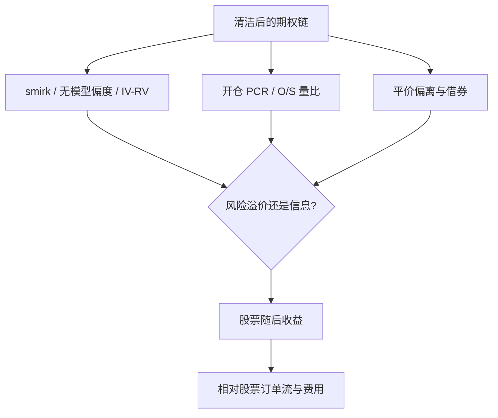

# 期权链作为现货信号

期权成交量中的非公开信息会进入期权价格，并随后出现在股票上；期权市场可以是股票信息的侧门，而不是仅仅对已有股价做波动定价。

<footer>—— Easley, O'Hara and Srinivas, Option Volume and Stock Prices: Evidence on Where Informed Traders Trade, Journal of Finance, 1998</footer>

把整条期权链当成现货的信号，问的是：隐含波动的形状、看涨看跌量比、偏离平价的基差，是否包含尚未写入股票中间价的信息。Easley、O'Hara 与 Srinivas（1998）从知情交易选择场所出发。Pan 与 Poteshman（2006）用开仓量中的看跌–看涨比预测股票收益。Cremers 与 Weinbaum（2010）看认购认沽平价偏离；Ofek、Richardson 与 Whitelaw（2004）把平价偏离与卖空限制连在一起。Xing、Zhang 与 Zhao（2010）用个股波动率 smirk（虚值看跌相对平值的隐含波动差）预测横截面收益。Bali 与 Hovakimian（2009）研究实现–隐含波动差；Johnson 与 So（2012）用期权对股票成交量比。An、Ang、Bali 与 Cakici（2014）把股票与期权特征放进联合截面。反面证据同样重要：Muravyev、Pearson 与 Broussard（2013）发现期权报价对股票价格发现的贡献很小，股票往往领先。本篇把期权链当**现货的横截面特征**来写：它与[偏斜](/quant/vol-skew)、[IV 对 RV](/quant/iv-vs-rv) 共享测量，但目标是股票的预期收益或短期方向，而不是复制方差互换。

## 问题

期权价格由无套利与做市库存共同决定。链上的每一个点同时含有：对未来二次变差与跳跃的风险中性预期、波动风险溢价、买卖价差与离散行权价的插值误差、以及可能的知情交易。当作现货信号时，必须声明抽取的是哪一块。Smirk 更接近下跌保护的价格，可能是崩盘溢价（Bates）而不是「知情者在买看跌」。量比更接近订单流，可能是知情或只是对冲需求（指数期权尤其如此）。平价偏离在存在借券费与提前行权时可以是摩擦，不是预测。问题是把**风险溢价、摩擦与信息**分开，否则横截面排序只是把高 IV、高 skew 的小盘股再卖空一遍。

测量依赖链的质量。短到期、薄行权价上的隐含波动噪声极大，须用成交或买卖报价、Δ 范围、到期日筛选，与[波动率曲面](/quant/vol-surface)同一套清洁规则。用结算价反解 IV 在远翼会得到假 smirk，信号来自插值而不是交易。

### 领先滞后与「场所选择」不是自动成立

Easley–O'Hara–Srinivas 的机制是：杠杆与卖空成本使知情者选择期权。经验上这随名字变化：大盘股的股票市场已经深度足够，Muravyev 等对报价的结论更接近「股票主导价格发现」。小盘、难借券的名字上，期权开仓量的增量信息更合理（Pan–Poteshman 使用开仓而非总成交，正是为了去掉平仓噪声）。把 SPX 期权的 PCR 当成 S&amp;P 现货择时，对象是宏观对冲需求，与个股截面不是同一回归。

用当日期权 IV 解释当日股票收益，多半是共同跳跃：股票跌则 skew 变陡。预测必须用 $t$ 日收盘后可获得的链去预测 $t+1$ 起的收益，并处理美股盘后与期权收盘的时钟差。

## 方法

**形状类。** 固定期限（例如 30 日）插值出虚值看跌与平值的 IV 差（Xing–Zhang–Zhao 的 smirk）、25-delta 风险反转、以及无模型偏度（Bakshi–Kapadia–Madan 式，Conrad、Dittmar、Ghysels 2013 把事前偏度推进收益截面）。这些量要按[截面 rank](/quant/cs-rank-features) 并控制 IV 水平，否则只是在交易波动风险溢价的另一张面孔。Goyal 与 Saretto（2009）表明实现–隐含差预测的是**期权**收益；把它原样搬到股票上需要单独检验，不能引用同一张表。

**流量类。** 看跌开仓 / 看涨开仓（Pan–Poteshman）、期权成交相对股票成交（Johnson–So）、主动买入虚值看跌的份额。流量必须用带方向的成交或至少可靠的报价规则，盘口标识错误会把做市对冲当成知情买入。指数与个股应分开：指数期权是宏观对冲池。

**平价与限制。** Cremers–Weinbaum 的隐含波动差（看涨 IV 减看跌 IV）在控制借券与期权买卖价差后是否仍预测股票，是在问信息还是摩擦。Ofek–Richardson–Whitelaw 提醒：卖空限制下股票可以相对期权高估，此时「信号」是可借券量的代理，容量由证券借贷市场决定，不是由期权链深度决定。

### 与现货微观结构对照

若信号真是知情流入，它应与股票侧的[订单不平衡](/quant/order-imbalance)同向或领先一短窗，而不是完全正交。若完全正交且只在高 IV 名字上显著，更像波动因子。Chakravarty、Gulen 与 Mayhew（2004）讨论期权与股票的价格发现份额，随期权成交活跃度变化。复制应分样本：期权流动性高的名字 vs 低的名字；后者的 IV 形状不可信，前者的信息优势更弱——这是令人不快但诚实的权衡。

Delta 对冲后的期权组合收益（波动溢价）与未对冲的方向性信号常被一张「期权因子」表混在一起。现货信号必须明确：左边是股票收益，还是对冲后的期权收益。Goyal–Saretto 与 Xing–Zhang–Zhao 的左边不同。

## 机制

风险通道：虚值看跌贵，对应负跳风险溢价，高 smirk 的股票期望收益可以更低（投资者为下跌保护付费，或这些股票本身更像高杠杆的左尾资产）。这是定价，不是「期权告诉你股票会跌所以做空能稳定赚钱」——做空这些名字可能是在收取崩盘溢价，在压力周一次性还回去，见[极值](/quant/evt)与拥挤。

信息通道：知情者买虚值看跌或买看涨，量与平价偏离暂时离开摩擦边界，随后股票跟上。该通道的容量受期权买卖价差与做市商对冲冲击限制：你在期权里看到的「信息」可能是做市商即将在股票里对冲的方向，领先时间以分钟计，日频截面里会被平均掉。这也是 Muravyev 等在报价层面更悲观的原因。

摩擦通道：难借券 → 合成空头（买看跌卖看涨）相对便宜，平价偏离，同时股票因卖空限制高估。信号有效，但实施要用期权合成或付出借券费，净边缘回到[可交易性](/quant/net-edge)。

### 期限结构与持有期

短到期链对隔夜跳与周末更敏感，信号换手高、噪声大。长到期更接近风险溢价与盈利不确定，衰减慢。应画 IC 对到期日、对预测期 $h$ 的热图，避免用 7 日期权预测下月收益这种期限错配。指数与个股的期限结构不同：VIX 期限结构是宏观状态，个股 30 日 smirk 是截面。把 VIX 当个股特征的共同因子即可，不要每个名字再减一遍同一 VIX。

## 边界与工程取舍

不要用未清洁的远翼 IV。不要在涨跌停或期权停牌日假设链可交易。美式提前行权、分红与借券使平价不是欧式公式，须用期货或远期作底层。A 股与内地期权品种少、做市制度不同，美股个股文献不能直接当参数。对冲需求在财报日、指数到期日（witching）会淹没信息，这些日历应单独报告或剔除，见[日历与隔夜](/quant/calendar-overnight)。

希腊字母风险：用期权表达现货观点会引入 Vega 与 Gamma，账本需要[对冲](/quant/greeks-hedge)与[闸门](/quant/trading-kill-switch)，否则「现货信号」在波动上升日变成波动赌博。

开盘集合竞价与隔夜新闻使股票跳空，期权 IV 在开盘重定价。用前一日收盘链预测当日开盘到收盘，和预测开盘跳空是两个标签；混用会把已实现跳当成预测神力。

## 小结

- Easley–O'Hara–Srinivas（1998）与 Pan–Poteshman（2006）提供知情交易进入期权流量的理论与开仓量证据；Muravyev–Pearson–Broussard（2013）表明报价层面股票往往仍领先。
- Xing–Zhang–Zhao（2010）的 smirk、Cremers–Weinbaum（2010）的平价偏离、Johnson–So（2012）的量比、Bali–Hovakimian（2009）的 IV–RV，抽取的是链上不同切片，不可合成一个未经中性化的「期权因子」。
- 形状类信号高度共线于波动与崩盘溢价；流量类依赖开仓标识与场所流动性；平价类常是卖空摩擦（Ofek–Richardson–Whitelaw）。
- 日频现货预测必须用可获得链、正确时钟，并扣期权与股票两侧成本；短领先若只存在于分钟级，不属于日频 alpha。
- 出处：Easley, O'Hara and Srinivas, *JF*, 1998；Pan and Poteshman, *JF*, 2006；Xing, Zhang and Zhao, *JFQA*, 2010；Cremers and Weinbaum, *JF*, 2010；Ofek, Richardson and Whitelaw, *RFS*, 2004；Johnson and So, *JFE*, 2012；Bali and Hovakimian, *JFQA*, 2009；Muravyev, Pearson and Broussard, *JFE*, 2013；Goyal and Saretto, *JFE*, 2009；Conrad, Dittmar and Ghysels, *JF*, 2013；Chakravarty, Gulen and Mayhew, *JF*, 2004。
