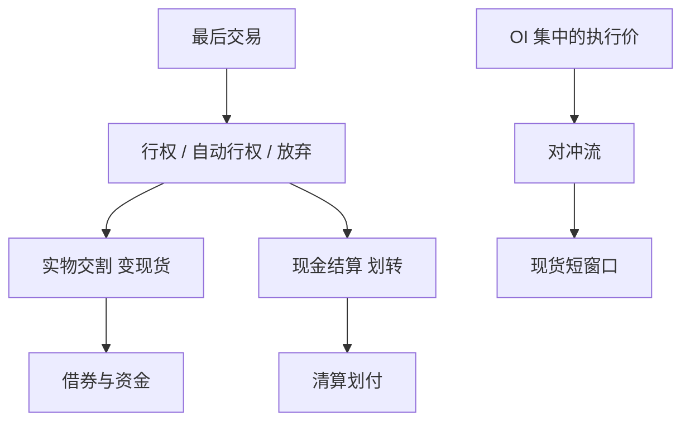

# 期权到期流程

到期不是多一个交易日：行权、指派、交割或现金结算会把希腊字母变成现货、期货或现金，并在短窗口里改写借贷与保证金。

<footer>—— OCC 期权清算与到期说明；Avellaneda and Lipkin, A Market-Induced Mechanism for Stock Pinning, Applied Mathematical Finance, 2003；对照交易所关于到期日交易时段与交割结算价的规则</footer>

[上一课](/quant/repo-funding)把现金约束停在融资。本课的缺口是**衍生品生命周期的终点**：美式/欧式行权、自动行权阈值、股票期权实物交割与指数期权现金结算、以及到期日附近的钉住（pinning）。Avellaneda 与 Lipkin（2003）给出做市对冲如何把价格吸向执行价的机制。A 股 ETF 期权与商品期权的产品细节在中国进阶课展开，本课写清算流程的一般状态机，作为本课序「从撮合到清算」的收束。

## 问题

存续期期权的风险用 delta、gamma、vega 描述。到期日这些量在执行价附近变得不光滑：实值变成 1 份现货（或现金），虚值变成 0。做市商的对冲需求在最后时段可以主导订单流，现货被「钉」在最大未平仓执行价附近——这是机制假说，不是保证。问题是回测与风控必须切换对象：到期前一分钟的信号若假设仓位仍是期权，到期后账户里可能是股票、期货或现金，并立即进入[借券](/quant/securities-lending)与[结算](/quant/settlement-fails)约束。

流程节点：最后交易、行权申报截止、OCC 或对应清算所处理、交割/现金结算、失败与调整。美式期权可提前行权，尤其在分红前；漏掉提前行权是研究里常见的前视或漏风险。自动行权阈值（如到期日实值超过某金额）使「没申报」不等于「没行权」。现金结算指数期权用官方结算价（如开盘或一段时间均值），与最后成交价不同，对冲要用结算定义而不是收盘价。

### 到期周的保证金与借贷

实物交割使空头期权在指派后变成股票空头或多头，借券与资金在同一夜备妥。现金结算则变成 VM 式的一笔划转。两种对[CCP 瀑布](/quant/ccp-default-waterfall)的压力不同。周度到期加密了「到期事件」的频率，钉住与对冲流更常出现，但单次未平仓通常小于月度。把所有到期当成月度 Triple Witching，会高估或低估特定日的容量。

A 股 ETF 期权到期与交割安排见上交所、深交所期权细则；商品期权见各商品交易所。不要用 OCC 的美股日历去填。本课只要求：到期是状态迁移，必须写进事件日历。

## 方法

事件日历：每个合约的 `last_trade`、`exercise_deadline`、`settlement_type`、`settlement_price_rule`。回测在截止后把期权仓位映射为交割物，再用交割物的交易规则（T+1、涨跌停、最小单位）继续。对冲模拟在到期日改用结算价定义的目标，而不是用收盘期权中点。钉住检验：到期日价格相对最大 OI 执行价的距离分布，对照非到期日；机制解释可引用 Avellaneda–Lipkin，但不要把钉住当可交易保证——对手同样知道。

库存三态在到期日特别容易乱：期权已停牌、股票腿已成交、清算尚未指派。监控应允许「过渡头寸」，并禁止在指派未知时加新的方向性期权。研究日志记下是否处理提前行权与自动行权，否则样本不可比。

### 与撮合的最后一跳

到期日往往伴随集合竞价、缩短交易或只平仓。撮合模式切换见[引擎架构](/quant/matching-engine-arch)。用连续 FIFO 假设去填最后十分钟，成交价会对不上官方结算。策略若以结算价为盈亏基准，执行必须对着该基准的生成过程，而不是对着任意最后一笔。

## 机制

对冲流在执行价附近非光滑：略实值与略虚值的 delta 差一个跳跃。做市商集体对冲可以把现货订单流变成指向执行价的力，直到未平仓衰减。这与[LOB](/quant/lob-structure) 的普通冲击不同：它是合约供给（OI 分布）与规则（到期、结算价）诱导的临时需求。融资与借券在同一窗口变贵，因为交割链同时要券。失败交收在期权到期周上升，不是巧合。

现金结算切断实物链，但把风险赶到结算价窗口：最后时段的现货或指数被更强地交易。操纵结算价是监管对象；研究只把窗口波动当风险，不把「如何影响结算价」当方法。

## 边界

不提供操纵结算价、利用未公开未平仓信息或在截止后虚假申报行权的方法。提前行权决策依赖分红与利率，模型以公开条款为准。场外期权、权证、可转债转股是相邻事件，条款各自独立，见后课转债。

本课序从撮合核走到到期清算。下一单元改为研究数据栈：没有正确的历史对齐，上面这些状态机无法回测。

## 小结

- 到期把期权映射为现货或现金；自动行权与结算价定义必须进日历。
- 钉住是对冲机制假说，不是收益保证；到期周融资与借券同时紧张。
- 回测在截止后切换标的与交易规则，不能继续用期权中点记账。
- 出处：OCC 到期与交割说明；Avellaneda and Lipkin, *Applied Mathematical Finance*, 2003。
