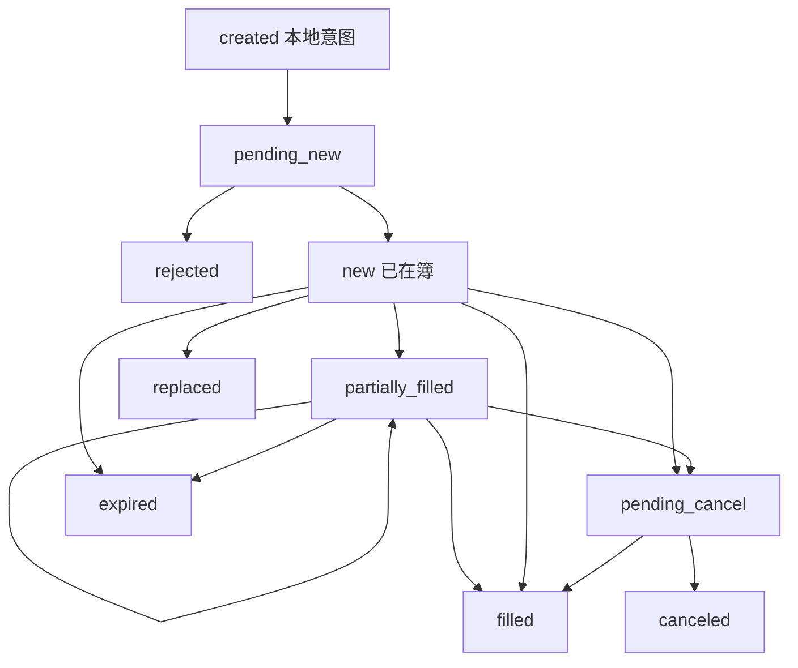

# 订单状态机

指令从提交到成交或消失，中间要经过确认、排队、部分成交、改单与取消。回测若把目标仓位直接写成持仓，等于跳过这部状态机，也跳过拒单与残余风险。

<footer>—— 据 Harris, Trading and Exchanges 对订单生命周期与优先规则的论述；对照 FIX 对订单状态的公开语义</footer>

策略输出的是意图：买或卖多少、以什么约束。交易所与经纪商返回的是状态：已接收、已挂上、已部分成交、已拒绝、已取消、已过期。Harris 把连续市场描述为指令进入、排队、撮合与取消的过程；公开的 FIX 协议把这一过程收成可互操作的状态与消息。回测与实盘要对账，必须共享同一部订单状态机：同一意图在模拟撮合器与真网关上走过同类转移，才能比较短fall。本篇写状态、合法转移、以及它们如何进入[事件驱动引擎](/quant/event-driven-backtest)。范围限于把意图诚实地变成仓位与记录，不讨论用挂单与撤单去塑造他人看到的簿。

## 问题

向量化回测的持仓是时间序列上的一个数。真实持仓是许多张订单的成交增量之和，每张订单还可能有未成交余量在簿上暴露。余量是风险：价格跳开时它可能被捡走，也可能成为你以为已经退出但实际仍挂着的腿。没有状态机，回测无法表达「已提交未确认」「已挂上未成交」「取消中」这些在实盘里占用风控额度的状态。Narang 把交易作业写成必须可审计的环节；不可审计的往往正是这些中间态。

拒单与替换使问题更尖。资金不足、涨跌停、自成交防控、重复客户订单编号，都会在「New」之前或之后把意图打回。回测若把每一次目标仓位变化都当成必然成交，完成率恒为 1，[容量](/quant/capacity-participation) 与[成本敏感性](/quant/cost-sensitivity) 都被高估。状态机的第一用途是让未成交成为一等公民：它改变下一事件上的目标缺口，而不是事后填成已成交。

### 状态是风控的输入

限额应作用在「已挂出的名义 + 已成交的名义」上，而不是只作用在已成交仓位上。只看仓位，策略可以在等待确认时连续发单，实盘瞬间超限。状态机把 in-flight 量暴露给风控闸门。Harris 对展示量与隐藏量的区分也是状态：冰山的隐藏余量仍是你的指令，即使簿上只显示一小块。回测若只模拟可见深度消耗、不追踪隐藏余量，账本与交易所会对不上。

客户订单编号必须在状态机里唯一且幂等。重发同一编号应回到同一张单，而不是开出第二张。回测忽略幂等，实盘网络重试就会双倍下单；这是对账事故，不是 alpha 衰减。

## 方法

最小状态集可以写成：`created`（本地意图）→ `pending_new`（已发送未确认）→ `new`（已在簿上或已进入撮合）→ `partially_filled` → `filled`；以及从可取消状态出发的 `pending_cancel` → `canceled`，还有 `rejected`、`expired`、`replaced`。转移由事件触发：交易所确认、成交回报、拒绝、到期、改单确认。非法转移应报错并使该次回测或该笔实盘进入对账失败，而不是静默纠正——静默纠正会让模拟与实盘各写各的「合理化」。

部分成交是普通情况而不是异常。每次成交减少余量、增加仓位、更新均价；余量为零才进入 `filled`。改单在许多市场上等价于取消旧单并提交新单，因而丧失[队列位置](/quant/cancel-queue-position)；状态机应把 `replaced` 做成显式，避免策略以为自己还在队头。市价单可能没有 `new` 上的长停留，但仍会经历 `pending_new` 与拒绝（例如已无对手深度且不允许虚市）。这些语义必须按场所分支，并版本化进配置发布。

### 与账本、托管三方对账

策略状态机是一方，经纪商/交易所是一方，内部账本是第三方。每一笔成交事件应能在三方找到同一 `exec_id`。对不上时进入[迟到数据与对账](/quant/late-data-recon) 的闸门：停止新开仓。模拟环境用撮合器冒充第二方，但消息字段应尽量与实盘一致，否则隔离只隔离了钱，没有隔离语义。[环境隔离](/quant/research-sim-prod) 要求实盘与模拟跑同一状态机代码，差别只在网关。

FIX 的 `OrdStatus` 与 `ExecType` 是两套信息：前者是订单当前状态，后者是本条消息的原因。回测自造一套枚举可以，但必须能映射到将用于实盘的那一套，否则日志无法对照。

## 机制

状态机把并发下单从「共享持仓变量上的竞态」变成「每张订单的私有状态 + 账本上的聚合」。聚合仓位 = 所有 `filled` 增量之和；在途风险 = 所有 `new`/`partially_filled`/`pending_*` 的余量。风控读这两项。事件循环保证同一品种上的转移有序，避免先处理取消回报再处理更早的成交这种乱序——乱序应通过序号与到达戳检测，而不是靠最后写入获胜。

完成率、拒单率、取消率是状态机的自然输出，应进入模拟的晋级关卡。研究层的向量化没有这些比率，只能事后用解析冲击近似。若模拟完成率远低于 1，向量化夏普应视为不可达，而不是用更大名义去「补上」未完成的风险——补上等于在事件层引入新的、未经 CPCV 的规则。López de Prado 对回测过拟合的警告在这里的形式是：针对拒单临时加的补丁是新试验。

### 过期、拍卖与会话边界

日终未完成的限价单可能过期、可能转入下一会话，取决于指令的时效（day、IOC、GTC 等）。状态机必须在会话事件上扫描时效，产生 `expired` 或保持 `new`。集合竞价期间的状态转移与连续竞价不同：可能没有队列消耗，而是一次性按规则分配。回测若用连续撮合去模拟开盘，均价与成交量都会错。这些是场所规则，应写成数据而不是写成策略 if-else；策略只面对状态与余量。

## 边界与工程取舍

状态机保真度有上限。没有 L3，你无法确知自己的队列名次，只能用统计模型；状态仍应追踪「我以为的余量」，并在成交回报与预期不一致时记录模型误差。不要为了让回测通过而对拒绝转移做自动重试而不计入 $N$：重试政策是策略的一部分，必须冻结。也不要把状态机做成可以在回测里手工改状态以抹平差错的后台；那会摧毁与实盘的可比性。

本篇的订单是为了完成已声明的目标仓位。展示、冰山、暗池是合法的执行约束，见订单类型一文；它们改变可见性与优先，不改变「状态必须与成交一致」这一会计要求。任何需要依赖误导性展示才能成立的边缘，都不属于回测架构的讨论范围。工程上应拒绝把「不打算成交的挂单」写成默认执行路径——那既无法与托管对账，也不是本系列的对象。

客户与交易所对「已取消」的定义可能差一笔在途成交：取消请求发出后、确认前的成交仍合法。状态机应允许 `pending_cancel` 下的成交，再进入 `canceled` 或 `filled`。回测若禁止这种转移，实盘对账会在快市里必炸。

## 小结

- 订单状态机把意图、在途余量与成交增量分开，使拒单、部分成交与取消成为回测的一等事件。
- Harris 的连续市场描述与 FIX 的公开状态语义，是模拟与实盘应对齐的最小词典。
- 风控必须计入 in-flight 名义；幂等编号防止重试双下单。
- 非法转移应使对账失败，而不是静默修补；`pending_cancel` 下仍可能成交。
- 完成率与拒单率是晋级关卡；为拒单临时加的补丁是新的试验次数。
- 出处：Harris, *Trading and Exchanges*；FIX 协议的订单状态语义；Narang, *Inside the Black Box*；López de Prado, *AFML*, 2018；执行约束见订单类型与队列位置两篇。
