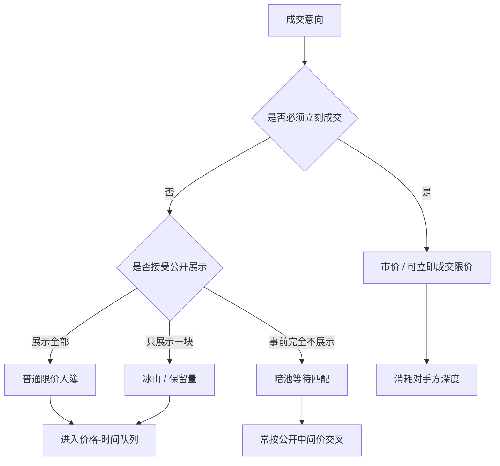

# 限价、市价、冰山与暗池

指令先决定你愿意以什么价格、在什么场所、暴露多少数量去成交；市场随后才用优先规则把这些指令变成价格。订单类型是交易策略的接口，不是装饰。

<footer>—— 据 Harris, Trading and Exchanges 对订单、展示与交易场所的论述整理</footer>

[上一课](/quant/lob-structure)给出了簿的几何与价格-时间优先。本课不重画买盘卖盘。缺口是：同一张簿上，指令对价格、数量、展示与场所的约束并不相同。市价单要求立刻成交；限价单指定最差可接受价格，成交不了就排队；冰山把总量拆成可见的小块；暗池把匹配移到公开簿之外。Harris 用大量章节处理这些指令，因为「谁提供流动性、谁消耗流动性」首先写在订单类型上。

## 问题

[LOB](/quant/lob-structure) 已经能描述状态，还不能描述人怎么改写状态。交易者要选的不是「买还是卖」这一比特，而是一组约束：能否接受不确定的成交价、能否接受不确定的成交量、愿意让多少量被对手看见、是否必须在公开簿上成交。这四件事互相冲突。立刻成交就要付价差、打穿深度；排队等待就有不被成交、以及价格走掉的风险；把量大块挂在明处，会招来抢跑和逆向选择；藏起来又可能找不到对手。

若只有市价与限价两种指令，问题已经足够尖锐：市价单是流动性的索取方（taker），限价单在未交叉时是提供方（maker）。引入冰山与暗池之后，可见性本身变成可选择的维度。公开簿上的人以为自己看见了深度，实际上一部分量被保留字段藏住，另一部分量从未进入这张簿。O'Hara 所讨论的信息不对称，在这里多了一层：不仅有人对价值知情，还有人对「真实可成交量在哪」知情。订单类型要解决的，是在即时性、价格、展示与场所之间做可执行的取舍，而不是发明一种没有代价的隐藏方式。

### 可立即成交与不可立即成交

实务上还有第三种经常被误称为市价的东西：可立即成交的限价单（marketable limit）。它带一个限价，但该限价已经穿过或触及对方 BBO，因而到场即撮合；吃不完的余量或按规则取消，或转为普通限价。它限制了最差成交价，却不保证全部成交。纯市价单在深度不足时会沿簿扫下去，价格不受己方保护。把这两者混成「主动单」在统计上常见，在机制上不精确：冲击路径与剩余量处理不同。

make / take 不是道德标签。一笔限价单若到场即交叉，它就是 taker；一笔贴在己方最优价上的单才是 maker。费用、返佣、队列位置都沿这条事后边界分配，而不是沿投资者填单时的心理分类。

## 方法

限价单给出价格 $p$ 与数量 $q$。若方向为买且 $p\lt a_1$，或方向为卖且 $p\gt b_1$，则进入己方队列，成为可见深度的一部分（除非标记为隐藏）。若已经交叉，则按对方队列的优先顺序成交，成交价通常是被动方的挂单价。市价单不指定保护价，数量 $q$ 沿对手方簿从最优价向内消耗，直到 $q$ 填完或簿被打空。成交均价是被消耗各档的量加权价，相对中间价的偏离就是这次主动成交的即时冲击。

冰山（iceberg / reserve）在同一条限价指令里拆出展示量 $q_{\mathrm{d}}$ 与隐藏总量 $q$。簿上只显示 $q_{\mathrm{d}}$；该展示块被吃完后，引擎从隐藏余量里再切出一块补上。补上的新块在许多市场上视为新到达，因而排到同价位队尾——这是冰山最重要的制度细节：隐藏换来的是反复丧失时间优先。有的市场允许完全隐藏的限价单，簿上完全不出现该价位的这张单，成交时才被看见。

### 暗池里的匹配而不是展示

暗池（dark pool）是不向公众展示买卖报价的交易场所。指令在暗处等待，匹配规则因场所而异：有的只在公开市场中间价成交，有的允许一定价格改善，有的做定期交叉。关键不在品牌，而在事前不可见：你不知道对面有没有量、量在哪一侧、是否有知情者正在用暗池隐藏自己的真实需求。Harris 把透明性分成事前（报价、深度）与事后（成交报告）；暗池牺牲事前透明，换降低信息泄露与降低对公开簿的冲击。事后是否立即打印、打印到哪、是否延迟，又决定这种换取能维持多久。

公开限价、公开市价、冰山、暗池可以组合成一条执行路径：大单先在暗处寻找中点流动性，找不到再把切片以冰山或普通限价送进明簿，急的部分用市价或可立即成交限价去吃。选择的依据是即时性约束与对逆向选择的判断，而不是「某种指令更高级」。

## 机制

市价单把等待成本压到接近零，代价是确定性地付半个价差，并沿深度支付冲击。它暴露的信息是「我现在必须成交」，方向与量都写在连续的成交里。限价单把价格风险的一部分转成不成交风险：挂在己方最优价，是在卖出一份免费的等待期权，同时把自己的方向暴露在簿上。若随后价值朝自己不利的方向跳，限价单会被知情者捡走——这正是 Glosten-Milgrom 框架里做市商（此处是限价单提供者）害怕的逆向选择。

冰山试图切断「量」这一维的暴露。对手只看见一小块，难以从深度判断后面还有多少。但机制惩罚也很硬：每次补量往往重新排队，填成概率下降；高频交易者可以通过一连串小的试探单，统计某档「刚被吃完又立刻出现同样的量」，推断冰山存在。隐藏不是消除信息，而是把信息从价量图换成更难读的事件模式。完全隐藏单更极端：连价位上的显示量都不贡献，对其他观察者的盘口不平衡信号是一种污染。

### 暗处成交如何改写明处价格

暗池若以公开中间价成交，它本身不直接改 BBO，却改变谁还需要去明簿上挂单或吃单。知情者偏好暗处，因为可以减少自己的脚印；非知情的大单也偏好暗处，因为可以减少冲击。两边挤在一起，暗池就会出现 O'Hara 意义上的柠檬问题：愿意在暗处跟你成交的对手，平均而言可能比明簿上的对手更知情。中点成交看起来「省了半个价差」，若随后公开价格向不利方向跳，省下的价差会被逆向选择吃回去。明簿上的做市者看不见暗处的流向，会把价差开得更宽，或把可见深度变薄，作为对未知流的补偿。

冰山仍是限价单，暗池仍是一个匹配场所。前者改的是展示字段，后者改的是事前透明与价格参照。把「藏起来的单」都叫暗池，会把簿内隐藏量与场外匹配混成一件事，后面的数据和监管口径都会错。

## 边界

订单类型的语义以交易所规则为准，名称不能跨市场翻译。同一句「冰山」，补量后是否丧失时间优先、展示量是否允许随机化、隐藏量是否参与集合竞价，答案都可能不同。暗池的中点参照哪一张公开簿、是否允许价格劣于公开 BBO、最小数量门槛、是否对部分参与者开放，都会改变逆向选择的结构。把美股 Reg NMS 环境下的暗池直觉套到期货主市场或加密货币的「隐藏单」，只是名称相似。

数据上，公开成交记录往往不区分冰山补量与新的普通限价，也不总是标记暗池成交的对手类型。用成交方向去反推「有多少隐藏深度」是不可识别的：你看见的是匹配结果，不是隐藏字段。统计 make / take 时，必须用到场是否交叉来定义，而不能用投资者自己申报的订单名称。涨跌停、拍卖、交易暂停会让市价单的保护价与暗池的中点参照暂时失效。

Harris 区分事前透明与事后透明。监管可以强制成交后尽快打印，却仍允许事前不展示。讨论「暗」时要写明暗的是报价、是身份、还是成交报告延迟，否则后文的信息不对称模型会对错对象。

## 小结

- 市价索取即时性，沿对手方深度支付价差与冲击；限价出售等待、换可能的价差收益，并承担不成交与逆向选择。
- 可立即成交的限价单带保护价，到场即交叉，余量处理由规则决定，不能与纯市价混名。
- 冰山把展示与总量分开，常以反复丧失时间优先为代价；隐藏把信息从深度图赶到事件模式里。
- 暗池牺牲事前报价透明，常参照公开中间价匹配；柠檬问题与对明簿价差的反馈是机制的一部分，不是例外。
- make / take 由是否交叉事后决定；可见性与场所是与价格、数量并列的指令维度。
- 规则细节不可跨市场照搬；数据往往看不到隐藏字段，只能看到撮合结果。
- 出处：Harris, *Trading and Exchanges*；信息不对称的一般框架见 O'Hara, *Market Microstructure Theory*。
