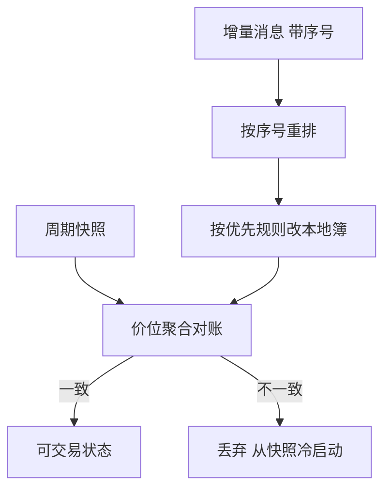

# 订单簿重建

你磁盘上的不是「市场」，而是一条按契约投影过的消息流；按交易所优先规则重放这条流，才能得到与撮合核一致的簿，否则第几档只是幻觉。

<footer>—— Huang and Polak, LOBSTER: The Limit Order Book Reconstructor, 2011 工作论文；对照 NASDAQ TotalView-ITCH 规格与 Cont, Stoikov and Talreja, A Stochastic Model for Order Book Dynamics, Operations Research, 2010</footer>

[上一课](/quant/matching-engine-arch)约定撮合核是单标的全序。[限价簿](/quant/lob-structure)给出几何与四类原语。[L2/L3 数据](/quant/l2-l3-data)给出投影层次。本课的缺口是**工程实现**：怎样从增量消息重放成与引擎一致的状态，丢包、快照、隐藏单与拍卖模式各自毁掉哪一层。后课协议课解释消息从哪根管子来。不要在这里重推导阶梯图。

## 问题

研究常拿到三种货：周期快照（各档价量）、价位聚合增量（L2 差分）、订单级增量（L3：增、成、撤、改，带订单号）。只有第三种能重建时间优先队列。Huang 与 Polak 的 LOBSTER 把 NASDAQ ITCH 重放成事件级簿，正是因为学术 TAQ 不够。问题是：本地状态与引擎状态在何种契约下相等。相等的判据不是「中间价看起来对」，而是每一事件后，各价位剩余量、队头订单号、以及你自己订单的名次与成交回报一致。

缺口来自四类信息损失。快照把间隔内路径压成净值，事件时钟消失。L2 丢掉队内次序，名次只能先验。隐藏/冰山在可见簿上只有展示量，成交却从隐藏量出。拍卖与连续的匹配函数不同，用连续 FIFO 去重放集合竞价，开盘价会对不上。A 股逐笔与十档、美股 ITCH、期货 MDP，名字不同，损失结构同构。

### 丢包比延迟更坏

延迟是因果平移：你看见的是过去的真簿。丢包是状态损坏：此后所有名次都可能错。增量馈送必须有序号；缺口则停用本地簿、等快照或重传。没有序号的「尽力推送」只能当展示，不能当可交易状态。后课快照与增量会把这条管道写细；本课先把重建失败写成一等事件，而不是静默用坏簿继续回测。

ITCH 一类馈送的订单号在成交与撤销消息里回指 add。本地必须保留「订单号 → 价、量、方向、入队序号」。丢掉这张表，L3 立刻退化成残缺 L2。

## 方法

L3 重放：维护价位到 FIFO 队列的映射。`add` 若未交叉则入队尾；交叉则按对手队头逐笔 `execute`，剩余再入己方。`cancel` 按订单号从队列中删除，可能制造空档。`replace` 默认撤旧加新（丧失时间优先），除非规格允许减量保位。每一事件后可与快照的价位聚合对账；对不上就标记 `desync`，从下一张快照冷启动。Cont、Stoikov 与 Talreja（2010）把簿当成队列系统，重建是该系统的样本路径，不是另画一张图。

A 股逐笔委托/成交与交易所行情档位要对钟。用档位快照去「校正」逐笔重建，必须确认快照是引擎状态的投影而不是行情商抽样。集合竞价时段不要跑连续匹配：按[集合竞价规则](/quant/cn-limit-auction)一次性出清，再把未成交申报导入连续队列。涨跌停锁定后，一侧队列可以极深，重建仍要保留队内次序——配给不是按你看到的「买一量」均分。

### 自己的订单是唯一的真探针

你挂在簿上的限价单，成交回报是引擎状态的直接观测。重建簿若显示你排第一却迟迟不成交，或显示你已不在簿上却仍有部分成交，优先查本地重放与行情源，而不是改策略参数。回测没有这笔探针，只能靠快照对账与成交价是否落在当时 BBO 内做弱检验。弱检验通过不等于名次正确。

## 机制

价格优先保证更优价先成交；时间优先把同价变成 FIFO。重建若把同价位收成一个整数，等于把 FIFO 换成「匿名池」，随后任何「队列位置 alpha」都是假的。冰山把可见量变成下界：引擎可能从隐藏量成交，本地可见簿会突然出现「无增量却减量」或「成交价在 BBO 内但可见量不够」。处理方式是承认可见状态是下界，不要用可见量当可成交量去填市价单路径。

引擎序号（上一课）是重建的主键。行情消息乱序到达时，应按序号重排再应用；按到达墙钟应用会制造负价差假象。这与[迟到数据](/quant/late-data-recon)同一逻辑：事件时间与到达时间必须分列。

## 边界

重建得到的是**该馈送契约下的可见簿**，不是全球可成交性。暗池、中转、冰山下量、做市商隐藏报价都不在流里。用本所 L3 去解释「全国最优」会漏掉外所。监管研究若必须以 SIP 磁带为准，不要用直连重建去替代，见[SIP 与直连](/quant/sip-vs-direct)。

本课不提供如何根据重建簿抢队或探测隐藏量的交易流程。隐藏量的存在只作为状态不完整的警告。加密订单簿、链上 mempool 不是同一套优先规则。

## 小结

- 只有订单级增量能重建时间优先；L2 与快照会丢掉名次或路径。
- 丢包必须停用本地簿并冷启动；对账主键是引擎序号与价位聚合。
- 拍卖、涨跌停、冰山各自改写匹配函数或可见性，不能用连续 FIFO 一路重放。
- 出处：Huang and Polak, LOBSTER, 2011；Cont, Stoikov and Talreja, *Operations Research*, 2010；NASDAQ ITCH 规格。
