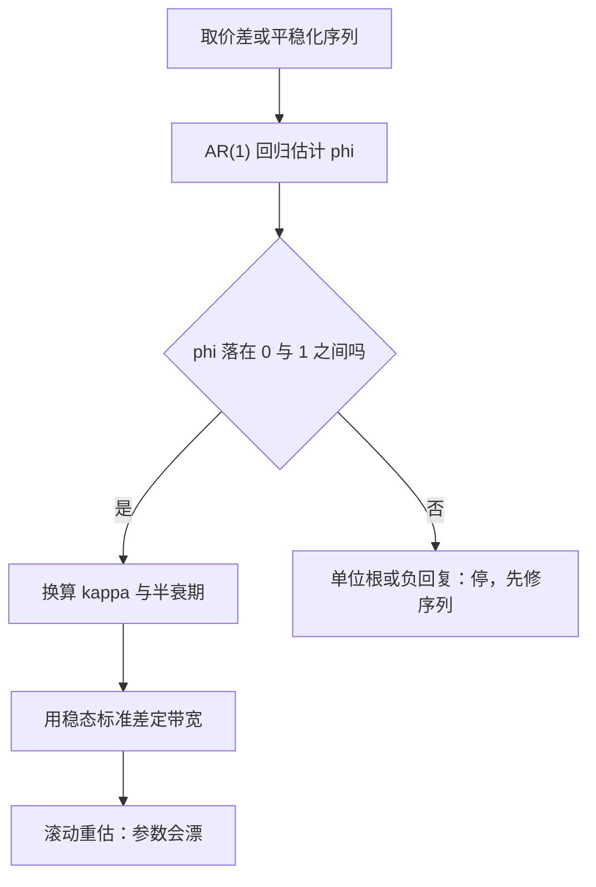
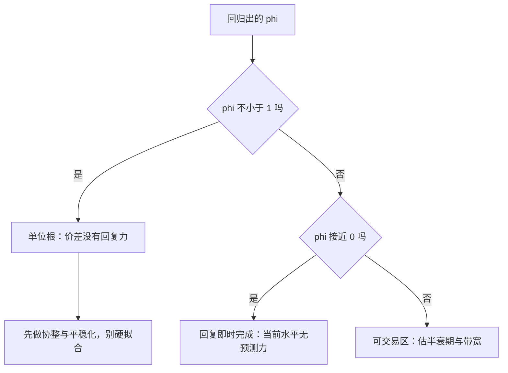

# Ornstein–Uhlenbeck 均值回复

带弹簧的随机游走：漂移按偏离比例把过程拉回锚点，回复速度定半衰期，噪声定带宽——价差、利率与对数波动的默认动力学。

<footer>—— 据 Uhlenbeck and Ornstein, Physical Review, 1930</footer>

[上一课](/quant/unscented-kalman)回答了「给定模型怎么滤状态」；本课退一步问状态自己怎么动。均值回复是最常被引用、也最常被滥用的动力学：$dX=\kappa(\theta-X)\,dt+\sigma\,dW$。回复速度 $\kappa$、锚点 $\theta$、稳态带宽 $\sigma/\sqrt{2\kappa}$，三个参数把「价差会不会回来、多久回来、回来时在多大范围晃」全部钉死。[布朗运动](/quant/brownian-motion-paths)给出的是无回复的随机游走；加一根看不见的绳，就是 OU。

## 问题

配对价差、对数利差、平稳化后的波动率都不该用 GBM 描述——GBM 的漂移与水平无关，偏离没有回程票。OU 的漂移正比于偏离：离锚越远拉力越强。缺的课是「怎么从数据把 $\kappa$ 估出来」：文献给方程，数据给的是离散采样，两者之间隔着离散化与小样本偏差两道坎。本课只写动力学与估计，不写 Vasicek 与 CIR 的利率定价推导，也不把 OU 宣传成必然盈利的信号。

## 方法

等间隔采样把 SDE 化成 AR(1)：$X_{t+\Delta}=\theta+\phi(X_t-\theta)+\epsilon_t$，其中 $\phi=e^{-\kappa\Delta}$。对离散序列跑 OLS 得 $\hat\phi$ 与截距 $\hat a$，再换算 $\kappa=-\ln\hat\phi/\Delta$、$\theta=\hat a/(1-\hat\phi)$，半衰期 $\ln 2/\kappa$。数字实例：日频价差回归出 $\hat\phi=0.95$，则 $\kappa=-\ln(0.95)\approx0.0513$，半衰期 $\ln2/0.0513\approx13.5$ 个交易日——偏离约两周走完一半回程；稳态标准差若为 1.2 个价差单位，$\pm1.2$ 只是入场带宽的起点，不是终点。

## 机制

回复力全在漂移项：单位偏离每个单位时间被拉回 $\kappa$ 的比例，回复是指数式的——前半段快、后半段慢，所以「半衰期」比「回复时间」更诚实。稳态分布是高斯，方差 $\sigma^2/2\kappa$：回复越快、噪声越小，带越窄。交易含义跟着参数走：带宽入场、锚点止盈、半衰期定持仓周期与止损时钟，头寸大小归 [Kelly](/quant/kelly-sizing) 的账。直觉类比：OU 像系着皮筋的风筝——风（噪声）把它吹得乱跑，皮筋（回复力）按拉伸比例往回拽；皮筋越硬风筝越贴着锚点小幅抖动，皮筋越松越像断线。交易带宽问的就是：风筝离桩多远时出手。

常见误区：把小样本 OLS 的 $\hat\phi$ 当无偏估计。错在自回归回归本身——真值接近 1 时向下偏差最重，$\phi=0.98$ 的序列估出 0.95 相当常见；半衰期从约 34 天被压成 13.5 天，持仓周期与止损时钟跟着全错。补救是给 $\hat\phi$ 配区间估计并滚动重估，而不是把单次点估计当常数。

## 边界

OU 是假设不是事实。参数时变：regime 切换后 $\kappa$ 与 $\theta$ 一起漂，滚动窗口只是补丁不是治愈；离散采样有限时 $\hat\phi$ 还叠一层向下偏，采样间隔越粗越明显。成本改写带宽：理论带宽外扩往返成本再谈入场。数字实例：双边成本 0.15 个价差单位，$\pm1.2$ 的理论带宽外扩到 $\pm1.35$ 再入场；半衰期 13.5 天意味着一次往返持仓约两周、年化周转约十次量级，成本一年吃掉一到两个价差单位——带宽设计先过成本这一关。回复节奏定好之后，仓位与风险分配不在本课。下一课换一个量纲：从「状态怎么动」转到「波动本身怎么量」——Garman–Klass 估计量。

## 小结

- OU 用三个参数钉死均值回复：$\kappa$ 定半衰期、$\theta$ 定锚点、$\sigma/\sqrt{2\kappa}$ 定带宽。
- 离散化即 AR(1)，OLS 可估，但小样本 $\hat\phi$ 向下偏，半衰期常被低估。
- $\phi$ 接近 1 是单位根，接近 0 是白噪声，两个格子都不该硬拟合。
- 带宽设计必须外扩成本；参数时变靠滚动重估缓解。
- 出处：Uhlenbeck and Ornstein, *Physical Review*, 1930；Lo and MacKinlay 对 AR 估计偏差的讨论，1988。
