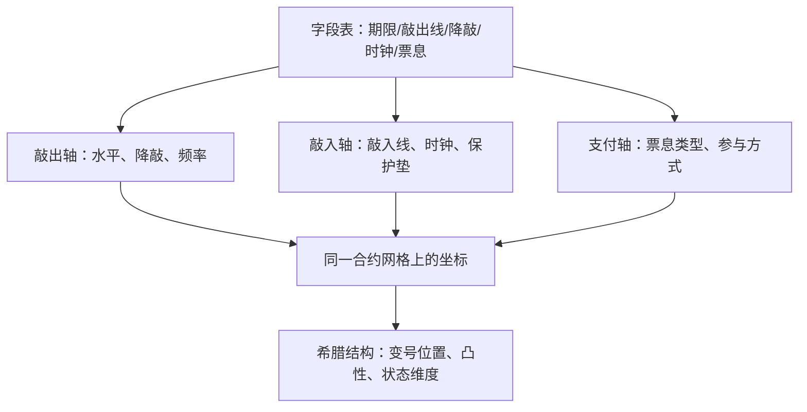
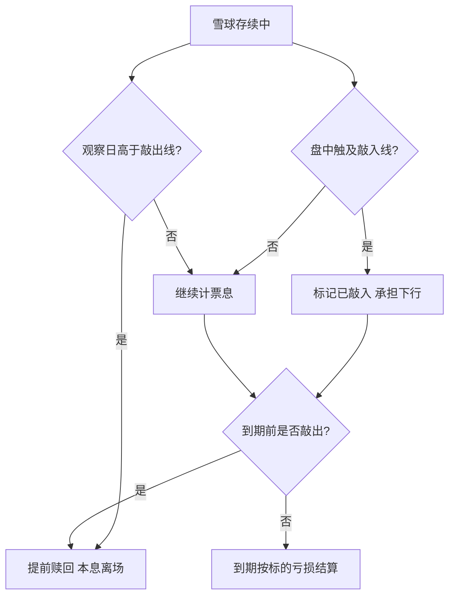

# 自动赎回谱系：雪球深化

雪球不是一只产品，是一张字段表：期限、敲出线、降敲节奏、观察时钟、记忆票息——每改一格，价格与对冲就换一个家族。

<footer>—— 据 Broadie, Glasserman and Kou, Mathematical Finance, 1997；条款口径据交易所与协会公开规则整理</footer>

[上一课](/quant/rc2-map)把研究协作收进两种可重放：引擎重放计算，台账重放决策——显式、可数、挂判据，让一次实验可复述、一群人的研究可评审。本课是「结构化产品与场外」的第一课：场外的条款、估值与限额同样是「每次变更可追溯」的对象，那三条机制在这里照常生效。主干已交付三块基石：[autocallable](/quant/autocallable) 的状态机、[雪球定价](/quant/snowball-pricing) 在合约观察网格上的票息反解、[敲入级联](/quant/snowball-knockin-cascade) 的信用路径。本课程不重推公式，而是把雪球当成一个谱系来管理：发行台面上同时挂着几十种变体，谱系不清，估值与限额就没有比较基准。后课默认已经读完本课。

## 问题

主干课回答的是「一只雪球值多少」，实务回答的是「这一批变体各自值多少、风险差在哪」。把变体当新产品从零定价，账本失去可比性；把变体当同一产品只改参数，又会在字段改变观察时钟或行权结构的场合漏掉质变——敲出观察从每月改每季只是数值变化，敲入时钟从收盘改盘中就是另一族触碰分布。缺口因此是先钉一张分类轴：把字段分成连续可微的数值字段与改变结构的状态字段，前者进报价，后者换族处理。

直觉类比：雪球是「你把震荡行情的保险卖给发行商」——行情温和，你按月收高票息，像滚雪球；行情大跌，你从收租人瞬间变成接盘人，下跌损失自己扛。高票息不是白给的，是你卖出的暴跌保险的保费。

### 三条分类轴

谱系按支付与时钟切成三轴。敲出侧：敲出水平、降敲节奏、观察频率、早赎权；敲入侧：敲入线、观察时钟、保护垫；支付侧：票息类型（固定、或有、记忆、按月 phoenix）与敲入后参与方式（全额承担、部分参与、带执行价的看跌）。

敲出按月观察、敲入接近每日观察——两种时钟并存正是高票息的来源：投资者卖出的是每日判定的尾部。Broadie–Glasserman–Kou 平移量随 $\sqrt{\Delta t}$ 缩放，间隔不同，同一根敲入线对应的连续等价障碍就不同，见[监控频率](/quant/barrier-monitoring)。

## 方法

每条轴给出定价与对冲后果，变体是轴上的坐标而不是独立产品。敲出观察从每月改每季，触碰概率上升，票息反解数值上升；降敲使敲出线随时间下行，Vega 变号的位置跟着敲出线穿过现价的窗口移动——[上一课](/quant/vt-exotic-risk-map)的障碍前变号在此按时间展开。敲入时钟从收盘改盘中，敲入概率与数字缺口一起变大，对冲带相应上移。记忆票息把状态从「是否敲入」扩成「欠几期」，估值网格多一维历史计数；phoenix 把票息切成按月或有，delta 的时间结构随之切细。最差表现把相关抬成一等项，篮子维度进[相关溢价](/quant/dispersion-corr-prem)的口径。

数字实例：敲出线 100%、敲入线 80%、月票息 1.5%。若第 4 个观察日标的到期初期 102%，合约提前终止，拿 4 期共 6% 票息走人；若某天盘中跌破 80%，之后涨回来也改变不了身份——到期仍按实际跌幅承担亏损，跌 25% 就亏 25%。

## 机制

票息必须逐字段反解，因为票息是使合约公允的或有期权费：记 $c\,A+B=1$，其中 $A$ 是未敲出时各期票息贴现因子沿存活路径的期望，$B$ 是敲入后支付沿全部路径的贴现期望；任何字段改变都改写 $A$、$B$ 里的路径集合，而不是线性修正。线性近似只在三处失效：敲入线附近、降敲线穿过现价的窗口、期限压缩的短端——字段微动，票息跳档。希腊随轴分族：敲出轴决定 Vega 变号的时空位置；敲入轴决定 delta 凸性与 gap 的量级；支付轴决定状态维度。不这么记账会错在哪：把降敲雪球当平敲报价，敲出线穿价的那个月 delta 突然对不上；把记忆票息当固定票息，敲入后每期负债都被低估。

常见误区：把「记忆票息」当成「跌了也照付」。记忆只是记住「上次敲出时欠你几期」；一旦敲入，欠息连同本金一起暴露在条款里——「欠着」不等于「必付」，支付轴那一格决定它最终是资产还是空头欠条。

## 边界

本课不给变体逐一定价，也不比较「哪个变体更划算」——那是适当性约束下的销售问题，口径沿[雪球定价](/quant/snowball-pricing)：不得按保本陈述，销售受适当性管理。谱系表是估值与对冲的字典，不是风险的全部：信用、保证金与文档是后课缺口。下一课把没有敲出提前终止、更像「固收增强」的 FCN 单独拆开。

## 小结

- 雪球谱系按敲出、敲入、支付三轴管理，变体是坐标不是独立产品。
- 字段分两类：连续可微的数值字段与改变结构的状态字段，后者换族处理。
- 票息逐字段反解；敲入线附近、降敲穿价窗口、短端三处线性近似失效。
- 希腊结构随轴分族：变号位置、凸性量级、状态维度。
- 出处：Broadie, Glasserman and Kou, *Mathematical Finance*, 1997；结构口径沿 [autocallable](/quant/autocallable) 与[雪球定价](/quant/snowball-pricing)两课。
