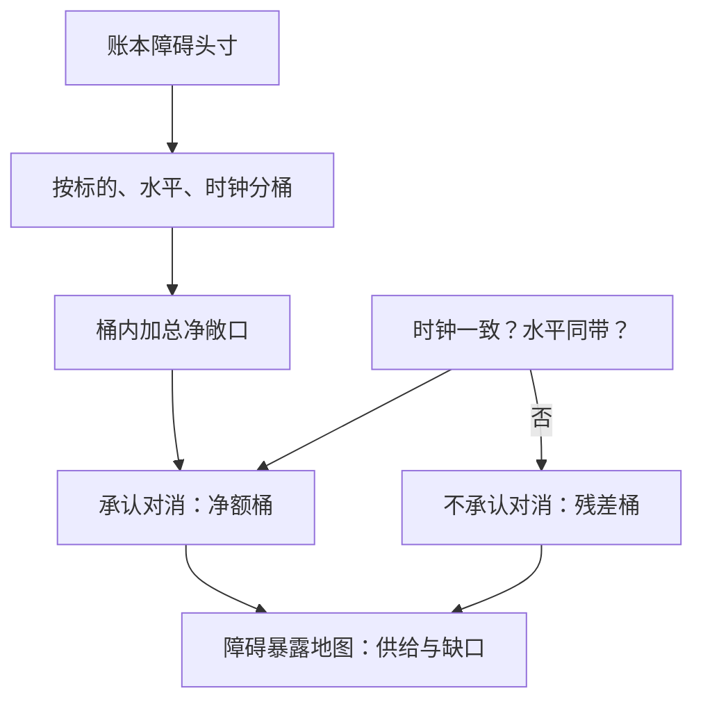

# 障碍结构的组合

障碍不是一种期权，是一根轴：敲入与敲出在轴上互补，触碰与数字在轴上取值；账本上的风险问的不是单笔头寸，而是同一根轴上还挂着谁。

<footer>—— 据 Derman, Ergener and Kani, Journal of Derivatives, 1995；Broadie, Glasserman and Kou, Mathematical Finance, 1997 整理</footer>

[上一课](/quant/ot-fcn)把 FCN 的风险收进一条向下敲入看跌，产品解剖里雪球与 FCN 的公共骨架至此露出来：障碍。本课不再按产品走，把障碍当成组合件——敲入与敲出的互补、触碰与数字的取值、账本上同一水平线的堆积如何聚合。单笔障碍的希腊在障碍前不连续，这是[奇异风控地图](/quant/vt-exotic-risk-map)立过的；本课把视角移到账本层，后课的发行方对冲默认以这张聚合地图为输入。

## 问题

单笔障碍的定价与对冲，主干已有[障碍解析](/quant/barrier-analytics)与[监控频率](/quant/barrier-monitoring)；剩下的缺口在组合层。发行台同时挂着几十份条款各异的障碍：卖给客户的敲出、从对手买回的敲入、雪球账本里嵌着的两道线、FCN 里的保护垫。每笔单独看都在限额内，加总却可能互相放大——同一标的两笔头寸的障碍线只差 $1\%$、观察时钟一个收盘一个盘中，账面上近似对消，风险上并不对消。缺口因此是两个：组合恒等式在什么条件下成立；不成立的部分怎么计量。

## 方法

第一条是代数。同一标的、同一期限、同一行权价、同一监控约定下，敲入与敲出互补：

$$
V_{\mathrm{KI}}+V_{\mathrm{KO}}=V_{\mathrm{vanilla}}.
$$

触碰结构在轴上取值：one-touch 是「只要触碰付一元」的美式数字，no-touch 是它的互补；数字障碍把触碰与支付量乘在一起。账本聚合按三元组分桶：标的、障碍水平、观察时钟。桶内加总净敞口，桶间只有当时钟一致、水平可视为同一带时才承认对消——[对冲商的堆积](/quant/snowball-dealer-hedging)用的正是这套分桶，只是那里加总到市场层，这里止于账本层。

第二条是静态复制。Derman、Ergener 与 Kani 表明：用香草期权条带可以在到期前的每个日期把障碍价值钉住，条带随时间衰减、需要在既定日期滚动；Carr、Ellis 与 Gupta 把单障碍的静态组合做成有限条香草加数字。静态条带给出的不是免费对冲，是一张到期日与行权价受限的近似——场内没有任意行权价时，残差回到账本。

Broadie–Glasserman–Kou 的平移量按 $\exp(\pm 0.5826\,\sigma\sqrt{\Delta t})$ 缩放：收盘观察与盘中观察之间，同一根名义障碍线对应的连续等价障碍可以差出可观的距离。KI 与 KO 的恒等式只在两边共享同一监控约定时成立；一边收盘一边盘中，代数恒等式变成两条不同的平移线之间的残差。

## 机制

恒等式成立的条件比恒等式本身重要。KI 加 KO 等于香草，是路径集合划分的恒等式：触碰与不触碰把样本空间切成两半。条件一，监控约定相同——划分必须切在同一个事件上；条件二，对手方可以同时履约——账面对消是风险的，法律上两笔头寸是两个对手的债权，一笔违约不减免另一笔。把组合对消当信用对消，是场外账本最贵的一类错误，ISDA 的净额集与法律构造是下一课的缺口。

静态复制的机制价值在于把「障碍不可对冲」的宿命论拆开：障碍的连续暴露可以用有限条香草分段钉住，代价是条带的维护与滚动。发行台因此有两条腿：动态对冲管理连续暴露，静态条带管理不连续点附近的暴露带——[波动率产品的对冲](/quant/vt-product-hedging)的 delta 手册在此延伸到障碍层。不这么做会错在哪：只用动态对冲，观察日前gamma 的峰值把对冲流量打满；只用静态条带，场内行权价间隔留下的残差没人认领。

## 边界

本课不重推障碍闭式与 BGK 平移的推导，监控约定的定价后果沿[监控频率](/quant/barrier-monitoring)；把聚合地图外推成市场供给曲线是[对冲商的堆积](/quant/snowball-dealer-hedging)的主题，本课不越界。窗口障碍、软障碍与重置障碍只报条款名，不逐一定价。对消的法律边界、对手信用折价，都推给下一课。

## 小结

- 敲入与敲出在相同监控约定下互补：$V_{\mathrm{KI}}+V_{\mathrm{KO}}=V_{\mathrm{vanilla}}$，恒等式的价值在成立条件。
- 账本按标的、障碍水平、观察时钟分桶聚合；时钟不一致或水平不同带，对消不成立。
- 静态复制用香草条带钉住障碍的分段价值，滚动与行权价受限是残差的来源。
- 组合对消不等于信用对消：对手不同，法律上没有净额。
- 出处：Derman, Ergener and Kani, *Journal of Derivatives*, 1995；Carr, Ellis and Gupta, 1998；Broadie, Glasserman and Kou, *Mathematical Finance*, 1997。
