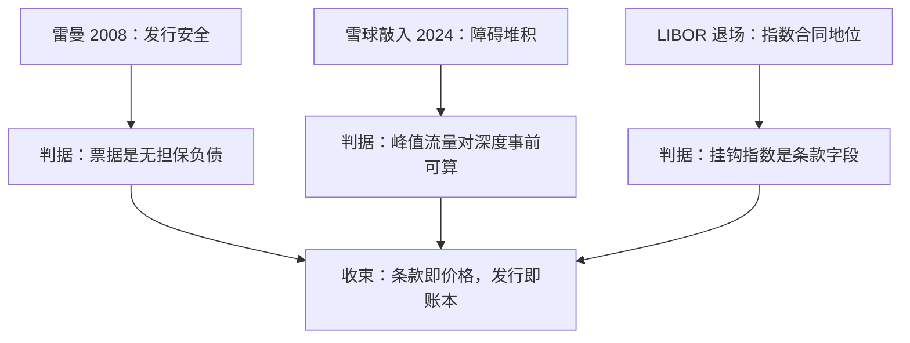

# 案例与收束

结构化产品的考试不出在定价题上，出在条款之外：发行人倒下、障碍堆积、指数退场——每一问考的都是条款、账本与合同哪一层先接住冲击。

<footer>—— 据香港证监会雷曼相关回购安排公告与 BIS Quarterly Review 相关评述整理</footer>

[上一课](/quant/ot-portfolio-regulation)把组合与监管收进四层程序。九课走完，本课用三个案例做收束：2008 年的雷曼迷你债券考发行安全，2024 年初的雪球集中敲入考障碍堆积，LIBOR 退场考票息挂钩指数的合同地位。每个案例停在本课程立过的判据上，本课程到此收束。

## 问题

案例教学的风险是把故事当知识。本课的问题只有一个：课程立的判据能否事前写进系统与限额，而不是事后解释情节。三个案例各考一课：雷曼考[对手方信用管理](/quant/ot-counterparty-credit)立的「结构安全不等于发行安全」；雪球敲入考[障碍结构的组合](/quant/ot-barrier-portfolios)立的分桶聚合与[对冲商堆积](/quant/snowball-dealer-hedging)立的同步流量；LIBOR 考[文档体系](/quant/ot-isda-documentation)立的「条款即合同」。

## 方法

案例一：2008 年雷曼兄弟破产。以「迷你债券」名义发行的零售结构化票据由雷曼关联实体担保，发行人倒下后票据按违约清偿处置，产品挂钩的抵押池并未消失，但持有人拿到的是清偿价值；香港市场余额以百亿港元计，分销行最终向多数持有人安排回购。判据有两条：票据是发行人的无担保负债，产品的对冲结构再完好也替换不了发行人信用；适当性若不评估发行人主体，等于只考了卷面不考了对手。这两条正是[对手方信用管理](/quant/ot-counterparty-credit)里投资者侧与销售层的全部内容。

案例二：2024 年初。A 股指数快速下行，存续雪球的敲入线集中分布的区间被相继击穿，发行台的对冲流量在同一带上叠加，市场讨论把「敲入」与「踩踏」连成一句。判据要拆开：敲入前，账本 gamma 按障碍水平与时钟分桶聚合，峰值流量对深度之比是事前可算的量；敲入后，凸性消失、库存再平衡是另一段流量。按[障碍结构的组合](/quant/ot-barrier-portfolios)聚合、按[发行方视角](/quant/ot-issuer-hedging)归因的台，事前就有这条带的风险地图；只有逐笔限额的台，事后的叙事替代不了地图。

案例三：LIBOR 退场（2014–2023）。挂钩利率的浮动票息结构与含 early termination 条款的票据整体迁移：[多曲线框架](/quant/multi-curve-ois)重建贴现与投影，fallback 利差让存续合约过渡，确认书逐笔修订。判据是[利率信用收束课](/quant/rc-case-map)同一案例立过的：挂钩指数的合同地位是条款的一部分——浮动票息 FCN 的「固定收益增强」标签下，连票息的参考利率都是一栏合同字段。

## 机制

三个案例合起来给出本课程的方法论。其一，条款即价格：谱系轴上的每个字段、每条监控时钟、每个挂钩指数，都是定价与风险的输入，字段管理先于公式管理。其二，发行即账本：卖断收价差、留存养对冲，利润逐日实现，残差分桶认领，归因留出没人解释的位置。其三，法律与信用决定谁付账：净额集划出暴露的边界，CSA 迁移暴露的时点，发行人信用价差写回票息——定价的最后一层永远是「对手付不付得起」。与姊妹课程对照：[利率信用收束](/quant/rc-case-map)把价格拆到资金与约束层，本课程把条款拆到字段与合同层，两层在报价单上会合。

三个案例的年份横跨十六年，考题却同构：冲击都从「条款之外」进来——主体违约、群体对冲、指数消失；课程九课的分工就是把条款之外的三层（账本、对手、合同）各写成可检验的判据。

## 边界

本课不写销售纠纷史与监管处罚史，案例只取与判据相接的截面；金额与时点引用带公开出处，不做估算。敲入潮的定量归因属于市场微观结构的计量专题，[堆积](/quant/snowball-dealer-hedging)课已给边界，不在本课下结论。收束之后，场外与场内的对照、全球制度差异另有课程接续。

## 小结

- 雷曼 2008：票据是发行人的无担保负债，适当性必须考对手主体，不只考结构。
- 雪球敲入 2024：障碍带事前聚合、峰值流量对深度是可算的量，叙事替代不了风险地图。
- LIBOR 退场：挂钩指数是条款字段，浮动票息结构整体迁移靠合同机制。
- 三条方法论贯穿九课：条款即价格、发行即账本、法律与信用定谁付账。
- 出处：香港证监会雷曼相关回购安排公告；BIS Quarterly Review 相关评述；判据出自本课程各课，见文中链接。
