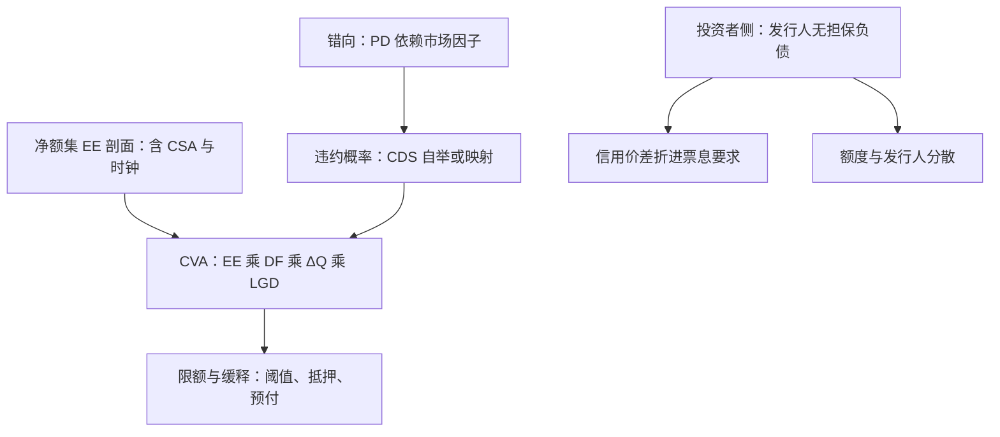
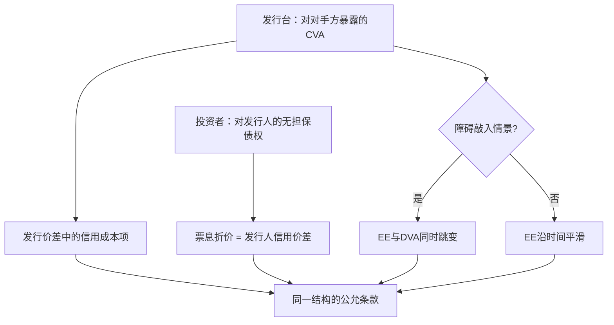

# 对手方信用管理

对手方风险是三件套的乘积：违约概率、未来暴露、违约后损失；合同决定暴露怎么算，信用决定这个暴露值多少钱。

<footer>—— 据 Gregory, The xVA Challenge；Canabarro and Duffie, 2003 的口径整理</footer>

[上一课](/quant/ot-isda-documentation)把净额集与 CSA 的法律构造搭好。本课把信用定价层加上：净额集决定暴露怎么聚合，违约概率与回收决定这个暴露折多少钱。结构化产品有两条信用线：发行台对对手方的暴露（对冲腿、互惠头寸），与投资者对发行人的暴露（票据本身是无担保负债）。两条线的工法不同，后课默认已经读完本课。

## 问题

第一条线是发行台的标准问题：净额集上的 EE 剖面乘上违约概率。结构化产品让它变难：障碍负债的暴露在敲入情景跳变——EE 剖面在观察时钟附近不连续，网格对不准时钟就漏掉尖峰；期限以年计，尾部违约概率的误差被长贴现放大。第二条线更基本：买入雪球或 FCN 的投资者持有的是发行人的无担保债权，产品的对冲再干净，发行人违约时票据按违约清偿处置。2008 年雷曼兄弟破产时，香港市场以「迷你债券」名义发行的零售结构化票据余额以百亿港元计，分销行最终向多数持有人安排回购——「结构安全」与「发行安全」是两件事，这是本课钉住的第一判据。

## 方法

分解式是共同的骨架：

$$
\mathrm{CVA}=\mathrm{LGD}\cdot\sum_i \mathrm{DF}(t_i)\,\mathrm{EE}(t_i)\,\Delta Q_i .
$$

发行台侧按[暴露剖面](/quant/cva-exposure-profile)的口径构造 EE：净额集为聚合单位、CSA 参数进剖面、网格对准支付日与观察时钟；$\Delta Q$ 沿 CDS 自举，无 CDS 的市场按映射计，映射与剖面分列敏感度。缓释按合同参数走：阈值、独立金额、抵押折扣改写 EE 的水平与形状；预付与限额改写增量业务的暴露上限，限额体系沿[对手方风险体系](/quant/rk-counterparty-system)挂情景限额而不是单笔敞口。

术语翻译：CVA（信用估值调整）就是把「对手可能赖账」折成价格——每一期你暴露给对方的金额，乘上对方当期违约概率、再乘违约后拿不回的比例，贴现加总。它不是手续费，是这笔交易公允价值里本该扣掉的一块。

数字实例：某对手 5 年累计违约概率 10%，平均暴露 EE 2000 万，违约后回收 40%（即 LGD=60%）。CVA 约 $2000\text{万}\times10\%\times60\%=120$ 万——谈判桌上，这 120 万应体现为更宽的报价、更高的抵押，或干脆换对手。

错向不是乘一个大于 1 的系数：把违约概率做成市场因子的函数，让暴露与违约在联合分布里同向放大，才是能进引擎、能对账的做法。[利率-信用混合定价](/quant/rates-credit-hybrid)立的判据在 2020 年 3 月被[利率信用收束课](/quant/rc-case-map)的案例兑现——卖出期权给低信用对手，正是暴露与 PD 同涨的结构。

投资者侧的缓释更薄：票据持有人没有 CSA 可签，能做的是额度、期限与发行人分散，以及把发行人信用价差折进票息要求——同一结构，两家发行人的公允票息不同，差额就是市场对发行人信用的定价。

常见误区：买雪球或 FCN 时只比票息高低、不问发行人。同一结构 A 家给 5%、B 家给 5.8%，多出的 0.8% 多半不是让利，而是市场给 B 更低信用开的补偿——票息差是发行人信用价的镜子，不是免费的午餐。

## 机制

两条线在机制上汇于一点：信用成本必须回到价格。[发行方视角](/quant/ot-issuer-hedging)的发行价差里，$c^{*}$ 的信用成本项就是发行台自己被要求的 CVA/DVA；投资者票息里被压掉的部分，是发行人信用价差的镜像。障碍产品 EE 的跳变使这条定价链对网格与敏感度格外挑剔：敲入情景把负债推向投资者，发行台侧的 EE 与 DVA 同时改写，静止单点暴露看不到。不这么做会错在哪：按「产品已对冲」给发行人信用零权重，等于把 2008 年的结构性错配原样重建。

## 边界

CVA 的对冲（CDS 对 $\Delta Q$、市场因子对 EE 的导数）沿[暴露剖面](/quant/cva-exposure-profile)课，不再展开；监管资本侧的 EEPE 与 SA-CCR 沿[监管资本下的定价](/quant/rc-regcap-pricing)。中央清算把双边暴露换成对 CCP 的暴露加违约基金，对象改变，口径沿 [CCP 清算](/quant/ccp-clearing)。发行人信用进产品条款的方式（担保、抵押、破产隔离的 SPV 结构）只点名不展开，那是产品设计的另一个课程。

## 小结

- 对手方信用是三件套：PD、EE、LGD；合同定暴露算法，信用定价格。
- 结构化产品的 EE 在敲入情景跳变，网格必须对准观察时钟与支付日。
- 错向进联合分布不进系数；卖出期权给低信用对手是同向放大的典型结构。
- 投资者侧的发行人信用没有 CSA 可缓释：额度、分散、价差折进票息是全部工具。
- 出处：Gregory, *The xVA Challenge*；Canabarro and Duffie, 2003；口径沿 [CVA 暴露剖面](/quant/cva-exposure-profile)与[对手方风险体系](/quant/rk-counterparty-system)。
