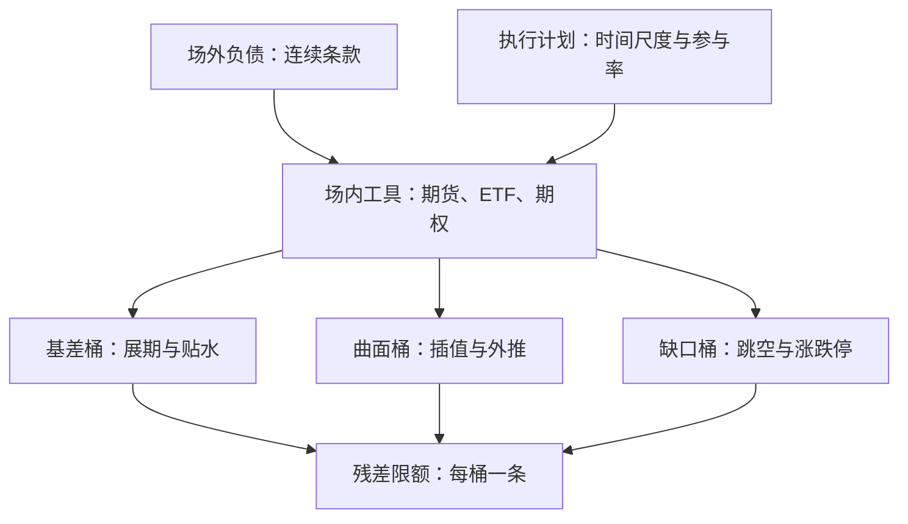
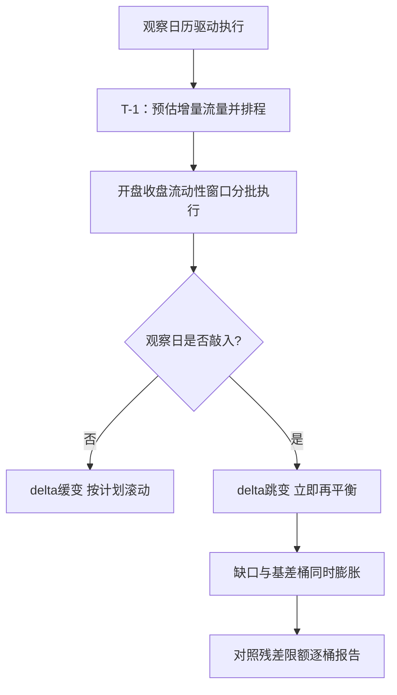

# 场内对冲场外暴露

场外条款是连续的，场内工具是离散的：对冲完成后账上剩下的不是零，是三类有名有姓的残差——基差、曲面与缺口。

<footer>—— 据 Almgren and Chriss, Journal of Risk, 2000 与场外做市执行实务整理</footer>

[上一课](/quant/ot-counterparty-credit)把对手信用折进价格。回到发行台的执行层：场外负债的对冲工具大多只能在场内找——股指期货、ETF、场内期权、国债期货。本课写三条失配怎么落账：条款连续与工具离散的价格失配、场外参数与场内曲面的波动率失配、条款时钟与市场微观结构的流动性失配。发行方的负债分解沿[发行方视角](/quant/ot-issuer-hedging)，本课补齐工具那一列。

## 问题

雪球敲入线 $73\%$，场内期权最深的实值行权价未必够到；FCN 的保护垫要放到三年，场内期权到期最长的月份屈指可数；对冲需要的是每天按时段的增量流量，场内流动性集中在开盘、收盘与竞价。对冲后的账本不是「已对冲」，而是换成了一套残差：用期货替 delta，把现货与期货的基差换进来；用最接近的行权价条带替 vega，把曲面插值差换进来；用日内计划替连续复制，把涨跌停与跳空换进来。缺口的本质是承认：对冲是换暴露，不是消暴露。

## 方法

三条失配各给一条工法。基差：delta 用期货执行时，展期成本与基差波动单列一个桶，对冲需求的季节性会推高贴水——中国市场上中证 500 股指期货的年化对冲成本在部分年份达到两位数百分比，据公开基差数据整理；口径沿[股指期货与贴水](/quant/cn-stockindex-basis)。曲面：场外参数（障碍带、期限）落在场内报价的凸包之外时，用[vanna / volga](/quant/vanna-volga) 三点或局部插值外推，插值假设与外推幅度写进残差桶，不写成对冲成本。流动性与缺口：执行计划按[平方根与 Almgren–Chriss](/quant/almgren-chriss) 的时间尺度排程，用[自适应参与率](/quant/adaptive-pov)贴市况；涨跌停与集合竞价的不可成交时段沿[涨跌停与集合竞价](/quant/cn-limit-auction)单列情景，隔夜跳空沿[隔夜跳空对冲](/quant/overnight-gap-hedge)的两列报告。

术语翻译：基差就是期货价与现货价的差；贴水指期货长期比现货便宜。用期货替现货做对冲，每次展期都在低价位卖旧买新，成本年化下来能吃掉好几个百分点——「对冲了」和「免费对冲了」是两回事。

## 机制

机制上，残差必须分桶认领，因为三类的对冲工具不同：基差桶用展期管理与现货替换，曲面桶用场外互惠与减仓管理，缺口桶用静态条带与现金垫管理。混桶的代价是归因失效：[发行方视角](/quant/ot-issuer-hedging)的日度归因里，残差桶如果混着基差与缺口，利差交易与事件风险互相掩护，谁都调不准。对冲纪律优先于工具选择：同样的场内工具，频率与观察网格对齐的账本，残差显著小于均匀加密的账本——[离散对冲频率](/quant/delta-hedge-freq)立的口径在执行层兑现。不这么做会错在哪：把「已用期货对冲」当成零风险，市场冲击来临时基差、贴水与折价同时动，账本的三只残差桶一起膨胀，而限额以为只有一条线。

场内对冲的执行成本要按「流量对深度」计，不按佣金计：同样的名义，观察日前的 gamma 峰值时段执行，滑点可以是平静时段的数倍。执行计划因此要挂在观察日历上，而不是挂在固定时点上。

常见误区：把「已用期货对冲」当成零风险。期货只换了 delta，基差、贴水、折价一样会亏——市场冲击来临时三只残差桶一起膨胀，若限额只盯一条 delta 线，真实风险早就从报表上「消失」了。

数字实例：账本 1 亿名义，隔夜跳空按 ±3% 情景设现金垫，就是 300 万流动性垫。跳空真来 2% 时垫子够用；来 5% 时缺口桶超限——超限不是操作事故，是这桶本来就该报警的地方，报警说明情景库该扩了。

## 边界

本课只写发行台自己的残差账；市场层面同步对冲对价格的反馈沿[对冲商的堆积](/quant/snowball-dealer-hedging)。用场外互惠替代场内工具会引入新的对手信用，缓释口径沿[对手方信用管理](/quant/ot-counterparty-credit)。组合层面的集中度与监管义务是下一课的缺口。

## 小结

- 对冲是换暴露：期货换进基差，行权价条带换进曲面插值，日内计划换进缺口。
- 三类残差分桶认领，各有工具与限额；混桶使归因失效。
- 基差成本随对冲需求与季节性波动，年化可达两位数百分比，口径沿贴水课。
- 对冲纪律优先于工具选择：频率与观察网格对齐。
- 出处：Almgren and Chriss, *Journal of Risk*, 2000；Leland, *JF*, 1985；口径沿[发行方视角](/quant/ot-issuer-hedging)、[离散对冲频率](/quant/delta-hedge-freq)与[涨跌停与集合竞价](/quant/cn-limit-auction)。
