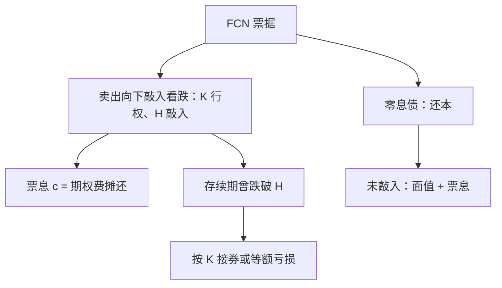
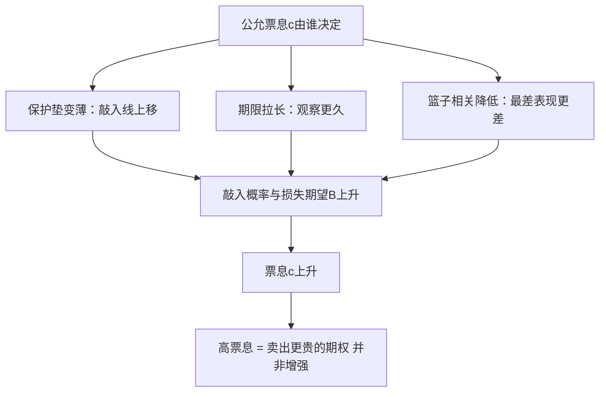

# FCN 与固定收益增强

固定票息票据不是一张高息债加一点风险，而是一张零息债叠加裸卖的下跌期权；「固定」修饰的是票息，不是本金。

<footer>—— 据 Henderson and Pearson, Journal of Financial Economics, 2011；结构口径据场外结构化票据条款书整理</footer>

[上一课](/quant/ot-autocall-snowball-deep)把雪球钉成敲出、敲入、支付三条轴上的字段表，票息逐字段反解。本课把谱系上敲出轴清空的那个端点单独拆开：固定票息票据 FCN。它没有降敲节奏、没有敲出观察，发行人放弃早赎权，只保留敲入风险；市场上以「固收增强」名义销售的正多。主干里[雪球定价](/quant/snowball-pricing)立的票息反解与适当性口径在此沿用，后课默认已经读完本课。

## 问题

把 FCN 当固收记账，会漏掉它在敲入后的全额下跌暴露；把 FCN 当雪球报价，又会在敲出轴上多算一条不存在的腿——发行人的早赎期权费。缺口是先钉清 FCN 相对雪球到底少了什么：少了敲出腿，票息理应更低，期限内的凸性结构理应更简单。实务里的错误恰恰反着来：销售端按票息与期限类比存款，账本端却沿用雪球的全套希腊。本课先给支付分解，再谈反解在此如何退化。

## 方法

标准 FCN：期限 $T$，每期付固定票息 $c$，到期日若存续期内标的从未低于敲入线 $H$，按面值还本；若曾低于 $H$，投资者按行权价 $K$（通常等于期初价格）接收标的或等额亏损。分解成两条腿：一张零息债，加一份投资者卖出的向下敲入看跌（行权价 $K$、障碍 $H$）。票息就是这条看跌的期权费摊还：

$$
c\,A+B=1,
$$

形式与雪球一致，但 $A$ 退化成「未敲入路径上的年金贴现」，不再含敲出截断；$B$ 是敲入后损失的贴现期望。变体只有两处值得单列：或有票息把 $c$ 从固定改成按期判定未敲入才付，此时 $A$ 里的路径集合再收窄一次；含早赎权的 FCN 由发行人买回一张百慕大式赎回权，票息上调，谱系坐标向雪球靠近一格。

术语翻译：敲入线 70% 就是给标的留 30% 的「缓冲垫」——跌幅不足 30% 你当无事发生；一旦盘中跌穿，垫子宣告击穿，此后亏损全额落到本金。垫子越薄（敲入线越高），票息越贵，因为卖出的保险越容易赔。

常见条款量级：两年期 FCN，敲入线 $70\%$，季度票息 $2.8\%$，敲入后按期初价接券。把敲入线从 $70\%$ 抬到 $90\%$，票息不是线性上移——敲入概率与损失期望同时改写，反解出的票息常翻倍以上，这正是「高票息结构」的真实来源。

## 机制

票息反解在无敲出轴下的机制含义是：FCN 的公允票息主要由敲入概率与敲入后损失期望决定，与「市场利率加多少点」没有先验关系。保护垫变薄，$B$ 上升，$c$ 上升；期限拉长，敲入概率上升，$c$ 也上升——但这些都不是线性映射，障碍附近的敏感度沿[雪球深化](/quant/ot-autocall-snowball-deep)立的三处失效区（敲入线附近、期限压缩短端）同样存在。「固收增强」的口径错在哪：本金风险没有被票息覆盖，票息是每期收到的期权费，敲入后的损失从 $H$ 到零全部由本金承担，票息越高的 FCN，卖出的期权越贵。Henderson 与 Pearson 对零售结构化票据的实证给出同一方向：发行价系统性高于可复制组合的成本，价差落在条款复杂性的支付意愿上，不落在「增强」上。

直觉类比：FCN 像把自家房子按今天的市价「预售」给发行商，同时每期收一笔占用费——房价一直没跌破约定线，你安心收租；一旦跌破，房子按合同价过户，跌得再深也按原价算你的亏损，占用费一分不涨。

数字实例：买 10 万元两年期 FCN，季度票息 2.8%，共收 8 期约 2.24 万。若第二年标的盘中跌破敲入线、到期跌了 35%，按期初价接券等于本金亏 3.5 万——两年「利息」不够补亏。票息是保费，不是本金的保险。

发行方视角的差异留到后课，这里只钉一句：敲出腿拿掉后，发行方账本在敲入带附近的凸性符号与雪球并不同族，市场层面的对冲行为对照[敲入级联](/quant/snowball-knockin-cascade)与对冲商堆积两课，不在本课展开。

## 边界

本课不回答「FCN 值不值得买」——那是适当性约束下的销售问题，口径沿雪球定价课：不得按保本陈述，评级与风险揭示挂钩条款字段。FCN 的篮子与最差表现变体把相关抬成一等项，定价进[相关溢价](/quant/dispersion-corr-prem)的口径；挂钩利率的浮动票息变体还多一层指数的合同地位，那是收束课的案例。发行人信用不进本课：票据的违约风险是后课的缺口。

## 小结

- FCN 是零息债加卖出向下敲入看跌；「固定」指票息，不指本金。
- 敲出轴清空，票息反解退化：$c$ 主要由敲入概率与损失期望决定，敏感区在敲入线附近。
- 或有票息与早赎权各改写一次路径集合；早赎权把谱系坐标向雪球拉近一格。
- 「固收增强」的错误在把期权费当利息；零售结构发行价系统性高于复制成本。
- 出处：Henderson and Pearson, *JFE*, 2011；结构与反解口径沿 [autocallable](/quant/autocallable)、[雪球定价](/quant/snowball-pricing)与[雪球深化](/quant/ot-autocall-snowball-deep)。
