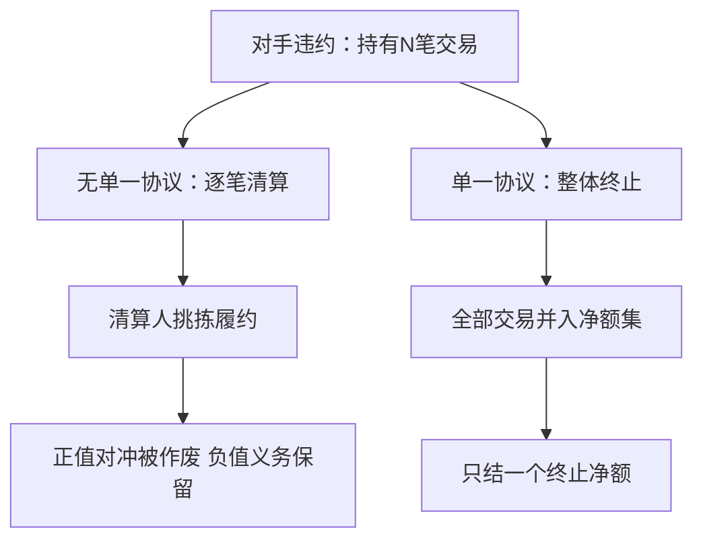
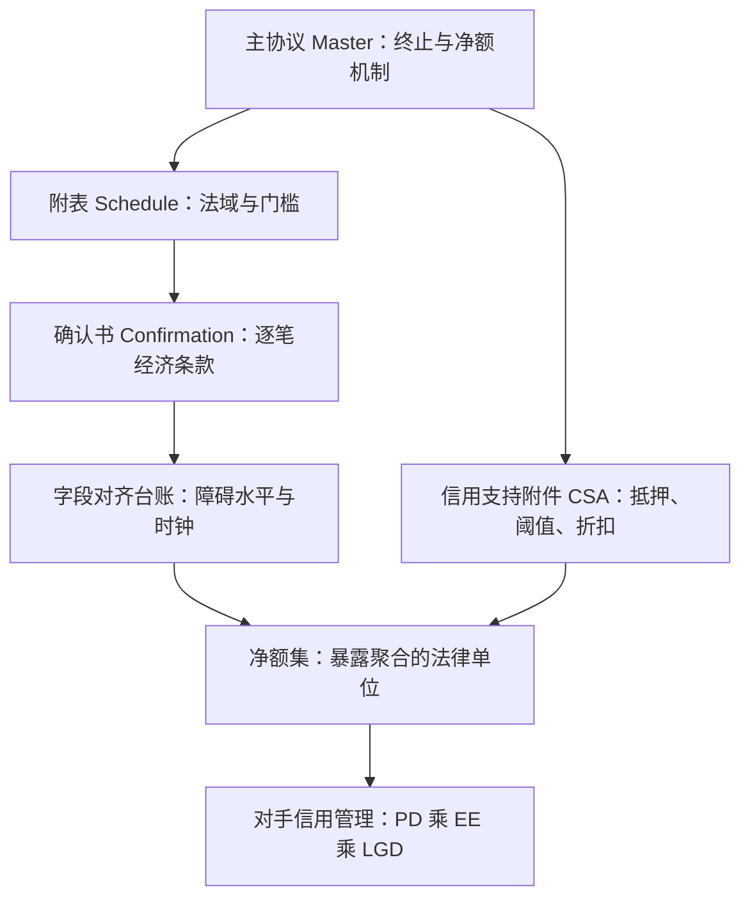

# ISDA 与文档体系

场外衍生品没有中央化的合约：净额与抵押不是会计惯例，是写在主协议里的法律构造；文档缺一格，风险模型里就多一行没人认领的暴露。

<footer>—— 据 ISDA 1992/2002 年主协议文本与 1994/2016 年信用支持附件整理</footer>

[上一课](/quant/ot-issuer-hedging)把发行台的对冲写成日常运作，但每一条对冲腿、每一笔保证金、每一次终止，都长在合同上。本课进入法律层：主协议、附件、确认书与信用支持文件如何把净额结算变成可执行的权利。前课反复出现的两个词在此落地——「净额集」从哪里取得法律效力，对消凭什么不能跨对手。

## 问题

两万笔互换与期权，逐笔独立看是两万张合同；违约时清算人若可以挑拣履约（cherry-picking），正市值留给你、负市值终止掉，净额不存在，抵押的根基也不存在。缺口是法律构造：必须让全部交易在违约时被视为一份合同的终止，且这一构造在对手所在司法辖区可执行。文档缺口的另一面同样真实：确认书晚到、条款字段与定价系统不一致、障碍时钟在确认书里与台账里写得不一致——定价认为的对消，法庭上不成立。

术语翻译：cherry-picking（挑拣履约）就是清算人当挑剔的买家——对你有利（欠你钱）的合同宣布作废，对你不利（你欠钱）的合同照常执行。单一协议条款的全部意义，就是堵死这种挑法。

## 方法

主协议三层：主协议本体（Master）写终止、违约事件与净额机制，跨交易一次性签署；附表（Schedule）改默认条款——适用法律、自动提前终止与否、交叉违约门槛；确认书（Confirmation）逐笔写经济条款。结构化产品的确认书字段即[雪球深化](/quant/ot-autocall-snowball-deep)的字段表：障碍水平、观察时钟、日历与调整惯例逐格对上台账，这是「条款即价格」的合同面。信用支持文件（CSA）独立签署：合格抵押品清单、估值折扣、独立金额与阈值、争议解决与补仓频率——暴露剖面课里 CSA 的每个参数都对应这里的合同字段。

$$
\text{终止净额}=\max\Bigl(\sum_i V_i,\,0\Bigr)\quad\text{而非}\quad\sum_i \max(V_i,0)
$$

1992 年版主协议用 Market Quotation（询第三方报价定终止额），1998 年俄罗斯违约期间市场报价不可得，机制失灵；2002 年版改为 Close-out Amount，由守约方按商业合理原则自行确定。中国 2022 年施行的《期货和衍生品法》写明终止净额结算不因单一交易违约而整体无效，净额的可执行性由此在立法层面落地。

数字实例：违约时与对手有 3 笔交易，市值 +500 万、−300 万、+200 万。逐笔清算，两笔正值只能各自主张 700 万，负的 300 万照样要付；终止净额只有一个数：$\max(400\text{万},0)=400$ 万。两式相差的 300 万，就是「单一协议」这条法律构造的直接标价。

## 机制

净额的机制核心是单一协议条款：全部交易构成一份协议，违约时一并按终止净额清算。它是风险的，因为各司法辖区的破产法不同——有些法域承认主协议与净额，有些对特定交易设强制留置。法律意见登记簿（netting opinions）因此是净额集的一部分：对某个对手所在法域没有有效意见，其交易在监管口径里不得并入净额集，[暴露剖面](/quant/cva-exposure-profile)的聚合单位随之改变。抵押的机制是降暴露而不是消除暴露：CSA 把当前暴露压到阈值附近，风险迁往保证金期内的跳价与抵押品本身的缺口——「有 CSA 故信用风险为零」在 2008 年已经失效，[抵押与资金链](/quant/rc-collateral-funding)的折价螺旋是它的市场面。

常见误区：签了 CSA 就当信用风险归零。CSA 只把日常暴露压到阈值附近，从对手违约到补足抵押之间还有几天保证金期，市场可以跳价；抵押品本身还有折价与法律隔离问题——2008 年「有抵押」的大账本同样出了大洞。

## 边界

本课是工程口径不是法律意见：具体交易的法律有效性取决于法域与文本，净额意见由法务出具并登记。不展开违约后的处置与拍卖机制——那是下一课对手方信用管理的入口。定义文件（利率、股本、大宗）只点名：[多曲线与 OIS](/quant/multi-curve-ois)课已经见过指数退场如何改写曲线的合同地位，定义文件的修订与确认书的 fallback 是同一机制在文档层的样子。

## 小结

- 场外的净额与抵押是法律构造：单一协议条款使终止净额成立，效力逐法域确认并登记。
- 文档三层分工：主协议管机制、附表管法域与门槛、确认书管逐笔条款；CSA 管抵押。
- 确认书字段必须与定价台账对齐，障碍水平与观察时钟尤其如此。
- Market Quotation 在 1998 失灵促成 2002 Close-out Amount；净额可执行性有赖立法与判例。
- 出处：ISDA 主协议与信用支持附件文本；《期货和衍生品法》（2022）；暴露与抵押的量化口径沿 [CVA 暴露剖面](/quant/cva-exposure-profile)与[抵押与资金链](/quant/rc-collateral-funding)。
