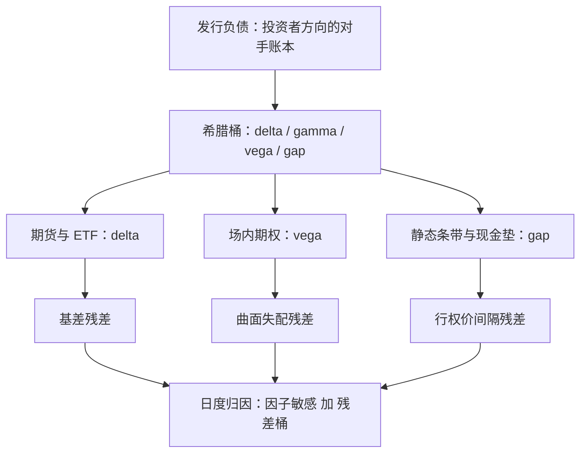

# 发行方视角：对冲与风险

发行结构化产品不是承销一次卖断，是开一本与投资者方向相反的账本；发行价差是对冲成本、资金成本与信用成本之后剩下的数，不是发行之前就锁定的利润。

<footer>—— 据 Leland, Journal of Finance, 1985 与场外衍生品做市实务整理</footer>

[上一课](/quant/ot-barrier-portfolios)把账本上的障碍按标的、水平与时钟聚合成一张暴露地图。产品解剖三课走完，本课转入发行方：雪球与 FCN 的负债挂上自己的账本之后，怎么对冲、成本从哪来、盈亏怎么归因。市场层面发行台群体行为对价格的反馈，[对冲商的堆积](/quant/snowball-dealer-hedging)已经写过；本课止于单一发行台，后课的法律与信用层默认已经读完本课。

## 问题

发行有两种模式：卖断（back-to-back，发行同时把结构原样转手给对冲商，价差一次性收讫）与留存账本（发行方自己持有反向头寸并动态对冲）。卖断模式下发行方只承担文档与信用，留存模式下发行方持有的是投资者的负债端：delta、gamma、vega、gap 全部反向落在自己账上。缺口是把发行利润当已锁定收益：留存账本的利润是逐日对冲出来的，对冲频率、工具与残差处理每一环都在改写它。错在哪一步、剩多少，要靠归因回答，不能靠发行时刻的价差回答。

## 方法

留存账本按三步走。第一步，负债分解：把发行负债的希腊按桶登记——delta 与 gamma 沿现货、vega 沿波动曲面、障碍前的不连续暴露单列 gap 桶，聚合输入正是[上一课](/quant/ot-barrier-portfolios)的障碍地图。第二步，工具映射：delta 用标的、期货与 ETF，vega 用场内期权，缺口用静态条带加现金垫；每条腿写出可得性与失配——场内行权价与到期是离散的，场外条款是连续的。第三步，执行纪律：对冲频率与观察网格对齐，观察日前收紧带宽、障碍远离时放松，这是[离散对冲频率](/quant/delta-hedge-freq)立的口径；隔夜跳空单列情景，沿[隔夜跳空对冲](/quant/overnight-gap-hedge)的两列报告——按当前频率的流量，与停手后的观察日缺口。

## 机制

发行利润的机制口径：对投资者的负债按票息 $c$ 计价，对冲组合的期望成本加资金与信用成本是 $c^{*}$，留存模式的发行价差是 $c-c^{*}$ 的逐日实现，不是合同签署日的数。价差为什么存在：财富端对复杂条款有支付意愿，发行台承担对冲残差与库存风险作为对价——[零售结构定价偏贵](/quant/ot-fcn)的实证方向在此与做市逻辑接上。Leland 的机制在离散再平衡处起效：交易成本使连续复制不可达，对冲者应以按成本与频率调整过的波动率做决策，带宽是成本与风险的交换，不是技术细节。

希腊的符号不随叙事走：敲入带附近的凸性符号取决于条款组合，[奇异风控地图](/quant/vt-exotic-risk-map)的变号结论在账本层同样生效——同一周发行的两只雪球，降敲节奏不同，对冲方向可以相反。不这么做会错在哪：按「雪球发行人一定在跌时卖期货」的统一叙事设置对冲，等于把别人的账本当自己的。

日度归因的残差桶必须留位置：市场因子敏感之和解释不了的部分——观察日跳变、曲面插值差、对冲执行的滑点——进了残差桶才有人看着它。残差桶持续为正或为负，先查工具映射与频率，再查模型。

## 边界

本课不给单一发行台对市场价格的反馈下结论——那是[堆积](/quant/snowball-dealer-hedging)课的聚合层；不展开信用与文档：对手违约、净额与保证金是后课缺口。对冲工具的场内约束（行权价间隔、涨跌停、竞价深度）在本课只点名，下一单元沿[涨跌停与集合竞价](/quant/cn-limit-auction)的口径展开。限额的设置沿用情景表达：单点 gamma 限额不足以约束障碍账本，触碰概率乘损失的情景限额是[希腊限额](/quant/omm-greeks-limits)的延伸。

## 小结

- 发行分卖断与留存账本：留存的利润是逐日对冲实现的，不是发行价差锁定。
- 负债分解成希腊桶，对冲按工具映射；对冲频率与观察网格对齐，缺口单列情景。
- 价差机制：条款复杂性的支付意愿减对冲、资金与信用成本；离散再平衡的成本沿 Leland 口径进带宽。
- 凸性符号随条款走，不随叙事走；归因必须留残差桶。
- 出处：Leland, *JF*, 1985；聚合与情景口径沿[障碍结构的组合](/quant/ot-barrier-portfolios)、[希腊限额](/quant/omm-greeks-limits)与[奇异风控地图](/quant/vt-exotic-risk-map)。
