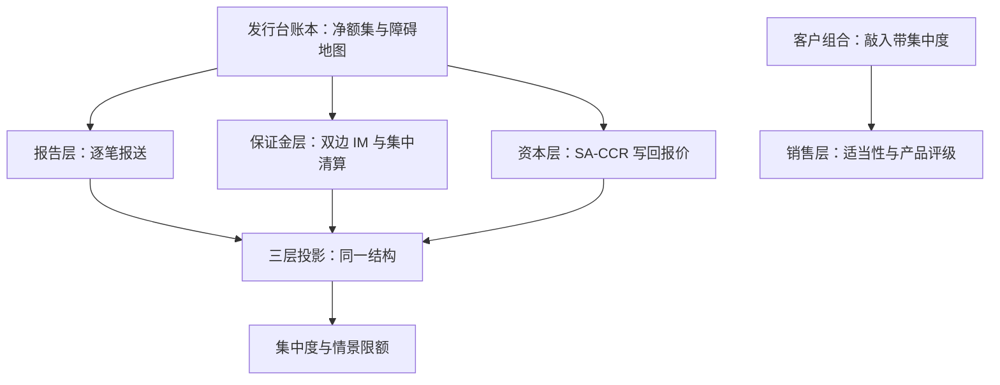

# 组合效应与监管

单笔合规不等于组合合规：监管的对象从来不是一份确认书，是账本、客户群体与市场上同步运行的对冲规则。

<footer>—— 据 BCBS-IOSCO 保证金要求框架（2015，分阶段实施至 2022）与中国证券业协会《证券公司场外期权业务管理办法》（2020）整理</footer>

[上一课](/quant/ot-exchange-hedge-otc)把场内对冲的残差分桶认领。本课把视角拉到最高一层：产品条款之外，组合与制度如何改写风险。三条线：发行台账本的组合效应、客户群体的组合效应、监管对两者的结构化要求。前七课的产出——谱系表、障碍地图、净额集、残差桶——在此都是监管口径的输入。

## 问题

账本内两笔头寸风险对消，监管是否承认，取决于它们是否在同一法律净额集——[文档体系](/quant/ot-isda-documentation)立的构造直接变成资本与暴露的计算单位。客户侧的效应更隐蔽：同一个月发行的两百只雪球，敲入线挤在同一指数区间，单只看分散良好，组合看是同一事件的重仓——客户的集中度、发行台的 gamma 峰、市场上同步的对冲流量，三层是同一个结构的三种投影，[对冲商的堆积](/quant/snowball-dealer-hedging)写的市场反馈是它的第三层。缺口是：组合效应既不被单笔检查捕捉，也不被逐产品的适当性检查捕捉。

## 方法

监管四层各落一个动作。报告层：场外交易逐笔报送集中结算与统计系统，字段与确认书一致，报送迟漏本身是合规事件。保证金与清算层：非集中清算的双边组合按 BCBS-IOSCO 框架交换变动与初始保证金——分阶段实施到 2022 年 9 月覆盖到日均名义超 80 亿欧元的机构集团；可清算产品强制集中清算，双边暴露换成对 CCP 的暴露，口径沿 [CCP 清算](/quant/ccp-clearing)。资本层：SA-CCR 把净额集、抵押与久期折成交易对手信用风险暴露，资本成本反过来改写报价——[监管资本下的定价](/quant/rc-regcap-pricing)立的「资本写回报价」在结构化产品上同样生效。销售层：适当性管理把[雪球定价课](/quant/snowball-pricing)的销售口径变成程序——产品风险评级、投资者匹配、双录与冷静期，中国场外期权的交易商与投资者分层沿《证券公司场外期权业务管理办法》。

## 机制

监管盯组合的机制理由是系统性风险的载体：危机传导不靠单笔违约，靠同步规则的共振——保证金触发的同步抛售沿[抵押与资金链](/quant/rc-collateral-funding)的折价螺旋，对冲触发的同步流量沿[拥挤螺旋](/quant/crowding-spiral)。合规因此必须给组合留两个量：法律净额集内的可对消量（资本口径），与跨对手、跨产品的不可对消集中度（风险口径）；两者不许互相借用。限额把集中度写成情景：同一敲入带上的存续名义、触发时按[对冲流量对深度](/quant/ot-exchange-hedge-otc)的冲击估计，挂进[限额体系](/quant/rk-limit-system)。不这么做会错在哪：每只产品都通过了单笔适当性，敲入集中触发的那一周，发行台的对冲与客户的赎回同时到门口，监管与账本一起发现「组合」这个对象此前不存在。

保证金规则的分阶段实施表本身就是一条风险时间线：新阶段生效日前后，过去双边免 IM 的组合一夜进入抵押品需求，合格的国债与现金被重新分配。制度日程要挂进压力测试日历，与观察日历同等对待。

## 边界

本课不写监管条文史，规则文本以现行有效的为准；跨境产品的法域冲突只在净额意见处点名。投资者保护的微观机制（双录、举证）属于销售管理专题。策略层面的台账与版本治理沿[策略台账体系](/quant/sl-registry)与[中国市场合规红线](/quant/cn-compliance-map)，不重复。

## 小结

- 组合效应有两层：账本内的法律对消与客户群的敲入带集中，单笔检查都测不到。
- 监管四层：报告、保证金与清算、资本、适当性；每层把前课的产出变成程序。
- 法律净额的可对消量与跨对手集中度分列，不许互相借用。
- 系统性风险的载体是同步规则：保证金、对冲、赎回三条共振线各挂情景限额。
- 出处：BCBS-IOSCO 保证金框架（2015–2022）；中国证券业协会《证券公司场外期权业务管理办法》（2020）；口径沿[抵押与资金链](/quant/rc-collateral-funding)与[限额体系](/quant/rk-limit-system)。
