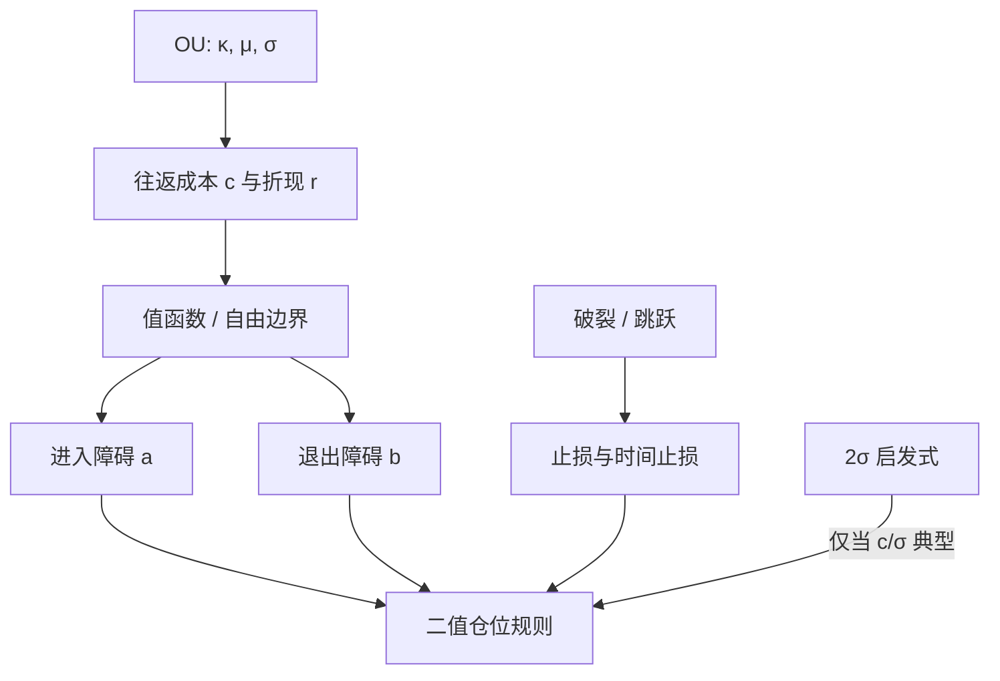

# OU 最优停时

在带折现与往返成本的 Ornstein–Uhlenbeck 价差上，开平仓是一对自由边界：偏离必须大到使期望折现收益覆盖摩擦与等待，启发式的两倍标准差只是这条边界的粗糙代理。

<footer>—— 均值回复最优交易见 Bertram, Analytic Solutions for Optimal Statistical Arbitrage Trading, Physica A, 2010；系统处理见 Leung and Li, Optimal Mean Reversion Trading, 2015</footer>

[OU 残差](/quant/ou-spread) 给出 $\kappa,\mu,\sigma$ 与半衰期；[半衰期与开平阈值](/quant/half-life-bands) 说明 Gatev 等人的 2σ 是可复现启发式，不是从动力学推出来的最优障碍。本篇把进出写成最优停时（或随机控制）：无仓时选进入水平 $a$，有仓时选退出水平 $b$，目标可以是单位时间期望利润、折现利润或成本后夏普。Bertram（2010）在 OU 加比例成本下给出解析结构；Leung 与 Li 把多组目标与约束写成同一套变分不等式。它补的不是又一个魔术数字，而是：**阈值必须随 $c,\kappa,\sigma$ 与折现率一起动**；样本内搜 $k$ 而不对这组参数负责，等于把停时也推进过拟合。

## 问题

无成本、可连续交易、线性效用或风险中性时，OU 的瞬时漂移 $\kappa(\mu-z)$ 在偏离处最大，最优往往是「立刻满仓、在均值平」——这与任何有摩擦的市场冲突。引入往返成本 $c$（价差单位）与折现率 $r>0$（资金占用与模型风险），进入必须等到 $\lvert z-\mu\rvert$ 足够大，退出往往**不到**均值就走：再等交叉要付时间风险与再一次可能的扩散走扩。问题是解出函数 $a(c,\kappa,\sigma,r)$、$b(c,\kappa,\sigma,r)$，而不是再网格搜索 $k=1.5,2,2.5$。

目标函数不同，边界不同。最大化单位时间净利润（Bertram 一类）不显式惩罚路径方差；最大化折现期望会让 $r$ 升高时障碍更远或区域缩小；夏普目标把波动放进分母，通常给出更保守的进入。必须先写目标，再谈「最优」。回测里用夏普选 $k$、用论文公式写进文档，是两套问题混为一谈。

### 进入、退出、止损是三个停时

完整规则至少三个障碍：进入 $a$、获利退出 $b$、止损 $d$（或时间止损 $T_{\max}$）。经典双障碍常省略 $d$，假定模型永远正确。真实 DGP 含 [协整破裂](/quant/cointegration-break) 与跳跃，$d$ 买的是误设保险，保费是纯 OU 下被切掉的期望。最优停时文献多数在**给定 SDE 正确**的条件下解 $a,b$；止损应来自对误设的显式建模（体制切换、断裂强度），而不是把 $d$ 也放进同一无摩擦变分式里一起「优化夏普」。

半衰期 $\ln 2/\kappa$ 不是持仓天数的上限，也不是 $b$ 的位置。它只是条件期望衰减的时间尺度。首达时间的分布有长尾；最优 $b$ 来自值函数的平滑粘贴，不来自「等一个半衰期」。时间止损是对长尾与破裂的截断，见[止损与时间止损](/quant/statarb-stops)。

## 方法

**SDE 与成本。** $dz=\kappa(\mu-z)\,dt+\sigma dW$。每次进出支付 $c$（可非对称：$c_{\mathrm{in}}\neq c_{\mathrm{out}}$，反映做空与冲击）。仓位取 $\{-1,0,+1\}$ 或连续仓位；后者变成奇异随机控制，实现更难，常先解二值仓位。值函数 $V_{\mathrm{flat}}(z)$、$V_{\mathrm{long}}(z)$ 满足 OU 生成元加上折现，在自由边界上值匹配与平滑粘贴。

**Bertram 的单位时间目标。** 在循环「进入–退出–再进入」下，期望循环利润除以期望循环时间，对障碍求导得到解析或半解析的最优 $a,b$。直觉：成本升则 $\lvert a-\mu\rvert$ 升；$r$ 或模型风险升则循环必须更快或单次利润更高，往往同时推远进入、提前退出。$\kappa$ 降则等待变长，同样的 $c$ 可能使最优选择是**不交易**（区域空集）。这与半衰期过滤是同一约束的连续版。

**Leung–Li 框架。** 把进入与退出分成两个最优停时问题，允许折现、允许有限时域、允许仓位约束。数值上用 ODE 打靶或 PDE 变分不等式。实务不必每次解 PDE：可把 $(c/\sigma_{\mathrm{stat}},\,r/\kappa)$ 做成两张无量纲表，形成期估 $\kappa,\sigma$ 后查表得 $k$，再加执行安全边际。关键是 $c$ 要用可成交的有效价差与冲击，不是报价价差的一半。

### 参数误差下的「最优」会反噬

$\hat\phi$ 近 1 时 OLS 下偏，$\hat\kappa$ 偏大，查表会给出过近的 $a$，策略显得更勤快——这是均值回复估计里最贵的有限样本偏误，最优停时把它放大成更高换手。应对 $\kappa$ 用中位数无偏或向较小 $\kappa$ 收缩，再解边界；或对边界本身加保守垫。$\beta$ 时变时，$z$ 不是同一 OU，最优边界跟踪的是一条正在漂移的原点，看起来像「阈值自适应」，实则在用错误状态交易。应先稳定 $z$（形成期切片、Kalman 预测残差、GH 未拒绝），再解停时。

## 机制

生成元 $\mathcal{L}=\kappa(\mu-z)\partial_z+\frac12\sigma^2\partial_{zz}$ 刻画瞬时权衡：靠近均值，漂移小、再等的期权价值可能超过立刻平仓；远离均值，漂移大但到达时间的不确定性与止损风险上升。平滑粘贴要求在最优边界上导数连续，否则可以微移障碍提高值函数。成本 $c$ 在进入时从值函数扣一块，使「刚刚值得进」的点外移。这就是 2σ 启发式有时能用的原因：对某一组典型的 $c/\sigma_{\mathrm{stat}}$，最优 $k$ 碰巧在 1.5–2.5；成本结构一变，$k$ 应变，固定 2 不会跟着走。

有[门限协整](/quant/threshold-cointegration) 时，DGP 自己在带内不拉，最优进入必须在经济门限之外；把线性 OU 的 $a$ 解在门限以内，理论利润在真实过程里是零减成本。有 HMM 体制时，值函数应依赖滤波概率，高 $\sigma$ 体制的 $a$ 更远。常参数障碍是对「体制概率钉在平静」的特解。

连续仓位的最优控制往往给出「偏离越大仓位越大」，与杠杆限额、借券与冲击凸性冲突。二值或分段线性仓位不是因为理论不够，而是因为执行与风险预算是一等约束。

### 与 Gatev 规则的对照

GGR：形成期距离选对，交易期 2σ 开、交叉平、期末强平。优点是零停时参数、可复现、多重检验负担小。缺点是不随品种成本与 $\kappa$ 变。最优停时：参数多，必须把估 $\kappa,\sigma,c$ 的样本与交易样本切开，否则边界在样本内完美、样本外崩溃。工程折中：用无量纲表把 $k$ 写成 $c$ 与 $\kappa$ 的函数，函数形式预先指定，只在形成期插入点估计，不在交易期重新优化障碍。

## 边界与工程取舍

解析解依赖高斯 OU、常数 $c$、无限时域。跳跃、隔夜缺口、离散交易时段会让实际首达早于或晚于扩散公式。应把「触及则下一可交易时刻按中点离场」写进规则，并把跳过障碍的额外损失算进 $c$。不要在 $\hat\phi>0.99$ 时仍输出一组很近的 $a,b$。不要用风险中性测度下的 OU（利率、商品）参数去解物理测度的交易障碍。

篮子残差相关时，各腿单独最优停时的叠加不是组合最优：同时触碰会放大冲击。应在组合层加风险预算，或只交易正交化后的主残差。容量使 $c$ 随规模上升，最优 $a$ 外移直到区域消失——这是策略容量的停时表述。

出处链应写 Bertram 与 Leung–Li，而不是只写 OU 的物理原文。交易篇的贡献是摩擦与目标函数，不是重新发现均值回复扩散。

## 小结

- 有成本与折现时，OU 的最优开平是自由边界问题；2σ 只是特定摩擦下的启发式代理。
- Bertram（2010）给出循环利润/时间目标下的解析结构；Leung–Li 把折现、有限时域与约束放进统一停时框架。
- 边界随 $c,\kappa,\sigma,r$ 移动；$\hat\kappa$ 上偏会把最优停时变成过度交易。
- 止损对应模型误设，通常不能与纯 OU 的 $a,b$ 放在同一无摩擦目标里一起优化。
- 先确认残差仍是可交易的 OU（无 GH 破裂、门限之外），再解障碍；体制切换时障碍应依赖滤波概率。
- 出处：Bertram, *Physica A*, 2010；Leung and Li, *Optimal Mean Reversion Trading*, 2015；启发式对照 Gatev, Goetzmann and Rouwenhorst, *RFS*, 2006。
