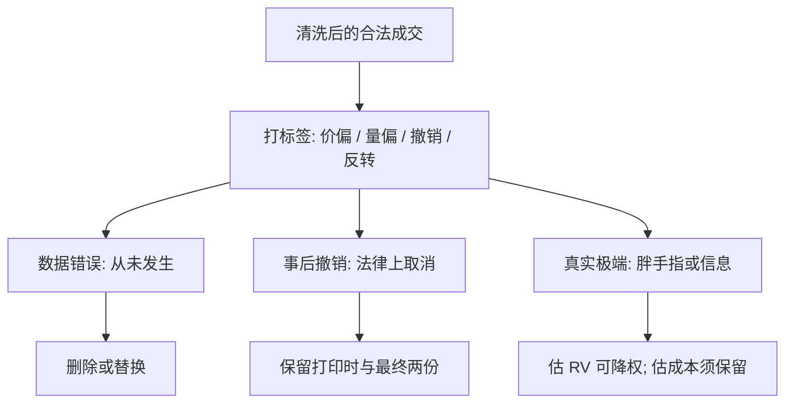

# 异常成交与错价

    
过滤器可以删掉不可能为真的记录；仍留在样本里的极端成交，有的是录入错误，有的是胖手指，有的是真实的信息或流动性冲击——三者进模型的方式不能相同。

    <footer>—— 在 Barndorff-Nielsen 等人的实务过滤与交易所错单处理规则之上的工作区分</footer>

[Tick 数据清洗](/quant/tick-cleaning) 解决的是合法性：闭市打印、非正价格、交叉报价、孤立的录入跳点。清洗之后，样本里仍会留下数量或价格极端的成交。它们可能是做市商键盘多打一个零、数据商把小数点移位、交易所随后宣布的错单（busted / erroneous trade），也可能是宏观秒级的真实成交。把它们一律当噪声删掉，会低估尾部流动性成本；一律当有效价格，会让 [已实现波动](/quant/rv-noise) 与 [有效价差](/quant/effective-realized-spread) 被单笔劫持。本篇处理这层**带业务含义的异常**：如何识别、如何与清洗规则分工、如何在估计里降权而不是装看不见。

## 问题

合法性过滤用的是支撑集：价格必须为正。异常成交用的是**经济可行性**：以当时簿的深度与最小报价单位，这一笔的价格、数量是否可能被真实订单生成。一笔比前一中点偏离 8% 的成交，在迷你股灾里可能真实，在平时可能是打印错误。同一统计阈值无法同时服务两种制度。

交易所自己有错单机制：明显偏离参考价的成交可被撤销，随后的数据源会发更正。研究若用「当时看到的打印」做实时策略，与用「T+1 更正后的磁带」做事后 RV，结论会不同。问题是建立标签，而不是再写一条更严的中位数规则。

### 三类应分开的极端

第一类是**数据错误**：字段错位、合约代码张冠李戴、未复权的拆股日。它们从未发生在市场上。第二类是**错单与撤销**：当时撮合了，事后被规则取消，法律上不当作成交。第三类是**真实极端**：胖手指若未被撤销，对手方确实成交；信息到达时的大单也是真的。三类对持仓、对波动、对交易成本的含义不同。混成一个 `outlier=True` 布尔值，下游无法决定是删、是改、还是保留并标注。

胖手指（fat finger）常常是真实撮合：价格或数量偏离意图，但簿上对手的单被吃掉了。若交易所未撤销，它应进入执行成本与存货，只是不应单独代表有效价格路径。RV 可以对这一笔降权或拆成「价格跳 + 随即反转」来诊断，而不是在清洗层物理删除。

## 方法

在清洗后的样本上打标签，至少四列：价格偏离、数量偏离、事后撤销、反转。价格偏离用当时中点或短窗中位数，但阈值按会话状态切换——开盘拍卖、熔断、涨跌停附近用另一套。数量偏离对照同标的的滚动成交量分位，以及当时可见深度：一笔量超过卖一到卖五合计很多倍，且没有后续跟风，更像错误或冰山暴露，需要人工规则或交易所标志。

事后撤销应对交易所的更正通道：成交 ID 被 cancel、insert 以新价格替换。研究库应保留「打印时」与「最终」两份，实时回放只能用前者。反转诊断：若 $t$ 的价格跳在随后 $\Delta$ 内几乎完整收回，且中间没有信息公告，则更像弹跳式错价或流动性空洞，而不是新的有效价格。这与 Hasbrouck 定价误差的想法一致——暂时成分会反转，信息成分会留下。

$$
\mathrm{rev}_t=\frac{(P_t-M_{t-})-(P_{t+\Delta}-M_{t-})}{P_t-M_{t-}}.
$$

$\mathrm{rev}$ 接近 1 表示跳被收回。可与有效价差、实现价差对照：错价往往有效价差极大、实现价差在 $\Delta$ 后接近零或变号。

### 降权，而不是只删

估计 RV、核、预平均时，对标记为疑似错价的点可以：删除、用前一有效价替换、或在核权重里降权。删除改变采样时间，进入 [不等间隔](/quant/irregular-sampling) 的偏差；替换等于承认有效价格连续。生产上应报告三种处理的区间，而不是只给一种「干净 RV」。交易成本研究则相反：若该笔对客户真实成交，必须进有效价差，哪怕事后你认为是错价。对象决定处理，没有全局最优。

## 机制

录入错误的生成是孤立的、与订单流无关的水平位移。胖手指的生成是把意图数量或价格乘错，撮合沿簿向下扫，往往伴随一串向下（或向上）的档位成交，随后人工或算法撤剩余单。信息冲击的生成是多方同时主动，后续成交会确认新水平，中点不回到原处。用「单点 vs 一串」「是否反转」「是否有公告与同行业联动」可以把三类分开，准确率不是 100%，但比单一 z-score 好。

错价进入平方收益的机制是二次的：$\Delta P$ 大十倍，对 RV 的贡献大百倍。所以异常成交对二阶矩估计的危害，远大于对一阶均值。PIN 的日度计数对单笔错价相对稳健（仍可能把方向计错），对把一笔拆成重复打印则不稳健。VPIN 的等体积桶会被超大错量提前封桶，打乱成交量时钟。异常标签因此要喂给所有下游，而不是只喂给 RV 模块。

重复打印（同一成交 ID 出现两次）看起来像数量异常，本质是数据管道错误，应在清洗的 ID 去重层解决。本篇说的异常是 ID 唯一、字段合法、经济上仍可疑的点。两层过滤器责任不同，日志也应分开，否则删除率无法诊断。

### 与微观结构噪声的关系

[微观结构噪声](/quant/microstructure-noise) 假定几乎每笔都有一个小的 $\varepsilon_t$，来自价差与离散。异常成交是稀疏的、幅度大的污染，用 i.i.d. 噪声或平稳噪声模型去吸收会把噪声方差估爆，并带偏已实现核的带宽选择。正确顺序：清洗合法性 → 标记异常 → 在干净且已降权的样本上估噪声与 RV。不要把胖手指拟合进 $\mathrm{Var}(\varepsilon)$。

## 边界与工程取舍

没有不含主观的异常定义。阈值必须按品种流动性分桶：对高价、高流动性股票 1% 的偏离已经极端，对薄货可能是正常的一档跳。涨跌停、指数熔断、个股停牌复牌的第一笔，应进入白名单，禁止当错价删。跨市场套利腿中，一腿看起来像错价、另一腿在对敲，可能是真实的延迟。

不要用全样本分位做回测标签，那会前视。不要把策略亏损的日子事后标成「数据有问题」再删。不要假设数据商已经应用了交易所全部撤销——延迟可能以天计。合规上，若研究用于最佳执行报告，必须以对客真实成交为准，不能用「疑似错价」把贵的成交从样本里拿掉。

A 股没有美式那样频繁的 trade bust 公开磁带，但有行情源对涨跌停、临时停牌、集合竞价的特殊标志。异常成交的优先信息是交易所标志位，其次才是统计反转。标志位缺失时，统计规则只能当候选，不能当法律事实。

## 小结

- 合法性清洗之后仍要单独处理异常成交：数据错误、事后撤销、真实极端三类不可共用一个布尔值。
- 识别靠偏离、深度、撤销通道与随后反转；信息跳会留下，错价常收回。
- 处理依赖用途：RV 与核应对疑似错价降权或做敏感性；执行成本必须保留真实成交。
- 错量会破坏 VPIN 的成交量时钟；错价以平方项主导 RV。标签要作为数据契约传给下游。
- 阈值因果、分品种、尊重停牌与熔断白名单；禁止用亏损日回写异常。
- 出处：过滤框架见 Barndorff-Nielsen et al., *Realised Kernels in Practice*；暂时价格误差与反转见 Hasbrouck 对定价误差的讨论。交易所错单规则按各市场现行通知执行。
