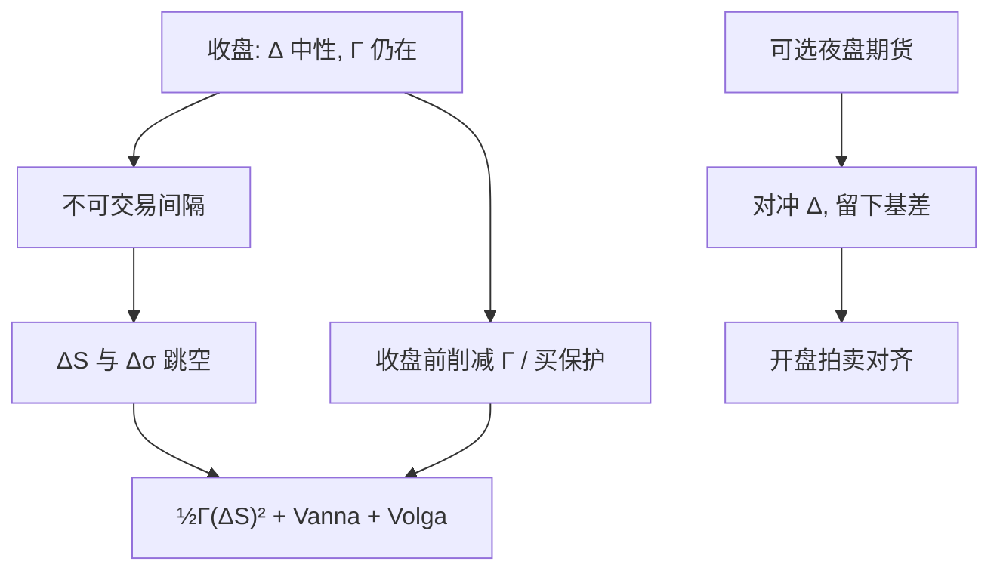

# 隔夜跳空对冲

    
收盘到开盘没有连续报价可以再平衡；这段强制的离散步把 Gamma 暴露变成对跳空尺寸的期权，不能用把日内对冲加密来消除。

    <footer>—— 隔夜与周末作为非交易间隔见 French, Journal of Financial Economics, 1980；离散复制误差见 Boyle and Emanuel, 1980</footer>

[日历效应与隔夜](/quant/calendar-overnight) 把收益拆成 close-to-open 与 open-to-close；期权账本还要把这一拆解写成对冲指令。日内可以把 [Delta 频率](/quant/delta-hedge-freq) 优化到五分钟，收盘铃一响，下一步再平衡最早也要到次日开盘（或夜盘）。跳空 $\Delta S$ 一次实现，空头 Gamma 的损失是 $\frac12\Gamma(\Delta S)^2$ 量级，中间没有切线可走。Black–Scholes 连续复制在这段区间不成立，与跳跃项同类，见 [离散对冲误差](/quant/discrete-hedge-error)。本篇写收盘前如何处置 Gamma、Vega 与交叉项，以及夜盘、周末、宏观发布如何改变「隔夜」的长度。

## 问题

记收盘时组合 Delta 已中性，Gamma 为 $\Gamma_{\mathrm{c}}$，隐含波动为 $\sigma$。隔夜现货跳 $\Delta S$，波动也可能跳 $\Delta\sigma$。P&L 近似

$$
\Delta\Pi \approx \tfrac12\Gamma_{\mathrm{c}}(\Delta S)^2+\nu\Delta\sigma+\mathrm{Vanna}\,\Delta S\,\Delta\sigma+\mathrm{Volga}\,(\Delta\sigma)^2+\Theta\Delta t+\cdots.
$$

第一项的符号由 $\Gamma_{\mathrm{c}}$ 决定：卖出期权在大跳时亏损。$\Delta t$ 按日历可能是 17 小时或整个周末，Theta 按日历accrual 还是按交易时段 accrual，会改变「隔夜收的时间价值」是否够补偿跳空。问题是：在无法交易标的的时段，哪些风险可以事先用期权结构转移，哪些只能用限额（限制 $|\Gamma_{\mathrm{c}}|$、限制短到期空头）。

股票现货通常无夜盘，指数期货可能有。对冲工具与现货隔夜不是同一信息集：期货跳了、现货尚未开，基差在开盘拍卖收敛。用期货把「隔夜 Delta」对冲到零，剩下的是基差与 Gamma。A 股 T+1 与涨跌停进一步限制开盘后的补救，见日历文对制度的强调。

### 隔夜不是又一个日内格子

把收盘价与开盘价塞进五分钟 RV 的第一格，等于假设跳空来自同一扩散。隔夜信息（财报、海外市场、宏观）常是跳跃。加密日内对冲不改变这一格的尺寸。周末效应把间隔拉长，但交易时段并不按小时线性增加对冲机会。对冲政策应按「不可交易小时数 × 事件强度」分档：普通工作日夜、周末、FOMC 夜、个股财报夜，限额不同。

开盘价用集合竞价还是开盘后数分钟中点，决定你把多少价格发现算进「隔夜」。对冲绩效归因必须与 [日历](/quant/calendar-overnight) 文同一口径，否则 Gamma 损失会被算进开盘滑点或反过来。

## 方法

**收盘 Gamma 限额。** 按产品规定：隔夜 $|\Gamma|S^2$ 对应的一次 $N$ 倍标准差跳空（或历史分位数跳空）不得超过损失预算。短到期平值最贵，应在事件前减仓。这比「Delta 中性即可过夜」严：Delta 中性只消灭一阶。

**用期权转移跳空。** 买廉价虚值保护或买回部分短到期，把 $\Gamma_{\mathrm{c}}$ 的符号翻过来或削峰。成本是 Theta 与 Vega。方差互换或 VIX 期货对指数隔夜方差敏感，可对冲 $\frac12\Gamma(\Delta S)^2$ 中与方差相关的一块，但权重不是香草的 $\Gamma(S)$，见 [方差互换](/quant/variance-swap-vix)。个股财报夜常用同一标的的虚值跨式，而不是用指数波动去代理。

**夜盘 Delta。** 若有流动性足够的期货夜盘，可对冲隔夜 Delta 与部分跳空，但基差风险留下。政策应规定：夜盘对冲的是期货 Delta 还是试图跟踪现货；在现货开盘拍卖时如何把期货腿与现货腿对齐，以免双倍对冲。

### 波动率跳与交叉希腊

隔夜不只动 $S$。财报后隐含波动常崩溃（事件落地），$\Delta\sigma<0$，多头 Vega 亏损，空头 Vega 盈利，同时现货大动。Vanna 项 $\partial^2 V/\partial S\partial\sigma$ 在偏斜产品上很大：现货下跌伴随 vol 上升是股指常见情景，见 [Skew](/quant/vol-skew)。只对冲 Delta 的隔夜政策会在「跌且 vol 升」时同时吃到 Gamma 与 Vanna。收盘前的结构应看 [Vanna / Volga](/quant/vanna-volga) 暴露，而不是只看 $\Delta$。[Heston](/quant/heston) 的负相关 $\rho$ 把这一情景写成模型；用 Black Delta 过夜等于忽略它。[SABR](/quant/sabr) 的微笑动态同样改变隔夜有效 Delta。

## 机制

不可交易间隔把复制从连续半鞅变成「扩散 + 一次强制跳」。跳的分布由隔夜信息集决定，不是把日内 $\sigma$ 乘 $\sqrt{\Delta t_{\mathrm{calendar}}}$ 那么简单：信息到达在闭市并不均匀，周末宏观更少、财报夜极多。隐含波动的期限结构短端含隔夜跳的价格；用无跳的扩散去解释隔夜期权，只能把瞬时波动推到不合理水平。

对冲者能做的是改变跳发生时的损益剖面：降低 $|\Gamma|$、买入尾部、或把 Delta 预置到跳的方向（若有观点）。预置 Delta 是方向性赌注，不是中性对冲。做市默认应是剖面管理。开盘后的第一段，有效价差宽、拍卖机制主导，[对冲频率](/quant/delta-hedge-freq) 应先宽后紧，避免把开盘噪声当成要追的 Delta。

### 与 Pin risk、Charm 的隔夜叠加

到期日隔夜若仍持有平值空头，跳空与 [Pin risk](/quant/pin-risk) 叠加：开盘可能直接越过 $K$，行权状态翻转。Charm 与 Color 告诉你：即使现货开盘等于收盘，隔了一夜 $\tau$ 减少，Delta 与 Gamma 已经变了。收盘中性不等于开盘中性。高阶希腊的隔夜用途见 [Charm / Color](/quant/higher-greeks)。商品与农产品在报告夜（EIA、USDA）的跳空机制类似，只是状态变量不同，见 [裂解](/quant/crack-spread) 与 [天气升水](/quant/ag-weather-premium)。

Theta 按日历夜计提、跳空按开盘实现，二者会计期间对齐，才能判断「隔夜是否赚了保险费」。若 Theta 只在交易时段计提，隔夜看起来永远在亏时间、只在开盘实现 Gamma——归因会系统性错。

## 边界与工程取舍

没有夜盘的标的，隔夜 Gamma 无法用标的微调和缓，只能用期权或承受。有夜盘但深度差时，夜盘对冲本身制造跳空。宏观日历与个股日历重叠时，指数对冲不能覆盖个股残差跳。涨跌停把开盘跳截断，Gamma 损失有上界，但补涨补跌把风险推到随后的交易日，限额应跨日。

连续模型（Heston、SABR、局部波动）可以把隔夜写成一段长 $\Delta t$ 的扩散，这通常低估尾部。事件夜应使用带跳的情景或历史隔夜经验分位数，而不是模型 $\sigma\sqrt{\Delta t}$。French（1980）提醒周末长度；它不给出你的 Gamma 限额数字。Hull 给出希腊字母分解；隔夜政策是把分解用在没有中间交易的区间上。

用开盘后五分钟的已实现方差去「校准」隔夜隐含，样本含拍卖微观结构，会把滑点写成波动。隔夜期权的公平价应对的是 close-to-open 分布，口径要锁死。

## 小结

- 隔夜是强制离散步，日内加密对冲不能消灭跳空 Gamma。
- 收盘政策应限制 $|\Gamma|$、转移尾部，并处理 $\Delta\sigma$ 与 Vanna，而不是只维持 Delta 中性。
- 夜盘期货对冲 Delta 时留下基差；开盘拍卖口径必须与收益分解一致。
- 周末、财报、宏观发布应分档限额；$\sigma\sqrt{\Delta t}$ 低估事件夜。
- 到期日隔夜叠加钉住与 Charm：收盘中性不是开盘中性。
- 出处：French, *JFE*, 1980；Boyle and Emanuel, *JFE*, 1980；跳跃与离散见 Bertsimas, Kogan and Lo，2000；希腊字母见 Hull；微笑动态见 Heston，1993 与 Hagan et al.，2002。
