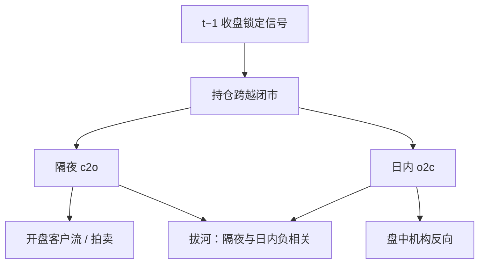

# 隔夜 / 日内 alpha

把收盘到收盘拆开之后，许多异象的利润几乎全部发生在隔夜，日内则在做反向的拔河；谁在开盘交易、谁在盘中交易，决定了 alpha 写在哪一段。

<footer>—— Lou, Polk &amp; Skouras, A Tug of War: Overnight Versus Intraday Expected Returns, Journal of Financial Economics, 2019</footer>

日收益默认是一块。拆成**隔夜**（close-to-open）与**日内**（open-to-close）之后，均值、因子暴露与异常利润可以对得很不对称。Lou、Polk、Skouras（2019）系统展示：美股上市场溢价与动量等策略的收益集中在隔夜，日内往往弱、零甚至为负；隔夜与日内收益之间存在负相关的「拔河」。这与本站 [日历与隔夜](/quant/calendar-overnight) 的制度分解衔接，但对象从「一天不像一天」推进到「异常收益住在哪一段时钟」。客户结构是候选机制：个人更影响开盘附近的持仓跨越，机构在盘中提供反向价格压力。本篇写分解口径、Lou 等的主要事实，以及把隔夜 alpha 当成可交易信号时会踩的拍卖与前视陷阱。

## 问题

若收益在连续交易的半鞅里均匀产生，隔夜只是一段不可交易的时间，均值应按方差或按日历长度摊。事实不是这样：隔夜方差大，但更惊人的是**均值的分配**——不少样本里股权风险溢价主要出现在隔夜，日内平均接近零。对异常更尖锐：动量的 WML 利润可以几乎全是隔夜的，日内动量甚至为负；某些反转、某些微观结构策略则主要在日内。若仍用收盘到收盘评价因子，会把两段符号相反的现金流捆成一个 α，既高估可实现性（隔夜无法用盘中算法去「赚」），也误导关于谁在提供错误定价的推断。

需要同时回答三个测量问题。价格用哪一个：官方收盘、收盘拍卖、开盘拍卖还是开盘后短窗口中点？间隔如何处理周末与假日？因子组合是用收盘价排序、再用隔夜收益评价，还是开盘就重做信号？第三个问题决定有没有前视：用今天收盘的 MAX 去「解释」昨夜的隔夜收益，是把结果当原因。

### 拔河：隔夜与日内的负相关

Lou 等把个股或组合的隔夜收益与随后日内收益放在一起，观察到负相关：隔夜涨得多的，日内更容易回吐，反之亦然。这不是简单的买卖价差弹跳——弹跳会在极短窗口消失——而是开盘附近的客户流与盘中客户流方向相反的持久模式。个人在收盘附近或隔夜消息后更可能成为净需求，把价格推过隔夜；机构在日内把价格推回去。组合层面的拔河意味着：只持有隔夜、在开盘平仓的纸面策略，会把机构在日内提供的负 alpha 丢掉；全日持有则把两段对冲掉一部分。评价必须分段报，不能只报净的收盘到收盘。

开盘拍卖把隔夜信息的很大一块写进开盘价。于是「隔夜收益」含价格发现，不只是闭市跳空。口径若改成开盘后 30 分钟相对昨日收盘，隔夜溢价的大小和归属的策略都会变。比较论文必须先对齐价格定义。

## 方法

对每个交易日 $d$，

$$
R_d^{\mathrm{c2c}}=R_d^{\mathrm{c2o}}+R_d^{\mathrm{o2c}},
$$

在算术收益下近似成立（对数收益则精确可加）。对因子组合，用$t-1$ 收盘可获得的信号决定持仓，分别累加 $t$ 的隔夜与 $t$ 的日内。市场因子本身也要拆：隔夜市场收益与日内市场收益，估计两套 β。Lou 等的核心表是：各异象组合的平均隔夜收益、平均日内收益、以及两者之差。动量、盈利等偏「隔夜」；短期反转、某些流动性提供偏「日内」。国际样本与 ETF 上应单独做，因为开盘机制不同。

执行约束要写进方法，而不是脚注。隔夜 alpha 若只能通过在收盘买、开盘卖来实现，则两边都撞上拍卖与流动性最差的时段，冲击成本可以吃掉账面均值。用期货或 ADR 的夜盘去复制「隔夜」改变了信息集：夜盘已经是连续交易，不再是 Lou 等的美股现货闭市。A 股有午休、T+1、集合竞价，隔夜与日内的切分多一段午休，不能直接套用美股表格的符号。

### 信号时钟必须与收益时钟一致

用收盘价算 12−1 动量，持有到下月收盘，隔夜利润来自「收盘后到次日开盘」的一段重复许多次。若有人用开盘价重做排序，再去收隔夜收益，信号含开盘信息，隔夜不再是未被信号使用的区间。MAX、IVOL 尤其危险：它们由日收益构成，若日收益含今天隔夜，再用这个 MAX 去预测今天隔夜，部分是同期。正确的是：特征在 $t$ 收盘锁定，预测 $t$ 到 $t+1$ 的隔夜与 $t+1$ 的日内。财报盘后发布会把信息写进隔夜，PEAD 的隔夜腿会特别强——这是信息释放制度，不是动量的同一机制，应单独标记公告日。

## 机制

客户结构是 Lou 等强调的通道。个人投资者相对更可能把持仓留过隔夜、更可能在开盘附近交易注意力股票；机构的算法与再平衡集中在连续竞价。于是需要隔夜风险补偿的那一侧（或被注意力推高的那一侧）把正的期望写在 c2o；日内则出现反向的价格压力。动量的隔夜集中符合「赢家被个人愿意隔夜持有、开盘仍有需求」；日内为负符合「机构在盘中卖出相对高估」。这与 [MAX](/quant/max-effect) 的彩票需求、与 BW 情绪的零售投机可以接到同一条客户链上，但频率不同：情绪是月与年，隔夜/日内是每个交易日的两段。

风险补偿叙事：不可交易时段无法对冲，隔夜应有溢价。它解释市场的隔夜均值，解释不了为什么有的异常在日内、有的在隔夜，除非不同股票的隔夜不可对冲性不同。微观结构叙事：收盘拍卖与开盘拍卖的设计、做市商隔夜存货，会把价差与跳空写成均值。它预测小盘、宽价差股票的「隔夜 alpha」更脏。稳健做法是在大盘、可投资宇宙上重做分段，看符号是否还在——Lou 等的部分结果在大盘上仍然存在，说明不只是微型股弹跳。

### 与因子模型、执行算法的接口

四因子、五因子若只用收盘到收盘估计，β 是两段暴露的平均。一只股票可以隔夜高 β、日内低 β，全日回归看不出来。对冲若在日内做，对的是日内 β，隔夜腿仍裸露。隔夜缺口对冲是另一条目的问题；这里只需承认：alpha 的时钟不匹配对冲的时钟时，残差不是模型失败，是交易时段失败。执行算法（VWAP、TWAP）默认在日内把仓位摊完，恰好会**丢掉**隔夜 alpha、留下日内那一段——若日内是负的，VWAP 实现会系统性地差于收盘到收盘回测。这是研究到产品最常见的缺口之一。

纸面组合用收盘价成交。隔夜 alpha 的实现至少涉及收盘拍卖的参与与次日开盘的平仓或继续持有。拍卖里的冲击、未成交与价格改善，不会出现在 CRSP 收盘价回测里。分段报告若仍假设收盘价无冲击，只是把同一偏见拆成了两段。

## 边界与工程取舍

不要把期货夜盘收益叫做 Lou 等的隔夜：信息集与可交易性都变了。不要用第一根五分钟 K 线当开盘价去复制论文，除非声明。不要在 T+1 市场假设开盘卖出隔夜多头没有约束。不要把所有隔夜正收益都归因于散户：宏观公告、海外市场、指数期货在闭市时的价格发现同样写入开盘，这是公共信息的时钟，与客户结构可并存。拆公告日与非公告日是最低限度的识别。

容量：能稳定收取隔夜溢价的，是能够在拍卖中提供流动性或能够持有跨越、并承受开盘波动的资本。高频抢开盘不是本篇对象，也不是 Lou 等的识别策略。作为研究诊断，隔夜/日内分解极有价值——它告诉你异常更像持仓跨越的需求还是盘中的反向。作为交易规则，必须单独做拍卖冲击、隔夜跳空风险与对冲工具（若有夜盘衍生品）的成本，不能把 JFE 表格的年化隔夜收益写进产品说明书。

与日历效应的分工：周末、假日改变的是隔夜长度与信息积累，应单独报告周五收盘到周一开盘。把所有 c2o 平均在一起，会把周末效应摊进隔夜 alpha。French 的周末效应与 Lou 的策略分解是不同频率上的同一把刀：先切时钟，再谈定价。

出处：Lou, Polk & Skouras, *Journal of Financial Economics*, 2019。日历与周末见 French, 1980 及本站日历条目。客户与开盘注意力见 Berkman 等开盘文献。不要用隔夜动量去替代 Jegadeesh–Titman 的月度 WML 出处。

## 小结

- 收盘到收盘应拆成隔夜与日内；许多异象（含动量）利润集中在隔夜，日内常弱或反向。
- 隔夜与日内存在拔河式负相关，指向不同客户在不同时段的方向。
- 信号必须在收益区间开始前锁定；开盘拍卖口径会改变「隔夜」的含义。
- VWAP 类日内执行会系统性错过隔夜腿，使实现偏离全日回测。
- 夜盘衍生品、T+1、涨跌停会改写分段，不能直接套用美股现货结论。
- 出处：Lou, Polk & Skouras, *JFE*, 2019。
