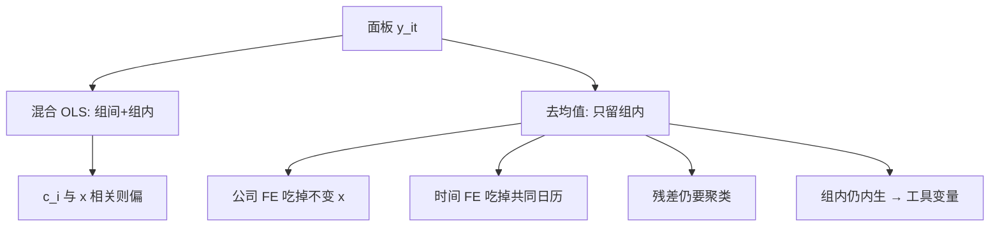

# 面板与固定效应

不可观测的公司禀赋若与回归元相关，混合 OLS 把禀赋写进斜率；减掉公司均值之后，识别改从同一公司内部的时间变化来，而不是从「谁一直更大」来。

<footer>—— 组内估计的教科书表述见 Wooldridge, Econometric Analysis of Cross Section and Panel Data；金融应用中的标准误仍须回到 Petersen 的聚类讨论</footer>

上一课用 [bootstrap](/quant/bootstrap-finance) 修补了聚类渐近的有限样本，但估计量仍常是混合 OLS：把所有 $(i,t)$ 当成同一条回归。公司金融与部分资产定价里，$x_{it}$ 与不随时间变的公司特质 $c_i$ 相关——治理、行业、未观测风险。混合 OLS 的 $\beta$ 是组间加组内的混合物。[聚类标准误](/quant/clustered-se) 只改精度，不拆开这两层。固定效应把 $c_i$ 吸收掉，让斜率来自**组内**变异。本课缺口：何时必须 FE，以及去均值之后还剩多少识别；工具变量留给下一课处理组内仍在的内生。

## 问题

$$
y_{it}=x_{it}^\top\beta+c_i+\delta_t+u_{it}.
$$

$c_i$ 是公司固定效应，$\delta_t$ 是时间固定效应。若 $E[c_i x_{it}]\neq 0$，混合 OLS 不一致。组内变换 $y_{it}-\bar y_i$ 消掉 $c_i$，用同一公司的偏离估 $\beta$。双向去均值再消 $\delta_t$。问题是：你要的经济对象究竟是组内弹性，还是包含「谁一直如此」的长期差异。

资产定价里，个股对特征的回归若加公司 FE，等于问「估值比自己历史更便宜时，当月收益是否更高」，而不是「便宜股是否平均回报更高」。两问都可以，不能混称为同一个溢价。Fama–MacBeth 截面更接近后者；公司 FE 更接近前者。

### 不随时间变的 $x$ 会被吃掉

性别、上市地、创始人持股若几乎不变，公司 FE 无法识别它们。这不是软件故障。要识别它们只能靠组间（混合 OLS 或随机效应），并接受 $c_i$ 相关的风险，或找组内有变化的代理（CEO 更替）。时间 FE 同样吃掉只随日历变的宏观，所有识别来自截面差异——这正是月度特征回归想要的。

随机效应要求 $c_i$ 与 $x$ 不相关，金融里通常不成立。Hausman 检验在异方差、聚类下名义水平差，不宜当唯一决策。更干净的是：经济上 $c_i$ 是否像遗漏风险，若是则 FE。

## 方法

**估计。** 最小二乘虚拟变量与去均值在线性模型等价。高维双向 FE 用交替投影（例如对 $i$ 与 $t$ 迭代去均值）。权重：等权公司与按市值加权是不同总体，FE 不会自动完成加权。

**标准误。** 去均值后仍按公司聚类（序列相关还在），月度面板仍考虑时间聚类。不要以为「已经 FE」就可以用同方差公式。短 $T$ 的 Nickell 偏误出现在**动态面板**（滞后 $y$ 加 FE），Arellano–Bond 一类 GMM 是后话；静态特征回归的 FE 没有 Nickell 这一项。

**与事件研究。** 公司与时间双向 FE 的面板是事件研究的回归写法（广义差分）。处理若几乎在同一天发生，时间 FE 会把处理吃掉，识别崩溃——应回到事件窗，而不是「加更多 FE」。

### 多维 FE 不是越全越好

行业–年 FE、城市–年 FE 能吸收更细的冲击，也吃掉更多变异。报告应给出：FE 集合、组内 $R^2$、识别所依赖的变化来源（谁在何时变了 $x$）。若组内变异只来自两三次并购，斜率是那几次并购的案例研究。

## 机制

组内估计把每个公司当成自己的对照。共同冲击若被时间 FE 吸走，剩下的是相对变化。一致性靠 $E[u_{it}\mid x_{i1},\ldots,x_{iT},c_i]=0$ 一类严格外生。反馈——今天的 $u$ 改变明天的 $x$（业绩影响杠杆）——会破坏严格外生，FE 仍偏。这是下一课 IV 的入口，不是再加一层 FE 能修的。

机制上，FE 把方差分解成组间与组内，只用组内。效率低于随机效应（若 RE 假设真），但金融里偏差通常更致命。Petersen 的模拟说明：正确 FE 加错误标准误，仍会过度拒绝——精度与识别要分开修。

「加了公司和国家 FE」并不自动控制文化或制度。它控制的是**不随时间变**的加性差异。制度若在样本期改革，那部分进残差或应写成时变政策变量。

### 资产定价里的 FE 陷阱

对个股月收益加公司 FE，会吃掉平均收益的截面——而平均收益正是定价要解释的对象。因子模型的 $\alpha_i$ 是公司均值，FE 会把它从左边拿走。定价检验应让 $\alpha$ 留在截距或 FM 的 $\lambda_0$，不要用公司 FE「洗」掉定价误差再宣布模型好。公司 FE 更适合：同一公司杠杆变化与收益、同一公司分析师覆盖变化与流动性，这类**组内政策**问题。

## 边界与工程取舍

$T=2$ 的 FE 就是差分，噪声大。非平衡面板里进入退出与 $c_i$ 相关（差公司退市），组内样本被选择。A 股壳资源、ST 会让公司 id 不稳定，FE 含义漂移。

工程：公司金融默认公司 FE + 年份 FE + 公司聚类；资产定价截面默认时间 FE 或 FM，慎加公司 FE。不要用高维 FE 替代 [工具变量](/quant/iv-finance)。不要把组内 $R^2$ 与总体 $R^2$ 比高下。动态滞后应明确是否进入 Nickell 区域。

## 小结

- 固定效应把不随时间变的加性异质吸收掉，斜率改由组内变化识别。
- 聚类标准误与 FE 同时需要：一个管精度，一个管这一层遗漏。
- 资产定价要解释的平均收益会被公司 FE 吃掉；对象是溢价时不要默认公司 FE。
- 反馈破坏严格外生，应接到工具变量，而不是继续堆虚拟变量。
- 出处：组内估计见 Wooldridge 面板教科书；金融标准误实践见 Petersen, *RFS*, 2009；动态面板偏误见 Nickell, *Econometrica*, 1981。
