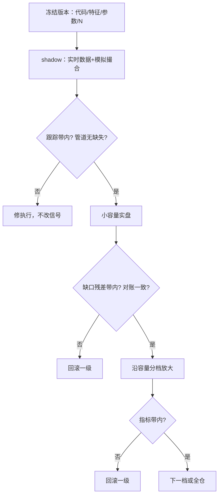

# 分级上线：shadow 到全仓

影子组合不花真钱，也买不到拒单、部分成交与排队；它验证的是定义，不是执行。

<footer>—— 据 Arnott, Harvey and Markowitz, Journal of Financial Data Science, 2019；Almgren et al., Risk, 2005 整理</footer>

[上一课](/quant/risk-overlay-cap)把触发器与恢复规则钉进政策层，组合在研究环境里已经三层齐备：权重、成本、风险。但所有数字产自同一个环境。分级上线把「验证过的定义」交给「不可控的执行」，台阶是 shadow 组合、小容量实盘、再逐步放大。环境分离的架构原则已在[研究、模拟、实盘隔离](/quant/research-sim-prod)立过：晋级产生不可变版本、试验计数可数；本课是那套原则在单次研究上的执行手册，写每级的通过判据与回滚条件。

## 问题

一步跳到全仓，错在同时引入两类未知：执行未知——拒单、部分成交、排队、状态机 bug；规模未知——容量曲线是小账户校准的，AUM 一步到位后自身冲击当场改写入场价。两类未知搅在一条净值里，出了问题既不能归因也不能修。反过来，shadow 太久同样有错：影子不花真钱，「再观察一个月」永远有诱惑，影子期还容易被当成第三段样本内反复调参——影子成了另一种过拟合。台阶的目的由此而来：**每级只引入一类新不确定性**，其余全部冻结。

## 方法

**第一级 shadow。** 冻结版本（代码哈希、特征定义、参数、声明的试验数 $N$）接实时数据，在与实盘同一套状态机与撮合假设里跑，不离开公司。通过判据预指定：与研究权益曲线的跟踪带、数据管道零缺失、时钟与日历一致。**第二级小容量。** 真账户、最小名义。判据是执行量而非收益：成交缺口对[成本预测](/quant/execution-cost-forecast-cap)的残差带内——模型第一次接受真成交检验；完成率、对账一致、风控闸门无误触发。**第三级放大。** 沿[策略容量与冲击衰减](/quant/strategy-capacity-decay)的 $\mu_{\mathrm{net}}(A)$ 分档，每档预指定停留时间与指标带；带外自动回滚一级而不是停机——回滚是默认动作，停机是最后动作。每级晋级都产出新版本号，$N$ 加一。

每级停留时间至少覆盖信号最短决策周期的一个完整换手；否则连一次完整调仓都没看过就晋级，判据全落在「没发生过的事」上。

## 机制

台阶有效靠控制变量。shadow 引入实时数据与时钟，小容量引入真实撮合，放大引入自身冲击与市场反应；每级观测到的偏差都能归因到刚引入的那一类，修复动作因此是局部的。放大的机制是**校准**而非验证：小容量实盘是估计冲击函数的数据源，短路径的夏普标准误大到没有判别力，所以判据必须设计成缺口残差、完成率这类高频可测量，而不是收益本身。影子期与模拟期的偏差用来修执行——状态机、日程、参与率——不用来回改信号；改信号则台阶全部清零重来，这是[研究、模拟、实盘隔离](/quant/research-sim-prod)的硬约束。

回滚与晋级共用同一组指标带：带的上侧是晋级判据，下侧是回滚触发，同一次冻结里对称写出。这让「回到上一级」成为一个不需要开会决定的技术动作，而不是一次挫败感驱动的政治决定。

## 边界

影子的撮合假设若比实盘乐观（中点成交、无拒单），所有判据失效——影子必须与实盘共享同一套状态机；由人盯盘点「假如成交」的不是影子，只是演练。放大不能因「前几笔赚了」加速：那是在用运气缩短停留时间，与用回测安慰自己是同一种错误。台阶中途市场制度切换，处理方式是回上一级重测，不是就地改参数硬扛。最后，台阶不是保险箱：它防的是「未知的未知集中爆发」，防不了 alpha 本身死亡——那是下一课监控的事。

## 小结

- 台阶原则：每级只引入一类新不确定性——实时数据、真实撮合、自身冲击。
- 判据设计成高频可测的执行量（跟踪带、缺口残差、完成率），收益不进判据：短路径没有统计效力。
- 回滚是默认动作，与晋级共用指标带；停机才进入研究账户走新试验。
- 影子必须与实盘同一套撮合假设；放大按 $\mu_{\mathrm{net}}(A)$ 分档，不用盈亏加速。
- 出处：Arnott, Harvey and Markowitz, *JFDS*, 2019；架构原则见[研究、模拟、实盘隔离](/quant/research-sim-prod)，冲击校准见[线性与平方根冲击](/quant/sqrt-impact)。
