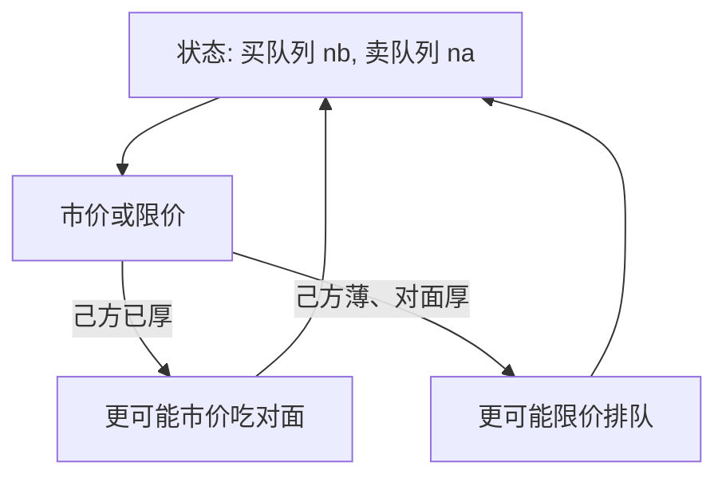

# Parlour 限价簿排队

限价单的价值取决于你前面排了多少人、对面簿有多厚。同一笔意向，在队尾可能变成市价单，在队空时才值得挂着等。

<footer>—— Parlour, Price Dynamics in Limit Order Markets, Review of Financial Studies, 1998</footer>

[透明度](/quant/transparency-anonymity)停在信息集：谁看见深度与身份。主干已有[LOB 几何](/quant/lob-structure)与[订单类型](/quant/order-types)，本课不重画价位阶梯，也不重推 Kyle 的 $\lambda$。缺口是第一张**策略性限价簿**：交易者在市价与限价之间选择，限价单进入队列，执行概率依赖两侧深度。Parlour（1998）用两档、序贯到达，把排队写成马尔可夫博弈。

## 问题

报价驱动模型里，专家或做市商外生存在，客户只提交市价。电子簿上每个人都可以挂限价，流动性供给是进入队列的决策。若己方队列已长，新来的限价单执行概率低，不如吃掉对方；若己方队列空、对方厚，挂单等待更划算。价格动态来自深度状态的转移，而不是外生的 $V$ 跳跃。问题是：在极简的两档簿上，能否存在均衡的下单规则，使观察到的价差与深度有持续性。

这与 Ho–Stoll 不同：没有一个指定经销商的库存状态，状态是**两侧队列长度**。库存被分散到排队的限价单里。

### 为什么必须先排队、后竞争

若忽略队列，限价单像一张免费的美式期权，人人挂在最优价，簿无限厚。时间优先让位置成为稀缺：先到的人拥有更高的成交权。Parlour 把这一点做成序贯博弈的核心，Foucault 下一课再加入被捡便宜（picking-off）的等待成本。本课先让执行概率随队深下降。

真实簿有多档、隐藏单、pro-rata。Parlour 的两档是为了让马尔可夫状态可写。结论的定性——己方厚则更可能吃市价——在多档上仍然是一阶直觉。

## 方法

离散时间，每期来一个交易者，方向随机或带估值。簿上各只有一个价位的买卖队列（长度为状态）。行动：市价买、市价卖、限价买、限价卖、或不交易。市价立刻与对方队头成交；限价加到己方队尾。价值过程可以是公开随机游走，使「等」有机会成本。均衡是状态依赖的策略：在每个队列对 $(n_b,n_a)$ 上给出行动概率。

比较静态：己方队列增加，限价的执行概率下降，市价概率上升。于是深度有均值回复：太厚的一侧会少人再挂、多人来吃。价格（由哪一侧被吃）因此也有条件动态。

### 与 Glosten 电子簿的预告

Glosten（1994）把整张簿写成竞争性限价供给曲线，逆向选择决定各档深度。Parlour 几乎没有逆向选择，主引擎是执行概率与时间优先。两篇合在一起才是后文单元：排队摩擦 × 信息。本课先隔离排队。

## 机制

时间优先把流动性供给变成占位。占到队头的人出售即时性，与 Grossman–Miller 的「在场」同构，但在场被实现为队列名次。名次靠后的限价单其实是一份很差的期权：价格走了还没轮到。理性交易者不会在队尾无限堆积，深度因而内生有限——即使没有逆向选择。这纠正「电子簿会自动无限深」的幻觉。

价格持续性来自状态持续性：一侧被吃薄之后，下一期更可能有人在那一侧补限价，而不是继续同方向市价。于是短期价格有反转成分，来源是簿的补给，不是 Roll 弹跳。VR 在这种市场上会小于 1，即使没有买卖价差弹跳的会计。

## 边界

两档、单位订单、无撤单，是硬边界。真实交易者可以撤单重挂抢队，排队价值被侵蚀，见后文撤单博弈。知情交易者会让「吃薄的一侧」变成信息而非补给信号，反转被削弱甚至反转成动量。tick 大小改变有几档可挂，两档模型不能谈最优放置。

不要用 Parlour 去校准 Level-2 的十档形状。它解释的是下单类型对队列状态的条件概率，不是幂律深度。

## 小结

- Parlour（1998）把限价簿写成队列状态上的序贯博弈：己方厚则改吃市价，深度因此均值回复。
- 时间优先使位置稀缺，即使无逆向选择，深度也有限。
- 簿补给可制造短期价格反转，对象不是专家库存。
- 不重画 LOB 几何；多档、隐藏、信息留给后续课。
- 出处：Parlour, *Review of Financial Studies*, 1998；几何先修见 Harris 与本站限价簿课。
