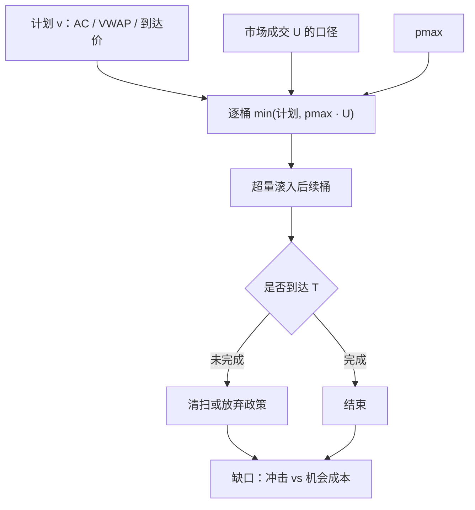

# 参与率封顶

    
把每一时段自己的成交占市场成交的比例钉死在上限以下，是在用一个可审计的容量约束代替「市场够深」的口头保证；封顶不消除冲击，只是拒绝进入冲击定律已经不可外推的那段。

    <footer>—— 对照 Perold and Salomon 对管理规模的讨论；Almgren–Chriss 与 POV 实务中的参与率约束</footer>

[上一课](/quant/dark-pool-routing)在事前不透明场所与明簿之间分配数量，剩余时间短、波动高、须参加竞价时应降低暗处等待。缺口是明簿（及可执行场所）上的强度约束：$p_t\le p_{\max}$ 几乎出现在所有机构算法里。封顶回答的是给定时钟桶内你愿意当多少流动性需求；最优 $v_t$ 可能想超过 $p_{\max}$，约束把它推到后面的桶或未完成。本课写定义、与体积时钟的关系、以及封顶如何改变 AC 轨迹的形状。不重写暗池质量表。

## 问题

市场成交增量 $u_t\Delta t$ 在时段 $t$ 发生，自己成交 $v_t\Delta t$。参与率 $p_t=v_t/u_t$（或 $v/(u+v)$，取决于是否把自己计入分母）。无封顶时，AC 前倾或开盘块可能在浅簿上拿走该分钟的大部分成交，瞬时冲击离开校准样本所在的 $p$ 区域，平方根定律外推失效。有封顶时，完成时间随机：市场清淡则拖长，可能撞上 $T$ 而未完成。问题是同时设定 $p_{\max}$、$T$ 与未完成政策，使冲击停留在可校准区，且完成率可接受。

$V$ 的口径决定封顶是真约束还是幻觉。用年度 ADV 当日内分母，开盘后二十分钟会系统性超参与；用含自己的成交当 $u_t$，高 $p$ 时分母膨胀，实际占比被低估。用不可交易的停牌日、涨跌停锁定区间的「成交」当 $V$，封顶形同虚设。

### 封顶不是风险预算

波动目标与风险预算决定**要交易多少名义**；参与率封顶决定**这些名义在时间上摊多薄**。两者同时绑紧时，可部署规模是交：想在 $T$ 内完成且 $p\le p_{\max}$，则 $Q\le p_{\max}\int_0^T u$。只设 $p_{\max}$ 却按无摩擦 $\mu$ 加码，会在 $T$ 内无法完成；只设 $T$ 不设 $p_{\max}$，回测在小盘上走出无法执行的权重。容量曲线必须在联合约束下画，见容量一文；本篇聚焦执行状态机里 $p_{\max}$ 如何截断 $v_t$。

「我们从不走超过 10% ADV」若 ADV 是过去 20 日均而执行是今天开盘，这句话在开盘桶里可以假。封顶必须定义在与交易同一时钟的 $u_t$ 上，并声明窗口长度。

## 方法

硬封顶：每桶目标量 $q_i^{\star}=\min(q_i^{\mathrm{sched}},\,p_{\max} U_i)$，$U_i$ 为该桶市场成交（或预测成交）。超出部分滚入后续桶或在 $T$ 按政策清扫 / 放弃。软封顶：超过 $p_{\max}$ 时提高临时冲击惩罚，允许在极薄流动性外的高紧迫度下短暂突破，并记录突破。审计上硬封顶更清晰；软封顶更接近带约束的最优执行，但必须把惩罚系数与 $p_{\max}$ 一起锁定。

POV 算法的 $p$ 本身就是目标而非上限；封顶型 POV 则设 $p_{\mathrm{target}}<p_{\max}$ 并加突发成交过滤器：市场异常放量时不把 $p_{\mathrm{target}}$ 用满，以免与毒性流同步，见[容量](/quant/capacity-participation)对拥挤的讨论。到达价 / AC 轨迹先算无约束 $v^{\mathrm{AC}}$，再逐桶截断并重分配。重分配规则要写死：均匀摊到剩余桶、按剩余体积曲线摊、还是提高后续 $\kappa$。不同规则在尾盘的块大小差很多。

$$
v_t=\min\bigl(v_t^{\mathrm{plan}},\,p_{\max}u_t\bigr),\qquad
\int_0^T v_t\,\mathrm{d}t \le Q.
$$

不等式在市场过淡时严格：完成率成为随机量。应事前模拟：用历史 $u_t$ 路径抽一条完成时间分布，再决定 $p_{\max}$ 与 $T$ 是否匹配 $Q$。

### 竞价、暗池与「市场成交」不同口径

开盘 / 收盘集合竞价的成交是一次性出清，不是连续 $u_t$。把竞价量计入分母再允许连续时段按 $p_{\max}$ 吃满，会双计流动性。更干净：竞价单独设数量上限（例如不超过预期竞价量的某一比例），连续时段的 $p_{\max}$ 只用连续成交。暗池成交是否计入 $u_t$ 取决于公开打印是否进入你用的市场成交源；源不一致时，封顶在暗处腿上失去意义。自己的暗处成交若计入明市场 $U$，会放松随后明簿封顶——应决定是否用「他方成交」定义 $U$。

预测 $U_i$ 的 VWAP 日程在封顶下会与实现 $U_i$ 偏离：预测偏高则计划量过大，硬封顶靠实现成交把量砍回来；预测偏低则整天参与不足，末端再突击。封顶不能补救一条错误的体积曲线，只能防止最坏桶的超速。

## 机制

机制是把瞬时冲击限制在供给曲线的局部线性（或已校准幂律）区域。微观结构上，过高参与率意味着你在该时段成为主要的消耗方，对手方深度被打穿、撤单上升、永久项更容易被写入。封顶降低「这一分钟就是知情者」的外观，与 Kyle 知情者平滑交易的定性一致，但动机首先是冲击与合规，不是隐藏私有价值。代价是执行时间变随机：流动性是外生随机流时，$p_{\max}$ 把完成时间变成该流的积分达到 $Q/p_{\max}$ 的等待时间。

拥挤机制：许多账户共用相似 $p_{\max}$ 与相似日程，会在同一分钟一起成交，市场 $U$ 含他们，每个人的 $p$ 看起来不高，加总参与却很高。封顶按自己相对 $U$ 计算，看不见同向拥挤。缓解是降低 $p_{\max}$、错开 $T$、或把指数调整日当单独状态。封顶不是对拥挤的充分统计。

### 封顶如何压弯双曲正弦

无约束 AC 在 $\kappa T$ 大时前倾。$p_{\max}$ 在前段把 $v$ 削平，库存下降变慢，后段为了完成不得不提高 $\kappa$ 或在 $T$ 清扫——路径从「前倾」变成「前段封顶、后段更陡」，风险比客户选择的 $\lambda$ 所暗示的更大。TCA 若只报平均参与率低于 $p_{\max}$，会掩盖前段被削、尾段超速。应报每桶 $p_t$ 的分位数路径，以及因封顶滚下去的量。紧迫度提高若不同时放宽 $p_{\max}$ 或 $T$，只是把违规从「冲击」改名为「末端清扫」。

$p_{\max}$ 常用 5%、10%、20%。数字没有定理。应相对 ADV 分位、自身 $\eta$ 校准样本覆盖的 $p$ 区域、以及完成率要求来选。把同业「10%」写进政策，只是借用了一个整数。

## 边界与工程取舍

涨跌停、停牌使 $u_t=0$，封顶公式除零：应定义无成交桶内不得主动加仓，或改用深度上限（不超过可见对手方某一比例），深度上限与 $p$ 封顶不是同一约束。极小 $U$ 的股票，$p_{\max}=10\%$ 仍可能是几手，价差主导，封顶约束不到冲击。T+1 不影响 $p$ 的定义，但影响反向腿能否在当日用卖出完成降杠杆。

不要用全样本搜 $p_{\max}$ 使夏普最大：那是把容量约束当成因子。不要在评价日放宽 $p_{\max}$ 让完成率好看。核对：超限次数（应接近零，若用硬封顶）、完成率、短fall 按 $p_{\max}$ 网格的样本外曲线、以及末端清扫贡献的缺口份额。报告 $p_{\max}$ 时必须附 $U$ 的定义、是否含自己、是否含竞价。

封顶与流动性地平 $H\approx Q/(p_{\max}\mathrm{ADV})$ 互为翻译。政策若同时写「10% 参与」与「两天变现」，两者必须与 $Q$ 相容，否则必有一条在说谎。

## 小结

- 参与率封顶把每桶 $v$ 限制在市场成交的 $p_{\max}$ 以内，使冲击留在校准区，并以完成时间为代价。
- $U$ 的时钟与口径（是否含自己、是否含竞价与暗池）决定约束真假。
- 它截断 AC 前倾，把风险推向后段；须重分配规则与未完成政策同时写死。
- 与波动目标、风险预算是不同旋钮：一个管名义规模，一个管交易强度。
- 同向拥挤不会出现在自己的 $p$ 里，封顶不能替代拥挤状态。
- 出处：Perold and Salomon, *The Right Amount of Assets Under Management*, Financial Analysts Journal, 1991；Almgren and Chriss, *Optimal Execution of Portfolio Transactions*, Journal of Risk, 2000/2001；POV / 参与率实务对照 Kissell 对算法约束的讨论以及容量文献中的 $p$ 网格。
