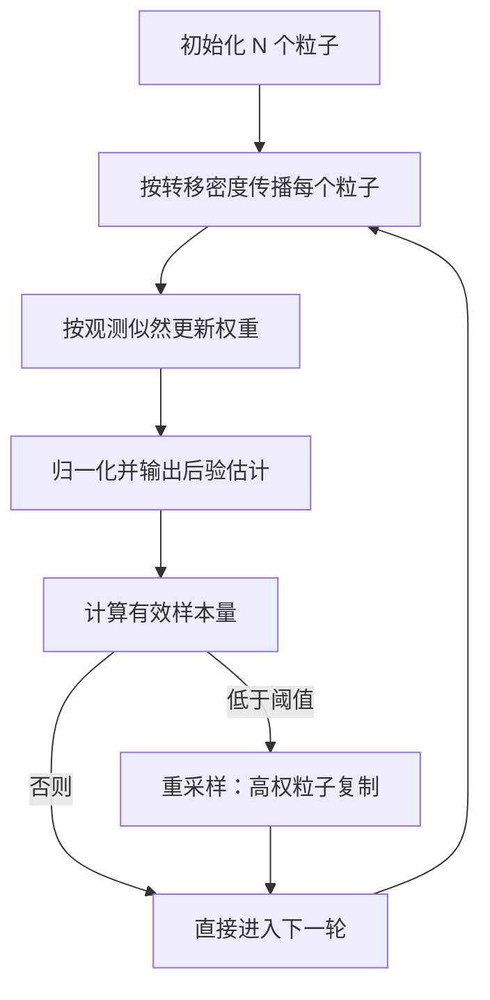
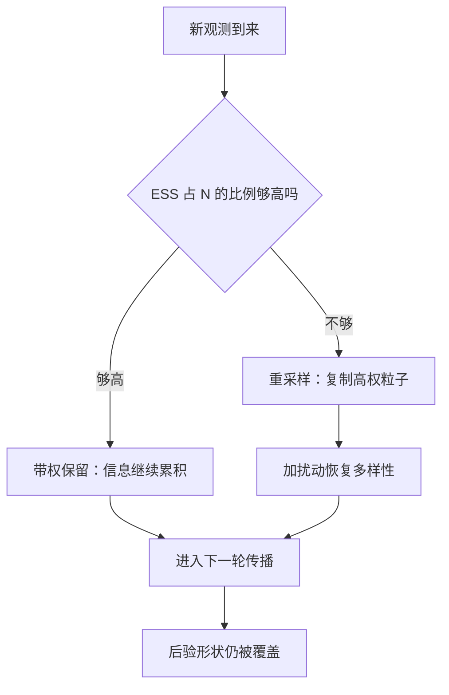

# 粒子滤波

状态不可观测、观测充满噪声时，别再硬猜单点估计——用一群带权粒子把整个后验分布搬进内存，让分布随数据逐笔滚动。

<footer>—— 据 Gordon, Salmond and Smith, 1993；Doucet, de Freitas and Gordon, 2001</footer>

[上一课](/quant/ed-case-map)把事件策略收束成一张谱系表，本课开新单元：状态估计。市场里真正关心的量——公允价差、波动率水平、当前 regime——都不在行情里，只能从带噪价格反推。线性高斯世界有 Kalman 滤波给精确解；转移或观测方程一旦非线性、噪声一旦厚尾，它只剩近似。粒子滤波换掉的是解的形态：不再解析地写下后验，而是用随机粒子群逼近它。这不是「更好用的 Kalman」，是表示层的更换。

## 问题

状态空间模型两行：状态按 $x_t=f(x_{t-1})+\eta_t$ 演化，观测按 $y_t=g(x_t)+\epsilon_t$ 到来。Kalman 滤波只在 $f$ 与 $g$ 线性且噪声高斯时给出精确后验。跳变、厚尾、阈值触发、regime 切换，任何一条都把它打回近似。[布朗运动](/quant/brownian-motion-paths)那课的维纳噪声是高斯驱动的起点，现实价格里塞满了不服从它的东西。本课写 bootstrap 滤波的完整循环与失效模式，不重推 Kalman 增益，也不展开 EM 参数估计的推导。

术语翻译：粒子就是「一份对当前状态的候选答案」加一个置信权重——2000 个粒子等于同时维护 2000 个平行世界，各自有一条状态路径，权重记录它与观测的吻合度。滤波（filtering）指只用截至 $t$ 的数据估 $t$ 时刻状态，区别于用未来数据的平滑（smoothing）。

## 方法

bootstrap 滤波四步，随每个观测滚动一轮：按转移密度撒粒子，按观测似然配权重，归一化出后验估计，权重塌缩时重采样。数字实例：取 $N=2000$ 个粒子，重采样阈值常设 $N/10$。某步算出有效样本量 $\mathrm{ESS}=1/\sum_i w_i^2=260\gt 200$，暂不动；下一步强观测把 ESS 打到 $150\lt 200$，触发重采样——按权重放回抽样 2000 个，权重重置为均匀。ESS 从 2000 掉到两位数往往只需几次集中观测，塌缩来得比直觉快。

## 机制

有效性来自大数定律：粒子经验分布以 $1/\sqrt{N}$ 的速度收敛到真后验，权重不是拍脑袋的分数，而是精确的似然比 $p(y_t\mid x_t^i)$。它对 $f$ 与 $g$ 的形态毫无要求——跳变函数、混合高斯、带阈值的观测照收，这是解析滤波器做不到的。代价藏在重采样里：复制活粒子、淘汰死粒子，粒子多样性被削，之后的差异全靠转移噪声重新长出来——粒子贫化。常见误区：把重采样后的粒子当独立样本。错在「权重均匀化」这一步——2000 个粒子此刻可能只有 150 个祖先，它们是复制品不是新证据；方差被系统性低估，置信区间随之虚窄。补救靠扰动粗糙化或正则化采样，不是靠再加粒子数。

## 边界

维度是硬墙：粒子要覆盖的体积随状态维度指数膨胀，十维以上的状态基本告别朴素粒子滤波——不是算得慢，是同等预算下后验根本没被覆盖。实时性另算一笔账：每个观测要做 $N$ 次转移加 $N$ 次似然求值。线性部分能剥离时用 Rao-Blackwellized 变体省预算，推导复杂度则直线上升。温和非线性、后验近似单峰的场景，下一课的无迹卡尔曼用确定性采样给出便宜一个量级的方案——粒子滤波留给它啃不动的厚尾与多峰。

## 小结

- 粒子滤波用带权粒子群逼近后验分布，对非线性和非高斯一视同仁。
- 循环四步：传播、加权、归一、按 ESS 判定重采样。
- 重采样治塌缩也引贫化，复制品不是新信息。
- 维度与算力是边界；温和非线性优先考虑确定性采样。
- 出处：Gordon, Salmond and Smith, *IEE Proceedings F*, 1993；Doucet, de Freitas and Gordon, *Sequential Monte Carlo Methods in Practice*, 2001；Liu and Chen, *JASA*, 1998。
