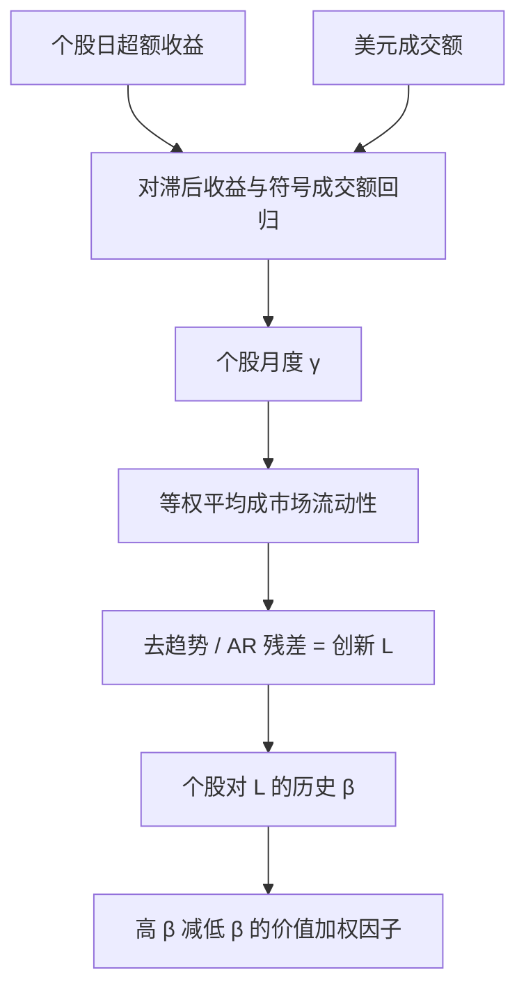

# Pastor-Stambaugh 流动性

流动性不仅是个股难不难卖的特征，也是一种共同风险：当市场整体的临时价格冲击突然变差，对这种冲击敏感的股票应当要求更高的预期收益。

<footer>—— Pástor & Stambaugh, Liquidity Risk and Expected Stock Returns, Journal of Political Economy, 2003</footer>

[上一课](/quant/hasbrouck-is)在多市场价格的协整系统里把有效价格新息方差分给各市场；IS 不是流动性、不是 PIN、不是 Kyle $\lambda$。缺口是共同流动性冲击：[Amihud 的 ILLIQ](/quant/liquidity-factor) 是个股特征溢价，还没有「市场整体突然变差、这种协方差被定价」这一条腿。本课钉 Pástor–Stambaugh 的 LIQ：从带符号成交额的临时冲击抽出 $\gamma$，再把截面平均的创新当风险因子。不重讲 Cholesky 上下界。后课有效价差默认特征 ILLIQ 与系统性 LIQ 已经分账。

## 问题

信息份额分解的是发现来源，不是「市场整体冲击变差」有没有被定价。做市资本有限。当许多股票同时需要变现，临时冲击变大，随后又部分回复——这正是流动性供给者赚取的那一段。若某些股票对「市场整体冲击变差」特别敏感，它们在流动性枯竭状态与市场同跌，持有者承担不可分散的协方差，预期收益应更高。这是风险故事，不是「这只股票平时难卖所以要补偿」的税收故事。两种溢价可以共存，持仓却不必相同：一只大盘股可以很流动（ILLIQ 低），却在危机月对市场流动性创新有高 β。

要把风险故事写成因子，必须先有一个能在长样本、日频上计算的市场流动性时间序列。买卖价差在 1960–1980 年代覆盖不全，深度更少。Pástor–Stambaugh 选的代理来自反转：给定带符号的成交额，次日收益在多大程度上朝反方向走。冲击越大、回复越强，越说明当日成交制造了临时而非永久的价格移动。问题于是收成：如何从个股回归里抽出 γ，如何把 γ 聚合成市场状态，如何把「水平」与「创新」分开，以免把长期变好的电子化趋势当成风险因子。

### 临时冲击而不是价差水平

价差是即时往返成本，γ 是「成交额推动价格、次日吐出多少」的斜率。电子化之后报价价差可以很窄，但大额成交的临时冲击仍在；危机里价差与冲击会一起恶化，平时两者可以分道。用 γ 而不是 Amihud 比率，是为了直接对准流动性供给的收益来源——[反转](/quant/short-term-reversal) 正是这段供给的截面版本。市场流动性则是这段供给在截面上的平均松紧。

Pástor–Stambaugh 的流动性是「冲击是否临时」的度量，符号约定是 γ 越负越不流动：同样的带符号成交额，次日反向收益越大，当日越缺乏深度。把它读成 Amihud 的 $|R|/\mathrm{VOLD}$ 会把特征和风险两条腿焊死，回归里再放 LIQ 就变成重复命名。

## 方法

对股票 $i$、月份 $t$ 内的交易日 $d$，估计

$$
r_{i,d+1}^e = \theta_{i,t} + \phi_{i,t}\, r_{i,d} + \gamma_{i,t}\,\mathrm{sign}(r_{i,d}^e)\, v_{i,d} + \varepsilon_{i,d+1},
$$

其中 $r^e$ 是超额收益，$v$ 是美元成交额，$\mathrm{sign}(r^e)\,v$ 是带符号的成交额。$\phi$ 吸收收益自身的一阶相关；$\gamma$ 才是流动性：预期为负。每月每只股票用该月日度观测估一组 $(\theta,\phi,\gamma)$，要求足够交易日，并对成交额做规模调整（相对市值或相对近期均值），以免高价大盘股的美元量把系数压扁。

市场流动性水平是当月个股 $\gamma_{i,t}$ 的等权平均 $\hat{\gamma}_t$。它有趋势：市场容量上升、tick 变细、电子做市进入，都会让平均 $\gamma$ 不那么负。定价需要的是**创新**。对 $\hat{\gamma}_t$ 做带滞后与趋势的回归，残差 $L_t$ 即市场流动性冲击。个股流动性 β 来自把个股超额收益对市场超额收益与 $L$ 的回归，用过去一段时间的月度观测滚动估计。按 β 排序、价值加权多空，高 β 减低 β，得到交易型因子 LIQ。

### 创新、滞后与可交易性

水平 $\hat{\gamma}_t$ 不是可交易资产。投资者不能「持有市场平均 γ」。可交易的是对 $L$ 敏感的股票篮子。因此因子构造必须先估 β、再排序，而不是把 $\hat{\gamma}_t$ 本身当右侧因子——除非你只做宏观状态变量回归。滚动窗口太短，β 是噪声；太长，会把体制切换（做市商资本结构变化）平均掉。实证上常用五年月度，并在形成期要求股票有足够的日度回归月份。

等权平均 $\gamma$ 让小盘主导市场流动性读数，这在经济上未必错：小盘的冲击对做市资本更敏感。若改用价值加权平均 γ，危机信号会被大盘的厚深度稀释。复制时必须写明聚合权重；把它和 Amihud 市场平均 ILLIQ 画在一起，相关高但不是同一个状态变量——一个来自次日回复，一个来自当日 $|R|$ 与成交额的比。

## 机制

机制的核心是流动性供给的共同性。做市商、高频做市账户、套利资本在多只股票上同时提供深度。当资本被占用（波动上升、融资紧张、赎回），他们在许多股票上同时加宽有效冲击，次日回复变大，$\hat{\gamma}_t$ 变负。高流动性 β 的股票正是在这种状态下跌得更多的那些：可能因为它们更依赖做市资本，也可能因为持有者更急于变现。风险溢价补偿的是这笔协方差，不是股票平时的 ILLIQ 水平。

另一条机制把 LIQ 和反转连在一起。个股 γ 本身就是反转对成交额的斜率；市场平均 γ 变差的月份，短期反转策略往往赚得更多——流动性供给更贵。于是 LIQ 因子的空头腿（低流动性 β）有时像「不需要这么贵的供给」的大盘厚深度名字，多头腿则在压力月承压。不要把 LIQ 的平均收益直接读成「做市利润」：因子是按 β 排的，不是按 γ 排的。

### 与特征溢价、规模的分离

特征路径说高 ILLIQ 要求补偿持有成本，即使共同冲击不大。风险路径说对 $L$ 的 β 被定价。Acharya 与 Pedersen 的流动性调整 CAPM 把净收益写成对市场收益与若干流动性 β 的函数，并允许自身非流动性进入期望收益。Pástor–Stambaugh 的实证焦点更窄：在控制市场、规模、价值、动量之后，流动性 β 是否仍预测收益。规模是主要共线：小盘 γ 更负、对 $L$ 的 β 也往往更高。价值加权与 NYSE 断点会显著削掉溢价；等权则会把微型股的测量误差写成 α。

下载 French 或其他数据源的「流动性因子」前，要看它是 Amihud 特征组合、Pástor–Stambaugh 的 β 排序组合，还是市场 $L_t$ 本身。三条时间序列的相关远低于名字暗示的程度，混用再做马赛克回归没有解释力。

## 边界与工程取舍

γ 回归在涨跌停、集合竞价、零成交日上会坏：符号成交额与次日收益被制度截断，回复被压扁或放大。A 股与新兴市场必须先处理涨跌停，否则危机月的 $L_t$ 会被规则而不是深度驱动。成交额口径（是否含盘后、大宗、暗池）会改 $v$，从而改 γ；跨数据商不可直接拼接。

不要用单月 γ 当交易信号去买「本月变不流动」的股票——那是水平，而且充满噪声。定价用的是对**市场创新**的暴露。也不要把 2008 年或 2020 年 3 月几个月的高溢价当成因子存在的证明；几个压力月决定不了样本外。若投资宇宙已是大盘可借券、高价格过滤，LIQ 溢价通常更薄，这不是复制失败，而是风险在可投资集合里被切掉了一截。

与 [Roll 有效价差](/quant/roll-effective-spread)、[Corwin–Schultz](/quant/corwin-schultz) 对照：那些是价差水平的估计，可进入交易成本模型；LIQ 是共同冲击的 β。与五因子对照：RMW/CMA 不会自动吸收流动性风险，是否加入取决于你是否声称对「做市资本状态」中性。

真实出处：Pástor & Stambaugh, *Liquidity Risk and Expected Stock Returns*, Journal of Political Economy, 2003。Amihud, Journal of Financial Markets, 2002 是特征路径；Acharya & Pedersen, Journal of Financial Economics, 2005 是把特征与若干流动性 β 放进同一期望收益方程。不要把 2003 年的 LIQ 写成 Amihud 比率的一阶差分。

## 小结

- Pástor–Stambaugh 用次日收益对带符号成交额的斜率 γ 度量临时冲击，市场平均 γ 的创新是系统性流动性风险。
- 可交易因子 LIQ 按个股对创新的 β 排序，不是按 Amihud ILLIQ、也不是按 γ 本身排序。
- 机制是做市资本的共同性；与短期反转、规模共线，价值加权会显著改溢价。
- 水平与创新必须分开：电子化趋势进入水平，定价用残差。
- 涨跌停与成交额口径会摧毁 γ；复制时要写明聚合权重与滚动窗口。
- 出处：Pástor & Stambaugh, Journal of Political Economy, 2003。
