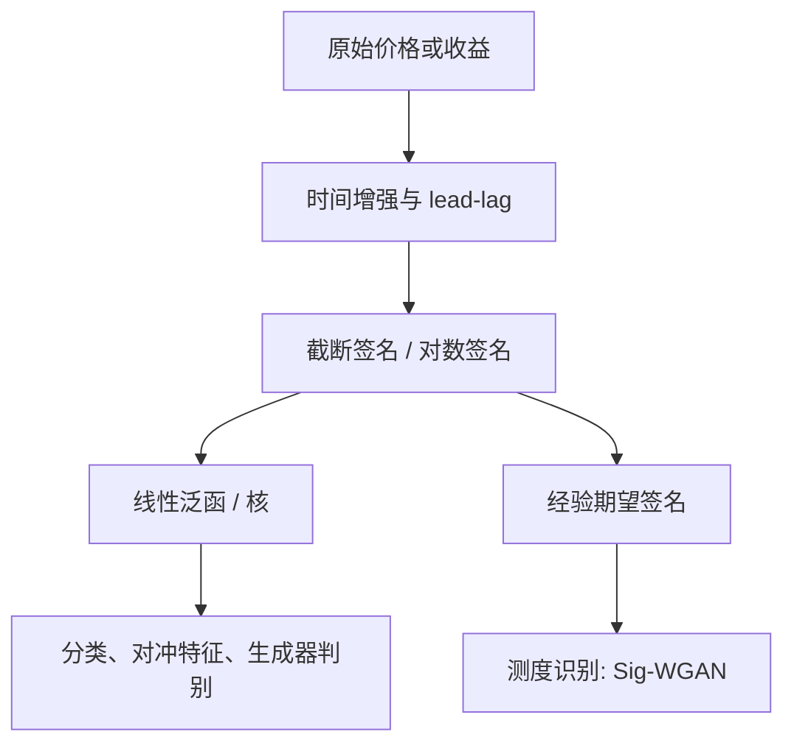

# Path Signature 特征

    
一条足够正则的路径，其迭代积分——签名——在树状等价意义下决定路径本身；连续的路径泛函因此可以被截断签名上的线性函数任意逼近。

    <footer>—— Lyons, Differential equations driven by rough signals, 1998；特征与期望见 Chevyrev and Lyons, 2016</footer>

机器学习要吃「一段轨迹」时，常见做法是重采样成固定向量，或交给 RNN。重采样丢掉时钟与二次变差的几何；RNN 的归纳偏置不透明。路径签名把 $X:[0,T]\to\mathbb{R}^d$ 映到张量代数里的坐标序列：一阶是增量，二阶是面积，更高阶是迭代积分。Terry Lyons 的粗糙路径理论说明，受控微分方程的解是签名的连续函数；金融里则把它当特征映射：对冲、分类、生成模型的判别器，都可以读 $S(X)$ 而不是读原始 tick。本篇写签名的定义、时间增强与 lead-lag、截断与对数签名，以及它为何适合做 [Sig-WGAN](/quant/sig-wasserstein-gan) 与 [Signature Trading](/quant/signature-trading) 的共用底座；计算与核方法点到为止，不把粗糙路径范数理论写全。

## 问题

设 $X$ 分段光滑或有有限 $p$-变差。其签名 $S(X)_{0,T}$ 的第 $n$ 级是

$$
S^n(X)_{0,T}=\int_{0\lt t_1\lt \cdots\lt t_n\lt T}\mathrm{d}X_{t_1}\otimes\cdots\otimes\mathrm{d}X_{t_n}\in(\mathbb{R}^d)^{\otimes n}.
$$

Chen 恒等式给出拼接性质：$S(X*Y)=S(X)\otimes S(Y)$。树状等价的路径（来回抽回的毛刺）共享签名；加上时间坐标后，时间重参数化被部分固定，签名能区分「走得快慢」。问题是：未经增强的价格路径平移不变（一阶含增量）、尺度污染所有阶、离散采样下二次变差退化。直接把收盘价序列丢进截断签名，得到的特征对交易几乎无用，不是因为签名理论错，是因为输入不是理论假设的那条路径。

期望签名 $\mathbb{E}[S(X)]$ 在 Chevyrev–Lyons 条件下决定路径测度，这是生成模型用签名当特征函数的理由。单条路径的 $S(X)$ 则是该路径的坐标，适合监督学习与线性策略。两件事不要混：一个是测度识别，一个是路径特征。

### 维数爆炸与信息分层

$d$ 维、截断到阶 $N$，坐标数为 $(d^{N+1}-1)/(d-1)$。多资产 $d=10$、$N=4$ 已经上万维，样本日频两三年会立刻过拟合。好消息是信息按阶分层：低阶先描述漂移与协方差型二次变差，高阶描述更细的先后与振荡。特征选择应先从阶 2–3 加时间增强做起，而不是一上来阶 6。对数签名通过 Lie 代数去掉 shuffle 冗余，维数仍指数长，只是常数更好。真正高 $d$ 应先投影到因子路径再签，或用签名核的随机特征。

签名不是傅里叶：它不是在时间上展开频率，而是在张量代数里展开迭代积分。把某一阶坐标解释成「第 $k$ 个谐波」是错误类比。二阶的反对称部分是 Levy 面积，对称部分与二次共变差相关。

## 方法

**增强。** 几乎总是做：(i) 时间坐标 $t$ 拼进路径；(ii) 对离散序列做 lead-lag，$(X_{t^-},X_{t^+})$，让折线能表达二次变差；(iii) 起点平移或用增量，避免绝对价格水平支配一阶；(iv) 尺度归一化，常按窗口波动或逐通道。比较实验必须共用增强，否则差异来自预处理。

**截断与基。** 线性模型 $w\cdot S_N(X)$ 已是通用逼近器的截断版：Lyons 的通用性定理说，紧集上连续路径泛函可用签名的线性函数逼近。阶 $N$ 是偏差。树、核、弹性网用来在高维坐标里选稀疏 $w$。不要把深度网络堆在已是通用特征的签名上再无正则地猛拟合——那是在用网络容量去记噪声坐标。

**核。** 签名核把两条路径的签名内积写成可递归计算的对象，避免显式展开高阶张量。适合双样本检验与 SVM 型分类。生成模型里，经验 MMD 用显式截断或随机傅里叶特征均可，但阶数与增强仍要与下游一致。

### 流式与窗口

签名有 Chen 拼接，理论上可在线更新：新来一段路径，用张量乘累乘到当前签名。实务窗口仍要切：制度非平稳时，从 $t=0$ 签到今天会把 2008 与昨日混成同一坐标。滚动窗口签名是特征，不是从开盘起的「真签名」。窗口长度决定能看见的最长依赖，应与策略持有期同量级，而不是与能算动的最大 $N$ 对齐。

## 机制

受控方程 $\mathrm{d}Y=f(Y)\,\mathrm{d}X$ 的解 $Y_T$ 是 $X$ 的签名的（非线性）函数；线性读签名能逼近很宽的一类 $Y_T$。交易与对冲里的许多信号——动量、开盘以来的面积、价量先后——正好是低阶迭代积分。这解释了为何签名线性模型在中低频路径依赖问题上异常强：不是魔法，是把本来该用手写的积分特征一次性生成，并带有代数结构（shuffle、Chen）。

离散实现把积分换成杨–杨或逐步张量乘。网格变细，签名收敛到连续对象（在合适变差下）；网格与训练时不一致，同一套 $w$ 失效。这与 [Neural SDE](/quant/neural-sde) 的步长问题同类。脏 tick、错误的复权，会以高阶坐标被放大的方式污染特征，输入清洗是模型的一部分。

### 与 RNN、分数差分的对照

RNN 用隐状态压缩历史，容量与可解释性在权重里。[分数差分](/quant/fracdiff) 保留记忆同时求平稳，是标量预处理。签名保留的是路径几何，多通道交叉项天然在张量里，不必先做手工交叉。RNN 对非常长的序列可以恒定内存；显式截断签名是固定维，但维数随 $N,d$ 指数。长窗口应降 $d$ 或换核，而不是把 RNN 与签名对立成「谁更深度学习」。

树状等价意味着「来回刷单再回到原处」在未加时间增强时可能签名相近。市场操纵或微结构噪声若表现为往返毛刺，时间增强与 lead-lag 之后仍可能可见；未增强时会被理论当作同一条路径。增强选择会改变你对噪声的立场。

## 边界与工程取舍

签名不处理事件型点过程的标记结构，除非先把事件编码成路径（计数过程、标记嵌入）。订单簿全深度签不进显式高阶，应先做因子或不平衡路径。期望签名匹配测度见 Sig-WGAN，不能从单条 $S(X)$ 读出分布。过拟合高阶坐标是签名交易最常见的失败，正则与样本切开见评估与交易篇。

计算库（esig、iisignature、signatory）在自动微分上的支持不同。若签名进神经网络的一层，必须用可微实现，并注意截断处的梯度切断。不要对同一路径既做复杂非线性网络又开到极高阶截断，再声称「签名端到端」——消融应包括：仅线性签名、仅网络、两者加正则。

Lyons 1998 年的论文是受控微分方程与粗糙信号，不是「用签名预测股价」。金融特征用法是后续把通用逼近接到数据管道。出处应写理论一文与应用一文，不要缩成单条神话引用。

对数价格与简单收益的签名不是线性可换。通道定义（是否含成交量、是否含波动代理）改变对象。特征字典要当成数据契约版本化，否则策略权重不可复现。

## 小结

- 路径签名是迭代积分坐标，在树状等价下识别路径；连续路径泛函可用截断签名的线性函数逼近。
- 时间增强与 lead-lag 是离散金融路径上使二次变差与时钟可被看见的标准预备。
- 阶数带来维数爆炸；先低阶、先降维，核方法用于避免显式高阶。
- 单条签名是特征，期望签名才涉及测度；生成与交易共用底座但损失不同。
- 窗口、网格、清洗与通道定义属于模型，变更即另一组特征。
- 出处：Lyons, *Revista Matemática Iberoamericana*, 1998；Chevyrev and Lyons, 2016；应用管道见 Kidger 等 Deep Signature Transforms 与 Sig-WGAN 一线。
