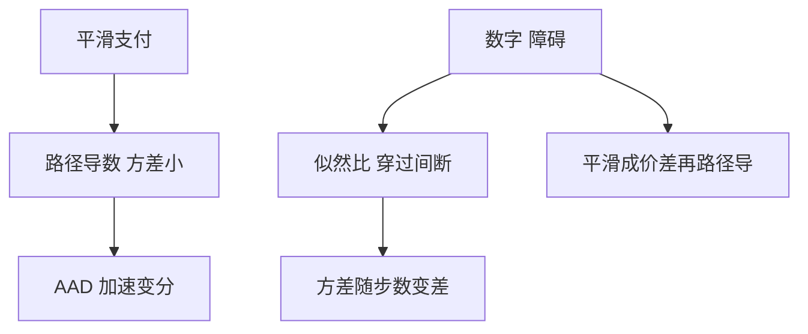

# 路径导数与似然比

路径导数对平滑支付方差小；似然比把导数转到密度上，能穿过间断，但方差随时间变长。

<footer>—— Broadie and Glasserman, Estimating Security Price Derivatives Using Simulation, Management Science, 1996</footer>

[上一课](/quant/aad-adjoint)把计算图倒过来，默认对象仍是路径wise 的 $\partial\mathrm{payoff}/\partial\theta$。本课的缺口是蒙特卡洛希腊值的**两条经典估计**：路径导数（pathwise）与似然比（likelihood ratio / score）。后课 Vega 桶用这些估计去填曲面风险；这里先写何时哪一条不炸方差。

## 问题

有限差分模拟：每 bump 一次要重新抽路径，噪声大，偏差与步长纠缠。路径导数在同一路径上对支付函数求导：若支付对 $S$ Lipschitz、几乎处处可微，期望与导数可换序，得到无偏估计。数字与障碍的支付不连续，换序失败，路径导数在触发路径上是 0 或未定义，估计**偏低**。似然比不碰支付，而对转移密度取对数导（score），间断支付也能用，代价是 score 的方差随模拟步数恶化。

问题不是选一个「更好的希腊值」，而是按支付光滑度与参数类型（水平参数 vs 波动参数）搭配，或做混合。

### 换序条件不是一句「几乎处处」

路径导数要求 $\mathbb{E}[\partial_\theta f(S(\theta))]$ 存在且等于 $\partial_\theta\mathbb{E}[f]$。示性函数 $\mathbf{1}_{S_T>K}$ 对 $S_T$ 的导数是 Dirac，模拟里看不见，估计变成 0。把数字平滑成窄价差，路径导数回来，但估的是价差不是数字——与 [数字](/quant/digital-options) 的复制一致，这是特征不是 bug。

波动率进入扩散系数时，路径导数要对 SDE 的变分过程（tangent process）积分，不能只对终点解析式里的 $\sigma$ 写偏导。GBM 闭式还能手写；局部波动与 Heston 必须联立变分方程。

## 方法

路径导数：对每条路径求 $\partial\mathrm{payoff}/\partial\theta$，平均。GBM 香草 Delta/Vega 有显式。似然比：$\widehat{\partial_\theta V}=\mathrm{payoff}\times\partial_\theta\log p$，其中 $p$ 是路径密度。重要性采样与似然比同源，可共用 score。混合：对平滑部分路径导数，对间断用似然比或 Malliavin 权。AAD 用来算路径导数的变分，不自动解决间断。

实践：障碍用布朗桥触碰概率做平滑；数字用价差；美式用回归后的连续近似价值再路径求导。

## 机制

路径导数利用的是**同一随机源**下支付对参数的 Lipschitz 依赖；似然比利用的是测度对参数的绝对连续。前者方差通常更小，因为支付与导数同路径强相关；后者把所有随机性推到密度上，支付越大 score 噪声越大。时间步一多，score 是很多高斯增量导数之和，方差近似线性涨。这就是为什么长期限 XVA 不用裸似然比去估全部曲线节点。

## 边界

似然比对离散观察障碍仍要求密度对参数可微；对「是否触碰」这种硬判据，要把触碰写进密度（桥）而不是写进支付。Malliavin 权是似然比的连续时间版，实现成本高，本课不展开。不要对已经用对照变量减过方差的同一批路径再盲目套似然比而不重新设计权。

## 小结

- 路径导数适合平滑支付，间断时系统性偏；似然比能穿过间断，方差较差。
- 数字用价差平滑后走路径导数，与复制一致。
- AAD 加速路径导数，不替代换序条件。
- 出处：Broadie and Glasserman, *Management Science*, 1996。
