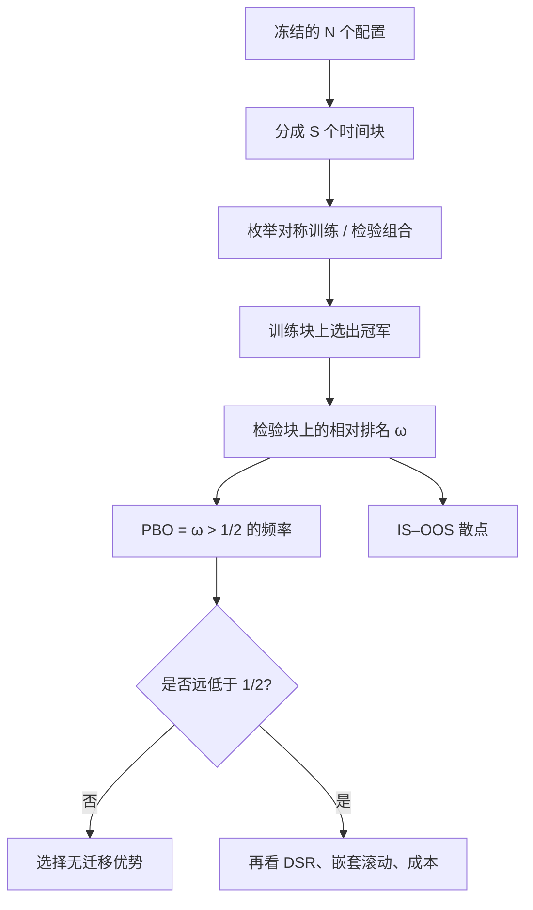

# Probability of Backtest Overfitting

    
回测过拟合概率是：样本内最优配置在样本外相对中位数表现落后的频率。它度量的是选择过程，不是那条被展示的净值曲线。

    <footer>—— Bailey, Borwein, López de Prado and Zhu, The Probability of Backtest Overfitting, Journal of Computational Finance, 2017</footer>

在同一段历史上试验足够多的止损、窗口、过滤与杠杆之后，总会出现一条夏普好看的回测。Bailey、Borwein、López de Prado 与 Zhu（2017）把这种现象收成一个概率：回测过拟合概率（Probability of Backtest Overfitting, PBO）。它不问「最优配置的夏普是否显著大于零」，而问「被选中的那一个，在没见过的样本上是否还能赢过候选集合的中位数」。与把过拟合当作一类风险的定性讨论相比，PBO 是可计算的频率；与 [紧缩夏普](/quant/deflated-sharpe) 相比，它用的是相对排名而不是被放气的点估计。估计工具是组合对称交叉验证（CSCV），[CPCV](/quant/cpcv) 在同一骨架上加上清洗与禁运。本篇写定义、估计与误用，不把 PBO 当成可优化的目标函数。

## 问题

设候选配置有 $N$ 个，历史被切成若干块。每一次划分得到一段「样本内」与一段「样本外」。在样本内按绩效（通常是夏普）选出冠军 $n^\star$，再看 $n^\star$ 在样本外相对全部 $N$ 个配置的排名。若相对排名落在后一半——即低于中位数——记一次过拟合事件。PBO 是该事件在所有对称划分上的频率。技能真实且选择温和时，冠军在样本外仍应系统性地高于中位，PBO 明显小于 $1/2$；纯噪声搜索时，样本内第一没有任何可迁移优势，PBO 靠近 $1/2$ 甚至更高。

这个定义有意不用「样本外夏普是否为正」。全体配置在牛市里样本外都可以为正，冠军相对中位仍然可能很差；全体在熊市里都可以为负，冠军仍可能稳定地少亏。PBO 度量的是**选择是否带来相对优势**，不是绝对盈亏。绝对盈亏要另用因果滚动路径与扣费后期望去看。Bailey 等人同时画出样本内绩效对样本外绩效的散点：过拟合常表现为负斜率——样本内越好，样本外越差——这是极值选择把噪声吃进冠军的几何图像。

### 为什么必须对称划分

若只做一次「前半训练、后半检验」，PBO 退化成一个 0/1，完全依赖切点。若只做滚动，路径条数通常是十几，且相邻窗口共享状态，估不出「低于中位」这种比例。CSCV 把样本均分为 $S$ 个连续块（$S$ 为偶数），枚举所有「一半块训练、互补一半检验」的组合，共 $\binom{S}{S/2}$ 条路径。每一段历史都有机会当训练、也有机会当检验，从而把「这段日子特别适合某条规则」平均掉，留下选择偏差本身。代价是部分路径在时间上交错，不再模拟真实部署顺序；那不是缺陷，因为 PBO 的对象不是可部署性。

送进 CSCV 的 $N$ 必须是实际搜索过的集合。Git 里删掉的网格、看过结果再改的过滤、换过的起止日期，都算。只把最后留下的十个「合理」配置拿去算 PBO，会得到假低的数字。

## 方法

**CSCV 步骤。** 将收益矩阵（时间 $\times$ 配置）按时间切成 $S$ 块。对每一个组合 $c$：在训练块上计算每个配置的绩效 $R^{\mathrm{IS}}_{n,c}$，取 $n^\star_c=\arg\max_n R^{\mathrm{IS}}_{n,c}$；在检验块上计算同一批配置的绩效 $R^{\mathrm{OOS}}_{n,c}$，得到 $n^\star_c$ 的相对排名 $\omega_c\in(0,1]$（可取高于其样本外绩效的配置所占比例）。过拟合指示 $1\{\omega_c\gt 1/2\}$（或等价地，冠军样本外低于中位数）。

$$
\widehat{\mathrm{PBO}}=\frac{1}{|\mathcal{C}|}\sum_{c\in\mathcal{C}} 1\bigl\{\omega_c\gt 1/2\bigr\}.
$$

Bailey 等人还建议报告 logit 变换与样本内—样本外绩效的相关系数。负相关是过拟合的典型症状；接近零的弱相关也可能只是信噪比太低，未必是技能。

**与 CPCV 的衔接。** 金融标签重叠时，交错块会让训练与检验共享同一段价格路径，PBO 被泄漏压低。做法是在每一条组合路径上对标签做 purge 与 embargo，见 [交叉验证泄漏](/quant/cv-leakage-finance)。这就是 CPCV 相对朴素 CSCV 多出来的手续。PBO 的定义不变，变的是路径是否诚实。

### 报告什么，不报告什么

最低报告：候选集合如何构造、$S$、绩效指标（是否扣费）、$\widehat{\mathrm{PBO}}$、IS–OOS 散点、以及各路径上冠军样本外绩效的分布。不要只摘分布的上分位。不要把 PBO 当成损失函数去调 $S$、调块长、调把哪些配置算进 $N$——那是对评估器过拟合。若必须给一个「能否进入模拟账户」的门槛，应预先声明（例如 PBO 显著低于 $1/2$ 且 [DSR](/quant/deflated-sharpe) 仍高），而不是看完数字再定。

配置高度相关时，名义 $N$ 很大但有效试验很少。大家样本外一起好或一起坏，冠军相对中位的优势会显得稳定，PBO 偏低，却只是同一个赌注。应先对配置收益做相关聚类，按有效独立个数读 PBO，并与 DSR 所用的有效 $N$ 交叉核对。

PBO $=0$ 在有限组合数下几乎意味着候选集合太同质或划分太粗，而不是发现了圣杯。反过来，PBO 略低于 $1/2$ 也不是许可：它只拒绝「纯噪声选择」这一幅漫画，不证明扣费后期望为正。

## 机制

统计机制是最大值的选择偏差。样本内绩效 $= $ 技能 $+ $ 该划分上的噪声。选出最大值会系统性地挑中噪声为正的配置；样本外噪声若近似独立，条件期望下降，相对中位的优势被侵蚀。信噪比越低、搜索越宽、配置越能贴合特定块的噪声，侵蚀越严重。这与 White 的 [Reality Check](/quant/white-reality-check) 是同一选择问题的两种度量：后者给出最大统计量相对基准的自举 $p$ 值，PBO 给出相对排名掉到中位以下的频率。

经济机制是：被选中的规则常常拟合了一段不可重复的微观结构或宏观路径。样本外体制不变时，纯噪声选择也足以毁掉相对优势；体制若变，见过拟合与 [体制切换](/quant/regime-break-risk) 的叠加。PBO 不能区分这两种失败，它只报告「冠军不可迁移」这一现象。

### 与 DSR、滚动、SPA 如何分工

一个完整的实验设计可以是：用 PBO/CSCV 看搜索是否过拟合；用 DSR 给最终那一个夏普放气；用 [嵌套交叉验证](/quant/nested-cv) 或因果 [滚动](/quant/walk-forward) 给出可叙述的样本外曲线；用 [Hansen SPA](/quant/hansen-spa) 或 Reality Check 检验是否优于明确的基准。四者回答不同问题。只用滚动，你不知道换切分会怎样；只用 DSR，你不知道相对排名；只用 PBO，你没有一张可审计的「从某年做到某年」的权益曲线。把 PBO 当唯一闸门，会放过「相对中位还行、但全体都没有经济边缘」的候选簇。

## 边界与工程取舍

块太短，切断依赖、路径看似很多但信息重复；块太长，组合数不够，频率估计吵。$S$ 应预先声明并做敏感性，而不是挑让 PBO 最低的 $S$。绩效指标必须与实盘一致：用毛夏普算出来的低 PBO，在扣费后可能翻转，因为高换手配置在样本内更容易靠忽略成本取胜。

PBO 不替代成本、容量与点-in-time 纪律。候选若在全样本上做过特征选择，CSCV 只是把泄漏复制到每一条路径。也不要用某一次实盘碰巧好来否证高 PBO：单次实现不能推翻一个关于选择过程的频率陈述。Bailey 等人讨论过第二类错误——真技能被保守评估杀掉。PBO 不是越小越好的优化目标；把它写进自动调参，会得到好看的 PBO 和同样过拟合的系统。

研究迭代本身在增加 $N$。同一个策略每月「改进」一次，一年后的净值曲线是十二次选择的复合。冻结规则、把后续改动当新候选重新走 PBO，比在旧数字上继续修补更安全。

## 小结

- PBO 是样本内冠军在样本外低于候选中位数的频率，度量选择过程而非单条净值。
- CSCV 用对称块划分估计该频率；金融标签须在每条路径上清洗，否则 PBO 被泄漏压低。
- 候选集合、$S$ 与绩效定义必须冻结；在 PBO 上再优化是第二层过拟合。
- PBO 不替代紧缩夏普、因果滚动与优于基准的检验，四者回答不同问题。
- 相关配置会让名义 $N$ 失效，应按有效独立簇来读。
- 出处：Bailey, Borwein, López de Prado and Zhu, *Journal of Computational Finance*, 2017；Bailey et al., *Notices of the AMS*, 2014；López de Prado, *Advances in Financial Machine Learning*, 2018，第 11–12 章。
