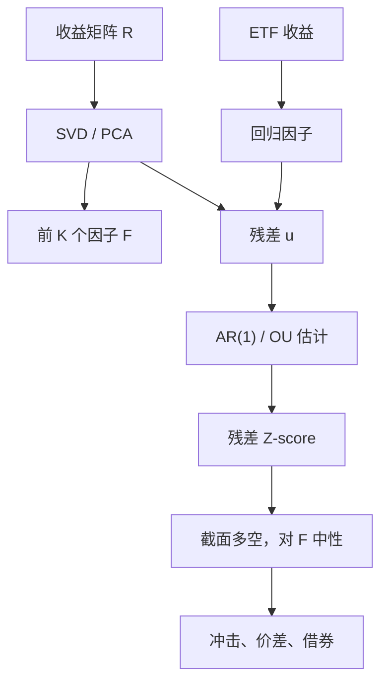

# PCA / SVD 统计套利

    
用主成分把收益里的共同模式抽掉，再把残差当成均值回归的 Ornstein–Uhlenbeck 过程来交易；ETF 组合可以代替统计因子，但残差的回归速度与波动都随时间变。

    <footer>—— Avellaneda & Lee, Statistical Arbitrage in the US Equities Market, Quantitative Finance, 2010</footer>

[上一课](/quant/distance-pairs)用形成期标准化价格的平方偏差选对、用两个标准差开仓——这是 GGR 的可复制规则，不是协整估计。距离近只说明历史路径贴近，共同因子仍留在价差里。缺口是截面残差的短持有均值回归：对收益矩阵做 PCA/SVD，取前 $K$ 个因子解释共同运动，交易正交补上的 $u_{it}$，而不是主成分本身。Avellaneda–Lee 同时试验 ETF 因子；把主成分当成 alpha，是另一类拥挤赌注。本课写这条工程链。不重写距离阈值。

## 问题

个股收益的大部分方差是市场、行业与风格。直接对价格做配对，等于把共同因子留在价差里。PCA 统计套利问的是：去掉前几大共同方向之后，残差是否仍有可交易的负自相关，以及这种自相关在扣费、容量与 2007 年这类平仓之后还剩多少。Khandani 与 Lo 记录的量化震荡说明，残差的相关结构可以在几天内从「可分散」变成「所有中性组合一起亏」。

高维下前 $K$ 个主成分既包含真因子也包含样本噪声。$K$ 太小，残差里留着行业；$K$ 太大，残差被洗成近白噪声，半衰期估计会假短。SVD 与 PCA 在中心化后是同一件事：对 $T\times N$ 的收益矩阵 $R$ 做 $R=U\Sigma V^\top$，右奇异向量是股票空间的载荷。交易的不是奇异值大的方向（那是风险），而是投影之后的正交补。

### 残差 OU 不是定理

Avellaneda–Lee 假定残差满足

$$
dX_t=\kappa(\mu-X_t)\,dt+\sigma\,dW_t,
$$

从而半衰期 $\ln 2/\kappa$，Z-score $(X-\mu)/\sigma_{\mathrm{eq}}$ 有平稳分布。这是模型，不是市场给出的恒等式。$\kappa$ 会在波动上升时变小，在拥挤时变号（残差动量化）。用过去 60 日估 $\kappa$ 再开仓，是在赌参数缓慢变化。参数一快变，Z-score 的阈值就错位，见[Z-score 开仓](/quant/zscore-entry)。

对原始价格做 PCA 与对收益做 PCA 不是同一策略。价格非平稳，前主成分会变成一条随机趋势；Avellaneda–Lee 的对象是收益或已构建的残差过程。混用会把单位根成分当成「可回归的价差」。

## 方法

典型日频流程。用过去 $M$ 日（文中量级为一年量级的滚动，实务常更短）的超额收益估协方差或直接 SVD，取 $K$ 使解释方差达到阈值，或固定 $K$。个股残差

$$
u_{it}=r_{it}-\hat\beta_{i}^\top F_t,
$$

$F_t$ 是主成分得分或一组 ETF 收益。对 $u_{i}$ 的累积和或对 $u_i$ 本身估 OU（实现上常用 AR(1)）。交易信号是标准化残差越过阈值（如 $|s|\gt 1$ 开仓，$|s|\lt 0.5$ 平仓），组合在截面上做残差多空，使对 $F$ 的暴露接近零。

ETF 版本用行业或风格 ETF 的收益作 $F$，载荷由回归得到。优点是因子可交易、有名字，对冲可以用 ETF 本身完成，冲击比复制主成分更透明。缺点是 ETF 有自身的溢价折价与申赎摩擦，残差会混进[ETF 套利](/quant/etf-arb)的微观结构。PCA 版本对未命名冲击反应快，但对齐符号、滚动窗口换因子时载荷会跳，组合换手无端上升。

### 对冲、换手与 2007 年之后

中性化必须在可交易空间完成。样本内把 $w^\top V_K=0$ 设死，样本外主成分旋转，约束会失效。需要对载荷做对齐（Procrustes 或对上期回归），并限制单名权重与换手。Avellaneda–Lee 报告策略在 2003–2007 前半表现强、金融危机前后结构变化；他们明确把参数时变当作核心风险。复制若只用「全样本夏普」，等于把不可重复的一段残差回归写成永续边缘。

把 PCA 因子反向交易（做空高方差主成分）不是残差统计套利，那是赌因子风险溢价为负或均值回归，与本文的正交补交易不是同一许可。风险模型与 alpha 模型共用特征向时，优化器会在同一方向上打架。

## 机制

残差回归的来源可以是过度的特异订单流（库存需要逆转）、指数再平衡的临时冲击、以及非同步交易。PCA 抽掉的是截面上最大的共变；剩下的若仍有负自相关，短持有的多空可能赚到流动性供给。这与[短期反转](/quant/short-term-reversal)同族，只是中性化更干净。一旦残差的主导交易者变成同类统计套利账户，拥挤使残差正自相关：亏钱的人平仓时残差继续沿亏钱方向走，OU 的 $\kappa$ 变号。

SVD 的稳定性随 $N/T$ 恶化。随机矩阵的 Marchenko–Pastur 边界提醒：靠近噪声边缘的「因子」不该进 $F$，也不该被当成可交易残差的一部分去放大杠杆。解释方差阈值在高波动期会自动抬升前几主成分的份额，$K$ 若随阈值浮动，中性化的经济含义每天都在变。更稳的是固定 $K$，让因子方差变、因子个数不变。

### 容量在残差空间里更窄

残差波动通常小于原始收益，同样的美元利润要求更大的名义。残差策略的杠杆或名义扩张，会在单名 ADV 上先碰到墙：因为中性化后仍要买卖那些流动性差的特异腿。2007 年 8 月的教训是：许多账户的残差看起来正交，因子模型外的拥挤因子却把它们变成同一个组合。容量应在「假设残差相关从 0 升到 $\rho$」的压力下估，而不是在样本内特异相关为零时估。

## 边界与工程取舍

成本。残差信号换手高，必须用有效价差与冲击函数，而不是佣金。隔夜跳空与开盘竞价会把「收盘残差」变成不可执行的分数。卖空费用集中在残差最负、看起来最好空的名字上，净边缘被选择性侵蚀。A 股涨跌停使残差在板上被截断，SVD 的载荷会被几个涨停名字扭曲。

不要把风险 PCA 的 $K$ 选择准则（Bai–Ng）直接当成 alpha 的 $K$。风险要的是预测 $\Sigma$，可以多留几个弱因子；交易残差时多留因子会把 alpha 洗掉。反之，$K$ 过小会把行业动量留在残差里，策略在行业轮动时看起来像残差动量，见[残差动量](/quant/residual-momentum)——那是要保留的因子暴露，与本文要剥掉的对象相反。文档里应写清：你交易的是正交补还是因子得分。

Quantitative Finance 2010 年这篇是方法论文，样本与成本假设都属于当时美股电子化做市的环境。把它的夏普当成当前可部署数字，忽略了拥挤、做市利润压缩与 ETF 因子可交易性的变化。

## 小结

- Avellaneda–Lee 用 PCA/SVD 或 ETF 抽共同因子，交易残差的均值回归；交易对象是正交补，不是主成分本身。
- 残差 OU 是参数化假设，$\kappa$ 会时变甚至变号；2007 年类拥挤使「正交残差」一起移动。
- ETF 因子可对冲、有名字，但引入溢价折价；纯 PCA 跟得快，载荷旋转制造换手。
- 残差空间里同样美元利润需要更大名义，容量比原始价格配对更窄，成本必须按有效价差计。
- 出处：Avellaneda and Lee, *Quantitative Finance*, 2010；量化平仓语境见 Khandani and Lo, *Journal of Investment Management*, 2007/2011；风险侧 PCA 见 Connor–Korajczyk 与 Bai–Ng。
