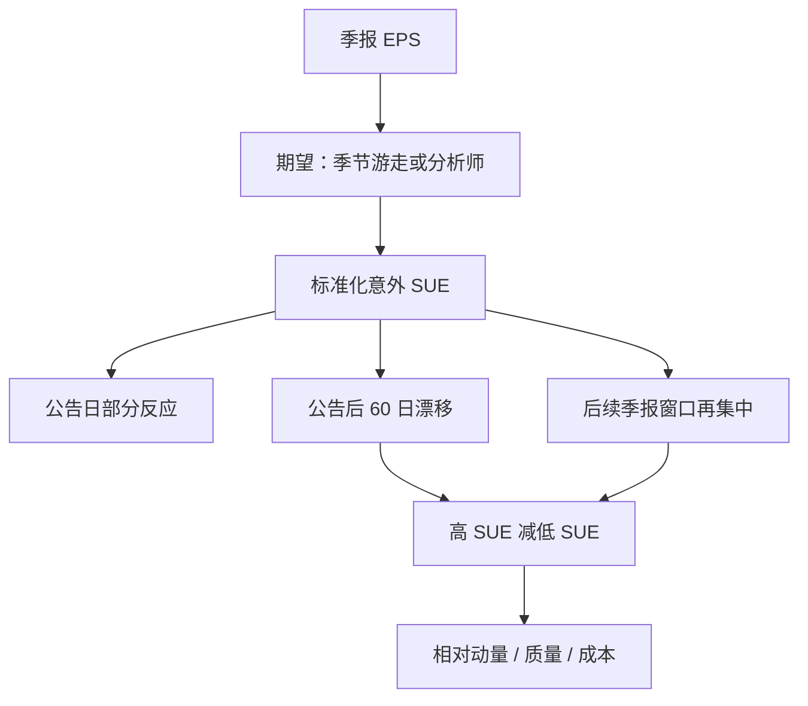

# 盈利意外 PEAD / SUE

未预期盈余为正的股票，在公告之后仍会沿同一方向漂移数周到数个季度；投资者像是没有充分利用盈余的序列相关。

<footer>—— Bernard & Thomas, Journal of Accounting Research, 1989 / 1990</footer>

Ball 与 Brown 1968 年已经看到盈余符号与事后收益同向。Bernard 与 Thomas 把现象收成可检验的机制：标准化未预期盈余（**SUE**）排序后，组合在公告后继续赚 α，且超额收益在**后续几个季报窗口**再次集中。这是事件时间的漂移，不是[质量](/quant/qmj)里的长期盈利水平，也不是月度[动量](/quant/momentum-wml)的全部。把 PEAD 写进 QMJ 或把 12−1 赢家全部解释成盈余惊喜，都会弄错频率。

## 问题

若价格对公开盈余即时、充分地反应，公告日之后按 SUE 排序不应再有平均收益。实证上漂移持续约 60 个交易日，并在下一季、下两季、下三季的公告附近再出现一截，到第四季往往反号。这与「市场有效所以只能赚 beta」冲突，也与「完全没有人看财报」冲突——公告当日已有一部分反应，只是不够。

需要一个把「意外」写成数字的定义。分析师预测均值、季节随机游走、时间序列模型都可以当期望。SUE 把意外除以波动，使大公司的分钱意外与小公司的嘈杂意外可比。问题是：漂移来自风险（公告后 β 变了）、来自交易成本（小盘难买）、还是来自对盈余自相关的错误模型？Bernard–Thomas 押在第三条：盈余近似季节差分上的 AR(1)，投资者却按季节随机游走来定价。

### SUE 量的是意外，不是盈利水平

高 ROE 可以 SUE 为负（相对预期失望）；亏损公司可以 SUE 为正（亏得比预期少）。PEAD 多头是正向意外，不是[毛利率](/quant/quality-profitability)多头。形成期是公告日，持有期是事件时间，不是自然月的 6 月重构。用月度横截面把「本月有正意外」做成因子，会把不同滞后长度的漂移混在同一栏，t 值难解释。

$$
\mathrm{SUE}_{i,q}=\frac{\mathrm{EPS}_{i,q}-\mathrm{E}_{q-1}[\mathrm{EPS}_{i,q}]}{\hat\sigma_{i,q}}
$$

季节随机游走取 $\mathrm{E}[\mathrm{EPS}_{i,q}]=\mathrm{EPS}_{i,q-4}$，$\hat\sigma$ 用过去数年同期差分的标准差。分析师 SUE 则用实际减共识。两种排序相关但不是 1：覆盖稀疏的小盘只能走季节模型。

Foster、Olsen、Shevlin 1984 已用 SUE 组合证明漂移。Bernard–Thomas 的增量是把后续公告的集中反应写成「对自相关估计不足」。出处不要只写 1989 而假装 1968 与 1984 不存在。

## 方法

每个季报公告日计算 SUE，按十分位分组，等权或价值加权，看 $[+1,+60]$ 个交易日的累计超额收益，并对规模、β 做控制。事件研究要处理集群：同一天许多公司公告，日历时间的标准误会低估。因子化做法是：每日持有「最近一季 SUE 最高减最低」的组合，权重随事件年龄衰减，得到一条可放进四因子回归的腿。

清洗：剔除公告日不可交易、价格过低、停牌；盈余定义对齐（GAAP vs 经营 EPS）；意外的分母过小要缩尾。分析师版本要处理预测日期晚于公告、以及少数分析师的噪声。持有到下一次公告，会与下一期 SUE 重叠——这正是机制所在，不是重复计算错误，但报告时应拆开「公告间的缓慢漂移」与「下一次公告的跳跃」。

### 漂移集中在后续公告附近

若投资者忽略盈余的正自相关，则下一季仍可能再超预期，价格在下一公告日才补一截。第四季出现负相关（季节性），错误模型会在一年后给反号的意外，于是 PEAD 在四季度后反转。这一预测是 Bernard–Thomas 1990 年相对纯「反应慢」故事的可证伪点。复制应画出事件时间曲线：不仅有 $[+1,+60]$，还要有下一次公告窗口。

## 机制

错误模型：真实盈余接近 $(E_q-E_{q-4})=\rho(E_{q-1}-E_{q-5})+u$，投资者当 $\rho=0$。于是对当期正意外之后的持续正意外反应不足。信息扩散：小盘、低分析师覆盖、机构持仓低的股票漂移更大，符合 Hong–Stein 式的缓慢传播。风险：正意外公司随后 β 或现金流风险更高——证据弱，因为漂移在特征调整后仍在，且符号结构像会计自相关而不像宏观 β。

与动量的关系：盈余公告是动量的一部分来源，但 12−1 赢家里还有价格自身的趋势与非盈余新闻。控制 SUE 后动量通常减弱但不消失；控制动量后 PEAD 也常剩下一块。两者应同时报告，而不是互相吸收完毕就宣布另一个是幻觉。

### 不可交易性会假造 α

等权 PEAD 强烈依赖小盘与低价股。买卖价差、隔夜跳空与涨跌停会把账面漂移变成不可实现。价值加权、剔除最低流动性十分位、用开盘后可成交价格，是最低限度的稳健性。A 股业绩预告与正式公告分离，漂移的一部分发生在预告之后、正式报告之前，事件日定义必须改。

PEAD 不是「盈利因子」。RMW 问的是盈利能力水平；PEAD 问的是相对预期的增量。高水平、负意外的公司可以同时空于 PEAD、多于 RMW。季度再平衡的 SUE 因子换手远高于年度 RMW。

## 边界与工程取舍

公告后六十年文献显示效应变弱：覆盖增加、量化资金交易 PEAD、微观结构改善。剩余是否够付成本，取决于宇宙与执行。分析师修订本身也是信号（盈余修正动量），与 SUE 部分重叠。不要把管理层指引、电话会语气做成「SUE」还引用 1989 年。不要在已经持有价格动量的产品里再叠加未经正交的 PEAD，而不查相关。

容量集中在中盘：大盘反应更快，微型盘交易不动。空头腿是负意外，常伴随困境与借券难。只做多正 SUE 得到的是偏市场、偏动量的多头，不是对冲后的 PEAD。

出处：Bernard & Thomas, *Journal of Accounting Research*, 1989 与 1990。更早的盈余-收益关系见 Ball & Brown, 1968；SUE 组合见 Foster, Olsen & Shevlin, 1984。不要把 PEAD 标成 Fama–French 因子。

## 小结

- SUE 标准化未预期盈余；PEAD 是公告后沿意外方向的漂移。
- 机制候选是对季节盈余自相关估计不足，预测漂移在后续公告再集中。
- 与盈利水平、价格动量相邻但不相同，须分开构造。
- 等权小盘会高估可实现 α；事件日与预告规则要因市场改写。
- 出处：Bernard & Thomas, Journal of Accounting Research, 1989/1990。
