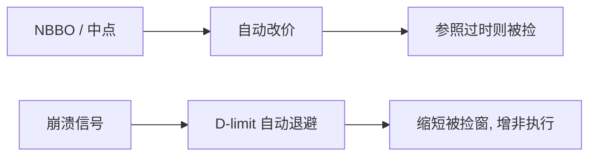

# peg 与 D-limit 订单

盯住指令把档位选择外包给引擎：随全国最优或中点自动改价。IEX 的 D-limit 更进一步，在其「报价崩溃」信号触发时自动降价，试图在连续协议里给慢挂单一条制度化的撤向保护。

<footer>—— 据 Harris, Trading and Exchanges 对盯住与展示的论述；IEX Discretionary Limit 的制度说明对照 Budish 等对过时报价的讨论</footer>

[速度与市场质量](/quant/speed-market-quality)把问题收到相对延迟。缺口是订单类型层的设计回应：不改整场批量拍卖，只给挂单者一种自动跟随或自动退避的指令。Peg（盯住）随参照价移动；D-limit 在 IEX 上结合离散限价与崩溃指标。主干[订单类型](/quant/order-types)未展开 peg。本课写这些指令如何改放置博弈，不重画簿的几何。

## 问题

最优放置要求随中点与 NBBO 连续改 $k$，FIFO 下改价丧失时间优先。Peg 让交易所代劳：primary peg 贴在己方 BBO，midpoint peg 挂在中点（常需暗处或允许的亚 tick），市场 peg 贴对方。代价是：参照价过时则 peg 本身成为被狙击对象；中点 peg 把价格发现让给公开 BBO 的形成者。问题是 peg 在降低操作成本的同时，是否把被捡从用户办公室挪到引擎与行情延迟上。

D-limit：普通限价加上当 IEX 认为报价正在崩溃时自动改到更保守的价。它试图把 Foucault 被捡窗口里的「撤」写成规则，而不是比拼用户速度。有效性取决于崩溃指标是否比狙击者更早、以及是否被博弈。

### 盯住参照是谁的价格

Peg 依赖 NBBO 或本地 BBO。[NBBO 构造](/quant/nbbo-construction)的时钟与尺寸规则会进入 peg 的行为。保护报价不含零股时，peg 可能盯住一个对你不可成交的价格。跨市场延迟下，peg 跟着已经过时的 NBBO 走，正好把 BCS 期权写进订单手册。

Discretionary 范围（D-peg 等）允许在限价内主动吃对侧，把限价/市价阈值外包。这与本课 D-limit 的「崩溃时退避」方向相反：一个更有攻击性，一个更保守。名字都带 D，机制不要混。

## 方法

把 peg 写成约束：$p_t=\mathrm{ref}_t+\mathrm{offset}$，受用户限价箱约束。每次 ref 变，引擎改价，优先权按规则：有的视为新单。均衡里，无技术的人用 peg 近似 Roşu 的近端放置，有技术的人仍用自营更新抢队头。于是 peg 用户提供「慢的近端」，成为狙击的自然对手方——除非场所加颠簸或 D-limit。

经验比较：peg 成交的实现价差、被捡（成交后中点走失）、相对普通限价的寿命。IEX D-limit 的公开描述强调在崩溃信号时减少被扫。评估必须对照同期其他场所，避免把 IEX 用户结构差当成指令效应。

## 机制

Peg 降低非执行（自动贴住市场），增加参照错误时的逆向选择。这是上一单元两项风险的订单化。D-limit 反向：信号触发时非执行升、被捡降。若信号与真的公共跳相关、与随机噪声不相关，做市的期权金下降，价差可窄；若信号滞后或可被填塞式消息骗过，则要么保护太晚，要么频繁误退避、深度闪烁。

对宏观形状：peg 把量钉在 ref 附近，轮廓更集中于近端；崩溃退避时近端突然空，形状出现空洞。执行算法看到的平均 peg 深度，不是压力期深度。

## 边界

各所 peg 规则、费用、是否允许锁定/交叉，差异大。中点 peg 与暗池中点是亲戚，毒性问题同构。D-limit 绑定 IEX 的信号与速度颠簸，不能当成一般连续市场的插件。把所有自动改价叫做「智能」，会忽略它们把延迟风险社会化到参照源。

用户仍要选 offset 与限价箱，放置问题没有消失，只是从 tick 选择变成对参照与信号的选择。

下一课把保护从指令层收到场所层：没有进场颠簸，崩溃信号再准时也跑不过同机房的吃单。Peg 与 D-limit 依赖那一段不对称时钟。

## 小结

- Peg 把档位外包给参照价，降低操作型非执行，但把被捡绑定在行情延迟上。
- D-limit 用崩溃信号制度化退避，权衡与限价寿命选择相同。
- 参照时钟与 NBBO 规则是 peg 的一部分，不是外部细节。
- 出处：Harris, *Trading and Exchanges*；过时报价机制见 Budish, Cramton and Shim, 2015；对照本站订单类型课。
