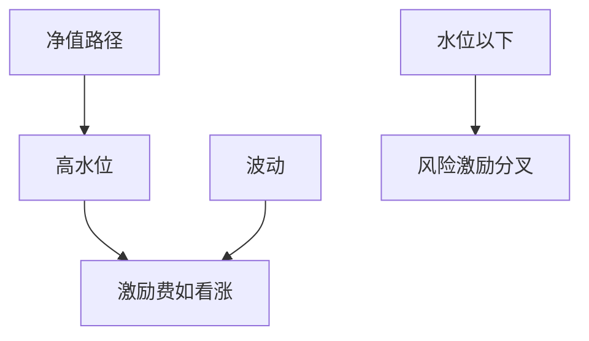

# 业绩费与高水位

高水位把管理人的激励费变成对净值路径的看涨：只有越过历史峰值才收费；期权的价值随波动上升，于是费率条款本身会改变愿意承担的风险。

<footer>—— Goetzmann, Ingersoll and Ross, High-Water Marks and Hedge Fund Management Contracts, Journal of Finance, 2003</footer>

[上一课](/quant/strategy-lifecycle)收口策略会衰减。业绩单元的缺口是**谁从剩下的 P&L 里先拿走一截**。管理费是对 AUM 的固定抽成；激励费常带高水位（HWM）：净值创出新高才计提。本课写条款如何改变风险激励，以及投资人看到的净收益为何不是毛收益乘以 (1−20%)。主干 [IR/Sharpe](/quant/ir-sharpe) 在扣费对象上必须对齐。

## 问题

Goetzmann–Ingersoll–Ross 把 HWM 写成或有要求权：管理人持有对基金净值的看涨，执行价是当前水位。波动上升提高期权价值，于是在水位以下时，管理人有动机加大风险去「搏回来」，或在无望时放弃努力（关闭基金、另开一只以重置水位）。问题是治理：条款要与锁定期、赎回、自有资本一起看，不能单独谈「2 和 20」。Panageas–Westerfield 等后续工作讨论即使无管理费，HWM 下的风险选择也不是简单的「总是赌博」。

与策略地图：短波动卖方的左尾会长期停在水位下，激励费为零，管理费仍抽；投资人此时付的是期权费加管理费，不是「没赚钱就不收费」。

### 均衡水位与基金关闭

水位远高于净值时，激励费的 delta 接近零，管理人与投资人的利益最分叉。重置水位（新基金、合并、协商打折）是隐性再谈判。回测若用固定 20% 激励、从不重置、从不关闭，会高估投资人净收益的左尾保护。

水晶条款（clawback）、均衡化（equalization）和系列份额是为了不同时点申购者之间的公平，不是为了提高夏普。忽略它们会把费用算错到份额层面。

## 方法

合同：管理费、激励费、HWM、 hurdle、结晶频率、clawback。会计：按日净值路径模拟费用，而不是按年收益×20%。对照：同一毛路径在不同波动下的净路径。风险：水位下的杠杆政策必须事先写进产品备忘，不能事后当择时。

## 机制

激励费是路径依赖的看涨。投资人卖出这笔期权，换来「有技能才付」。技能若不可持续（后课），期权费是纯转移。HWM 保护投资人免于对同一块净值重复付激励，但不保护管理费，也不保护水位下的赌博。

## 边界

本课不写如何设计合同去规避监管或误导披露。税务对激励费的处理因辖区而异。下一课把管理费与激励费一起放进复利。

## 小结

- 高水位使激励费成为路径依赖期权，改变风险激励。
- 水位以下管理费仍在抽；净收益不是毛收益×0.8。
- 关闭与重置水位是隐性再谈判，回测要包含。
- 出处：Goetzmann, Ingersoll and Ross, *JF*, 2003；后续风险选择见 Panageas and Westerfield 等。
