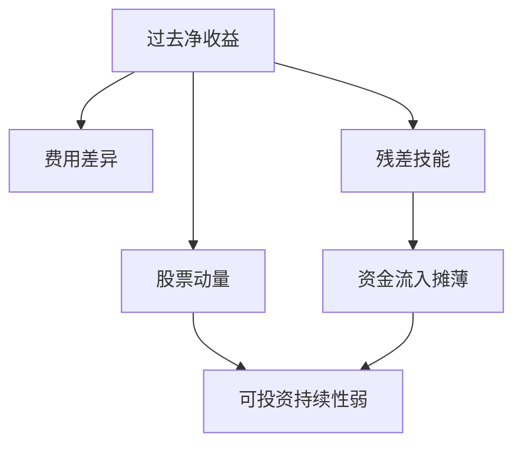

# 业绩持续性

扣费后，共同基金的业绩持续性大部分被动量与费用解释掉；剩下的「热手」很弱，且会被资金流冲淡。

<footer>—— Carhart, On Persistence in Mutual Fund Performance, Journal of Finance, 1997；技能与运气见 Fama and French, Journal of Finance, 2010</footer>

[上一课](/quant/fees-compounding)说明费用确定地吃复利。持续性的缺口是：**扣费后的超额会不会重复**。Carhart 用四因子（市场、规模、价值、动量，见 [Carhart 四因子](/quant/carhart4)）表明：一年期的「赢家基金」持续性很大一块是股票动量加上费用差异，不是稳定的选股 alpha。Fama–French（2010）用 bootstrap 问：行业里有多少基金的 alpha 超出运气。Berk–Green 把持续性弱写成均衡：技能会吸引资金直到净 alpha 为零。本课不重做截面定价实证，只把这些结论接到产品评价。

## 问题

投资人选基金就是在做因子择时加选经理。若持续性只来自未扣的动量暴露，买「去年前十分位」等于买拥挤动量。问题是分层：毛 alpha、净 alpha、暴露调整后的残差。Kosowski、Timmermann、Wermers、White 的 bootstrap 显示右尾可能有技能，但可投资性还要过容量与后课资金流。对冲基金样本有存活偏差与回填，持续性更容易被高估。

与生命周期：策略衰减是信号层；基金持续性是产品层。一只基金可以换信号继续活，持续性仍可以断。

### 运气的零假设要含费用

把净收益对因子回归得到 $\hat\alpha$，再问是否大于零。零假设若不管费用，平庸经理也会因为费率为正而 $\alpha\lt 0$。Fama–French 的「技能」是相对净 alpha 的横截面：真正的问题是右尾是否厚过运气。不要用单只三年夏普宣称技能，见后课抽样误差。

排序期与持有期若重叠，或用同一段动量因子两边解释，会制造假持续性。Carhart 的贡献之一就是把动量从「经理技能」里拿出来。

## 方法

排序：过去 1 年净收益或净 alpha → 随后持有期。控制：四因子暴露、费用份额、规模。稳健：发表后子样本、存活偏差处理。对冲基金：用报告频率与锁定期对齐，不可用月频平滑当低波动技能。

## 机制

若技能存在且资金有限，净 alpha 可暂为正。资金追逐（下课）把 AUM 推到技能的容量上限，净 alpha 被摊薄到零（Berk–Green）。费用提高摊薄速度。动量使短期排序看起来像技能。于是可投资的持续性短、弱、容量小。

## 边界

本课不给「如何选到未来前十分位」的清单。私募与封闭结构改变流量机制，结论不能直接搬。下一课专门写流。

## 小结

- 扣费后共同基金持续性大部分是动量与费用，不是稳定 alpha。
- 技能若存在，会被资金流摊薄（Berk–Green）。
- 单只短样本夏普不够当技能证据。
- 出处：Carhart, *JF*, 1997；Fama and French, *JF*, 2010；Berk and Green, *JPE*, 2004。
