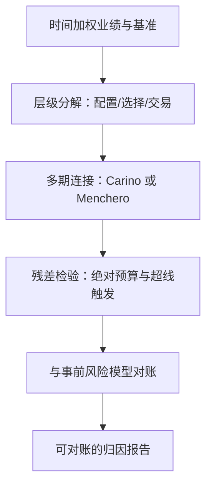
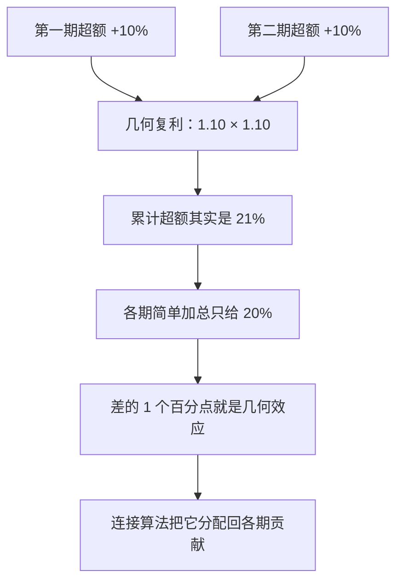

# 绩效归因的深化

归因不是成绩单，是账本审计：它的首要美德不是好看，而是闭合——每一分超额都有去处，每一处残差都有名字。

<footer>—— 据 Brinson and Fachler, Journal of Portfolio Management, 1985；Carino, Journal of Performance Measurement, 1999；Menchero, Journal of Performance Measurement, 2000 整理</footer>

[上一课](/quant/pf-stress-testing)把情景库接进行动闭环；组合跑起来了，报告季的问题随之而来：超额收益从哪来。组件的课已有：[Brinson 归因](/quant/brinson)的配置、选择与交互，[因子归因](/quant/factor-attribution)的回归口径，[交易层级归因](/quant/trade-level-attribution)的执行拆解。本课深化三件主干没展开的事：多期闭合、口径一致性、与事前风险的对接。

## 问题

单期的 Brinson 分解是算术，多期就是问题：各期「配置+选择+交互」简单加总，与累计超额对不上——复利是非线性的，几何效应真实存在。不闭合的归因没法对账：凭空出现或消失的几十个基点，恰好是管理层最想追问的地方。第二类病是口径打架：业绩用时间加权（[时间加权对资金加权](/quant/twr-vs-mwr)），归因用的基准时点与现金流假设却与业绩系统不同；Brinson 的分区与因子归因的回归窗口不一致，两份报告给出两个「主动管理来源」，投委会不知道信谁。第三类病是残差黑洞：回归归因的残差项没有预算，常年超线，说明模型漏了载荷——残差被当成「未解释的正常现象」，而不是警报。

基点（bp）就是一个百分点的百分之一，即 0.01%。数字实例：规模 10 亿元的组合，50 个 bp 的残差就是 500 万元——归因账里凭空消失的几十个基点，换算成钱后足以值得开一次正式的审计会。

## 方法

方法是把归因当账本工程来做：多期闭合用连接算法把几何效应分配掉，层次上让归因树逐层复刻决策树，对接上把事后因子桶与事前风险模型的因子桶逐一钉齐；三件事之上再立一条残差的绝对预算，超线即触发载荷复核。所有口径事先写进约定表——分区、窗口、现金流假设一旦漂移，闭合与对接同时作废。

### 闭合、层次、对接

多期闭合：Carino（1999）与 Menchero（2000）一族的连接算法，用平滑系数把单期贡献调整为可加——几何效应从「消失」变成「被分配」；选哪一种算法是会计惯例不是真理，但必须事先钉进约定表（因子研究深化课程的报告规范口径在此通用）。层次一致：归因树必须复刻决策树——战略配置、类别内配置、证券选择、交易执行（接[交易层级归因](/quant/trade-level-attribution)与[滑点归因](/quant/slippage-attribution)），每一层的基准是上一层的输出；层级错位的归因，算的是投资者根本没做过的决策。风险对接：把事后归因与事前风险模型对齐（[Barra / 基本面风险模型](/quant/fundamental-risk-model)）——主动收益的每个因子桶对应主动风险的因子桶，报告从「赚了多少钱」升级为「赚了哪个风险的钱、付了多少风险」；主动份额（[主动份额](/quant/active-share)）与跟踪误差（[基准与跟踪误差](/quant/benchmark-tracking-error)）是对接时的两把标尺。

「交互项」就是配置与选择叠加后多出来的一小块：数字实例——超配了当期上涨 10% 的行业（配置贡献为正），又恰好在这个行业里选中了再跑赢 5% 的股票，两笔贡献的耦合部分若没人认领，多期加总时就会变成对不上的残差。Brinson 把它单列成第三项，就是为了让账本闭合。

## 机制

闭合为什么是第一美德：不闭合的分解允许贡献凭空出入，而多期几何效应是真实存在的钱——把它塞进残差或干脆丢掉，是账本意义上的失真。连接算法的差别只是把几何效应分配给谁：Carino 分给全体、Menchero 按贡献比例，这是惯例之争；惯例本身必须稳定，否则两期报告之间的「改善」可能只是换了算法。口径一致性为什么贵在事先：Brinson 需要分区、因子归因需要载荷与窗口，两套约定各自合理，拼起来就打架——治理的办法是把分区、窗口、现金流假设写进一份约定表，所有报告从同一张表生成。残差预算为什么能当模型体检：给 |残差| 设一条线（例如年化超额的一成），逐月监控，超线触发载荷复核——归因系统由此从展示工具变成发现工具，因子模型的漂移最先在残差上露头。

为什么残差预算重要：残差是模型漏掉的载荷的藏身处。若某月残差突然放大，往往不是运气，而是组合新暴露了模型里没有的因子（比如悄悄押上了长久期利率）。设线、监控、超线即复核，能在「模型漂移」变成大亏损之前把它抓出来。

量级感受：年化 2% 的超额若逐月简单加总不闭合，年度残差可达几十个基点——足以淹没一位真实管理人的全部配置贡献；闭合与否，直接决定归因是证据还是修辞。

## 边界

本课不重推 Brinson 代数（[Brinson 归因](/quant/brinson)），不重写因子回归的设定（[因子归因](/quant/factor-attribution)）；费前费后与业绩展示的行业规范不在本课。机器学习的归因工具（[SHAP 因子归因](/quant/shap-factor-attribution)）是另一族口径，接口已通：它的分解同样要过多期闭合与残差预算两道检验。固定收益归因（曲线、利差、carry）的结构不同，此处只点名；归因发现的问题流向何处——限额、模型复核、还是下一轮构建——是风险治理课程的对象。

## 小结

- 多期闭合是归因的第一美德：连接算法把几何效应分配掉，算法是惯例、惯例要钉死。
- 归因树复刻决策树：每层基准是上层输出，层级错位等于在算别人没做过的决策。
- 事后归因与事前风险对账：从「赚了多少」升级到「赚了哪个风险的钱」。
- 残差要有绝对预算与超线触发：归因系统由此变成模型体检工具。
- 出处：Brinson & Fachler, *JPM*, 1985；Brinson, Hood & Beebower, *FAJ*, 1986；Carino, *Journal of Performance Measurement*, 1999；Menchero, *Journal of Performance Measurement*, 2000。
