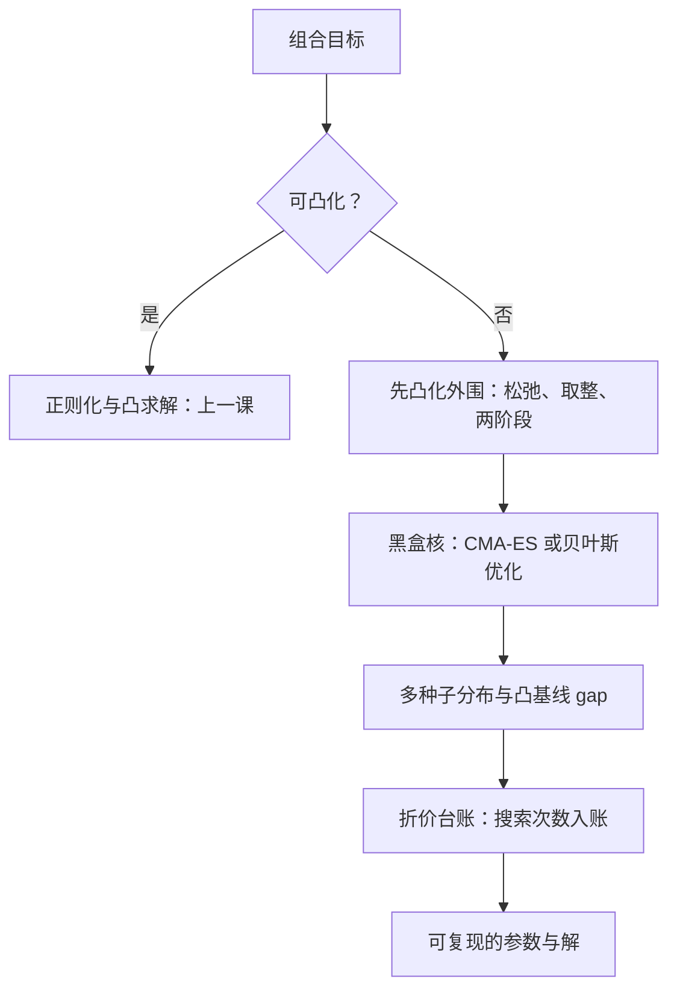

# 黑盒优化器在组合里的使用

梯度是优化器的坦白书：没有它，每一次「更优」都只是一次未经检验的声明。

<footer>—— 据 Hansen and Ostermeier, Evolutionary Computation, 2001（CMA-ES）；Jones, Schonlau and Welch, Journal of Global Optimization, 1998 整理</footer>

[上一课](/quant/pf-regularized)把不信任写进目标函数：$\ell_1$、$\ell_2$、收缩与约束当正则，全部在凸的世界里兑现。缺口在边界之外：最多持有五十只（基数约束）、手数取整、固定佣金台阶、必须用历史情景原样计算的路径目标——这些把问题推出凸集，[CVaR 优化](/quant/cvar-opt)的线性规划也救不了带整数与台阶的版本。梯度缺席，本课写黑盒优化器在组合里的用法与纪律：什么时候值得用、怎么验收、怎么不被它过拟合。

## 问题

黑盒指只能查询输入输出、拿不到导数的优化器：遗传算法、模拟退火、CMA-ES、贝叶斯优化。组合语境的诱惑特别大，因为目标函数现成——就是回测器。把回测器当适应度函数去搜权重，等价于把多重检验机器接在权重空间的每一根轴上。错法清单：把搜出的参数当发现；种子一换结果大变，报告的却是单一最好的那一次；两千次评估的搜索史被忘掉，[Harvey-Liu-Zhu 多重检验](/quant/harvey-liu-zhu)的折价没有记进任何台账；以及更隐蔽的——凸化其实可行，只是写约束的人懒得想。

### 纪律三件套

第一件，先凸化再黑盒。基数用 $\ell_1$ 松弛加投影，或连续解取整后做局部修复；固定成本拆成两阶段（先定持仓、再定交易批次）；路径类目标若能写成情景上的凸形式就退回上一课。凸化把搜索空间缩小一寸，过拟合的表面积就小一寸——只有真正凸不动的核才交给黑盒。第二件，管理评估预算。组合黑盒的每次评估都是一次回测，昂贵且缓慢；贝叶斯优化用代理模型与采集函数挑下一次评估的点（Jones 等 1998 的高效全局优化是原型），CMA-ES 适合中等维度的连续核，遗传算法对付离散与混合变量。预算要事先钉死，跑完不许追加——追加预算就是追加检验次数。第三件，验收协议。报告多种子的解分布而不是单点；与凸松弛解比较，得到最优性间隙的经验感受；搜索次数进台账，按 [Deflated Sharpe](/quant/deflated-sharpe) 与[过拟合次数与试错](/quant/backtest-overfitting)的口径折价。

## 机制

黑盒在组合里比在超参里更危险，原因在评估数据的重复使用：调学习率的搜索消耗的是验证集的一次机会，组合黑盒却常在同一个历史窗口里反复评估——验证信息被成千次透支，样本内最优与样本外表现的相关性随评估次数衰减，[Probability of Backtest Overfitting](/quant/pbo) 与 [CSCV 组合对称交叉验证](/quant/cscv)正是给这类搜索做尸检的工具。种子敏感性与上一课的平坦谷底同源：非凸目标的多解集合比凸问题大得多，种子决定停在哪一个坑里；报告单点解等于把一片解集伪装成唯一真值。为什么贝叶斯优化值得优先考虑：代理模型显式携带不确定性，采集函数在「利用已知好区」与「探索未知区」之间做权衡，评估次数省下的同时，每一步选择都有记录可审计——这对台账纪律是加分而不是负担。

台账口径：一次两千次评估的黑盒搜索，等价于对「这套框架能赚钱」做了两千次隐式检验；报告的 $t$ 统计量要按搜索次数重算，折价后的显著性才是可以拿去投委会的数字。

## 边界

本课不写具体算法的实现细节：CMA-ES 的自适应协方差、采集函数的族谱各有专文；执行层母单拆分与日内路径是 [Almgren-Chriss](/quant/almgren-chriss) 课序的对象，与这里的仓位层黑盒分属两层。黑盒不是凸优化的替代品：凸可得时用黑盒是纪律问题，不是能力问题；它也不是过拟合的豁免——恰恰相反，搜索越自由，[White Reality Check](/quant/white-reality-check) 这类数据挖掘校正越必要。

## 小结

- 黑盒只在没有梯度可用的核上使用：基数、取整、固定成本、路径目标；外围先凸化，缩小搜索空间。
- 评估预算事先钉死；贝叶斯优化用代理省评估，CMA-ES 适合连续核。
- 验收靠多种子分布与凸基线间隙，不靠单一最好解；种子敏感性提示多解集合很大。
- 搜索次数进多重检验台账，按折价口径重算显著性。
- 出处：Hansen & Ostermeier, *Evolutionary Computation*, 2001；Jones, Schonlau & Welch, *Journal of Global Optimization*, 1998；折价口径据 backtest-overfitting 一课整理。
