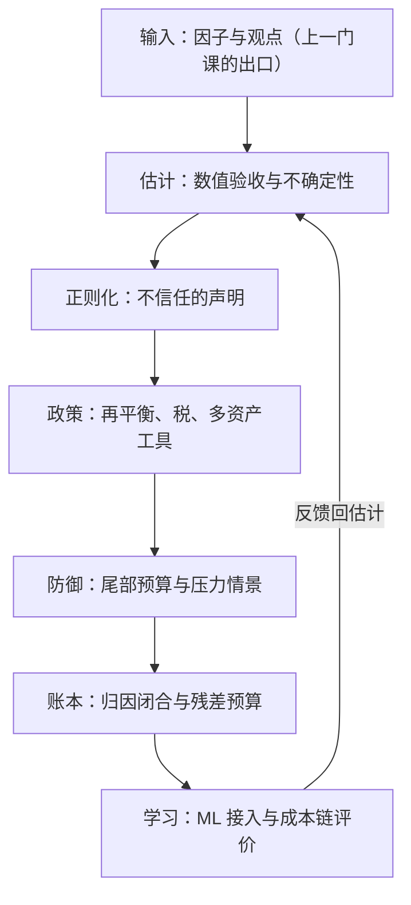

# 组合案例与收束

组合构建的全部知识，只在「从因子清单到月末账单」的路上同时为真；收束课把这条路走两遍，再给你一张地图。

<footer>—— 据 Markowitz, Journal of Finance, 1952；Michaud, Financial Analysts Journal, 1989；Grinold and Kahn, Active Portfolio Management, 2000 的口径整理</footer>

[上一课](/quant/pf-ml-in-portfolio)把机器学习接进构建管线：分层接入、不确定性进优化、成本链验收。本课是组合构建深化的收束课：两个案例把十一课的机器串起来跑一遍，然后给出课程的地图。单课视角的盲区在接缝：每环单独都对、连起来错——收束检查的正是接口。本课程到此收束。

## 问题

接口失败的三种典型。数值层与统计层的接缝：扰动验收过关的解，喂进的是一份过时的 $\Sigma$——稳定地错。政策层与目标层的接缝：税优的再平衡（卖出亏损、保留盈利）悄悄改变了因子暴露，归因报告里以「风格漂移」现形——政策在它自己的会计里正确，在账本里欠账。防御层与资负层的接缝：对冲预算在压力情景里被证明买错了凸性——情景库没有覆盖对冲工具自身的基差。两个案例各暴露一类接缝。

## 方法

方法是把两个案例当接口测试来跑：每个案例沿同一条流水线走全程——估计、正则化、政策、防御、账本——只换外部条件，不换验收口径。案例的产出不是复盘叙事，而是一张标了地址的接口修正清单：凡是需要人工「翻译」才能通过的接缝，就是失败点，事后由压力测试与归因对账把地址钉实。

### 案例一：多资产风险平价遇上 2022

通胀冲击让股债相关转正：体制分层的协方差估计（[多资产组合](/quant/pf-multiasset)）若只做了形式分层，此时给出的对冲比照旧；波动目标自动减仓（[波动目标](/quant/vol-targeting)）与再平衡带宽（[再平衡策略学](/quant/pf-rebalancing)）争夺同一笔交易——带宽过松，减仓落在风险兑现之后；杠杆的保证金追缴（[期货保证金](/quant/futures-margin)）与展期成本挤占现金流；尾部预算若只买了股指 put，对冲的是股票左尾，不覆盖债券的实际波动。事后复盘的压力测试（[组合压力测试](/quant/pf-stress-testing)）把「通胀驱动的双杀」从假设情景升级为必测情景——产出是接口修正，不是失误名单。

### 案例二：应税账户接入一条动量因子

因子账本交付约定显式的动量信号（因子研究深化的出口）；第一道关是[优化器的数值稳定性](/quant/pf-optimizer-numerics)：扰动测试显示高换手动量的权重稳定带极窄，[正则化组合](/quant/pf-regularized)的 $\ell_1$ 与换手惩罚把换手压到成本线上；[税负敏感的组合](/quant/pf-tax-aware)用批次识别与损失收获吸收实现税，替代持仓维持暴露；[组合中的机器学习](/quant/pf-ml-in-portfolio)的 meta-labeling 只调仓位不改方向；季度末由[绩效归因的深化](/quant/pf-attribution-deep)对账：税负单列、残差在预算内、动量的钱可指认。两个案例共用一条流水线。

## 机制

为什么案例要跨体制：案例的价值在暴露隐藏假设——2022 暴露的是「平滑相关与低利率 carry」假设，应税案例暴露的是「税前效用」假设；每条假设在被击穿前都不可见，把两条已知裂纹摆在一起，接口清单就从演练变成经验。为什么流水线要闭环：归因与压力的发现流回估计与政策，与因子研究收束课的闭环同构——没有回边的部门反复在同一接口上犯同一类错，有回边的部门，每次危机都在提高下一版构建的存活率。三句话带走这门课：优化器是误差放大器，纪律从数值层开始；约束、税与再平衡不是实现细节，是策略本身；验收在成本链与危机故事上，不在样本内夏普上。

接口自查的一句话版本：任何一个环节的输出，能否以其下游要求的格式与口径被无修改地消费？因子清单到估计、估计到政策、政策到账本——每处「翻译」都是下一次事故的候选地址。

## 边界

本课程不进入波动率产品的定价与对冲细节（波动率交易深化课程的对象），不展开机构风险治理与限额体系（风险体系深化课程的对象），不替代执行层的算法选择（交易执行课程）。方法论不替你选择目标函数与政策参数——它收敛于让每个选择可审计：数值有稳定带，正则有对偶口径，政策有成本核，防御有情景库，账本有残差预算。深钻的尽头是接口的纪律：下一门课的波动率，会以同样的方式验收本课程交出的组合。

## 小结

- 两个案例各暴露一类接缝：前者在防御与资负之间，后者在政策与账本之间。
- 流水线闭环：归因与压力的发现流回估计与政策，每次危机提高下一版的存活率。
- 三句话：优化器是误差放大器；约束与政策即策略；验收在成本链与危机故事上。
- 课程地图：输入、估计、正则化、政策、防御、账本、学习，七站各有验收标准。
- 出处：Markowitz, *JF*, 1952；Michaud, *FAJ*, 1989；Grinold & Kahn, *Active Portfolio Management*, 2000。
