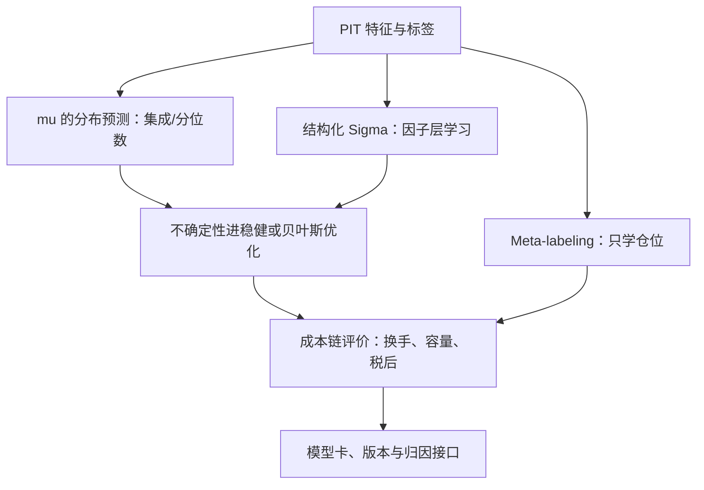
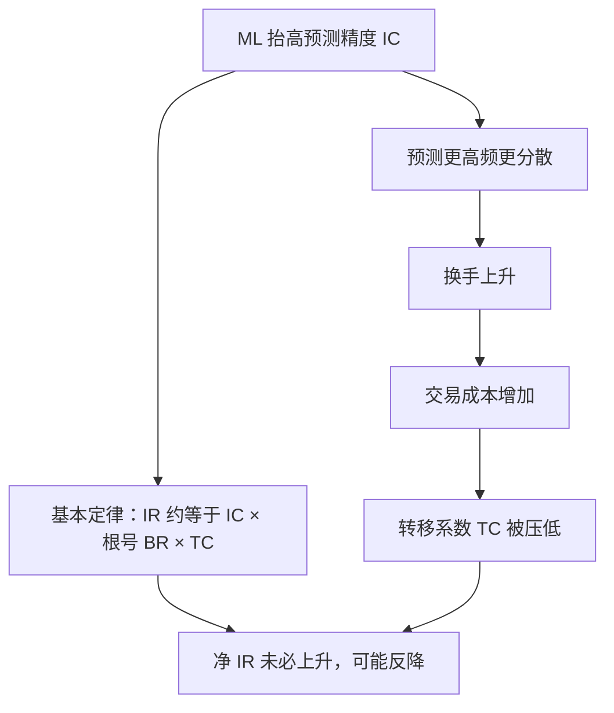

# 组合中的机器学习

机器学习提高的是估计的上限，不是估计的信用；把它接进优化器的那一刻，前面十课的每一条纪律都变得更贵，也更必要。

<footer>—— 据 Gu, Kelly and Xiu, Empirical Asset Pricing via Machine Learning, Review of Financial Studies, 2020；Grinold and Kahn, Active Portfolio Management, 2000 整理</footer>

[上一课](/quant/pf-attribution-deep)把账本闭合：多期连接、层次一致、残差预算。缺口回到前端：输入优化器的 $\mu$ 与 $\Sigma$ 越来越多由机器学习生产。[Gu-Kelly-Xiu 与 NN3](/quant/gkx-nn3)、[IPCA 工具主成分](/quant/ipca)、[自编码器因子模型](/quant/autoencoder-factor-model)写了估计层的方法；本课写 ML 输出变成权重这一段——接入点、病与纪律。信号研究的方法论是金融 ML 工程课程的对象，此处不重复。

## 问题

三个接入点各有病。其一，$\mu$：神经网络预测的信噪比低且非平稳，直接当均值输入，优化器照单放大——第一课的误差放大机制在更糟的输入上全速运转。其二，$\Sigma$：学习型协方差（自编码器、神经网络）不带标准误，错误的相关比错误的方向更隐蔽——它悄悄改写每一个对冲比。其三，端到端：把组合目标直接写进损失、梯度穿过优化器（可微分优化），甚至用强化学习直接学仓位——整条管线可训练的同时也整条管线可过拟合；用样本内夏普评价端到端管线，等于把黑盒搜索（第三课）的评估次数再乘上参数量。「端到端」就是让模型从原始数据一步直出最终仓位，成本与约束不再各自成层。直觉类比：分层管线像流水线上每道工序有独立质检，端到端像一台机器包揽全部——坏在哪一环查不出来，而且整台机器可以齐心协力地过拟合同一个历史窗口。错法的共同根源：ML 生产的是预测，组合消费的是持仓，中间隔着成本、约束与不确定性，省掉中间层就是把三笔账记成一笔。

## 方法

方法是分层接入而不是端到端一步到位：估计层只生产带不确定性的预测，仓位层用轻量方法把方向与仓位解耦，验证协议原样继承信号层的防泄漏纪律，评价则必须走完整条成本链。分层的代价是放弃「一次训练直接出仓位」的便利，换来的是错误可定位——哪一层出问题，症状与修法各不相同。

### 分层接入

第一层，估计层带不确定性：$\mu$ 用集成或分位数给出分布而非点值，不确定性进入[稳健优化](/quant/robust-portfolio-opt)或[贝叶斯组合与参数不确定](/quant/bayesian-portfolio)的口径；$\Sigma$ 保持结构化（因子层学习、残差层解析），让错误的传播有迹可循。第二层，仓位层的轻量接入：[Meta-labeling](/quant/meta-labeling) 把方向与仓位解耦——ML 只学「什么时候信这个信号」，不改目标函数的凸性，是性价比最高的一步；Meta-labeling 可以读成「给信号打分」：主策略只管指方向，ML 模型只学「这个信号出现时该信几分」，输出的是仓位大小而不是买卖方向。直觉类比：老司机（主策略）负责认路开车，副驾（ML）只在颠簸路段提醒「这段慢点开」——方向盘始终在主策略手里。[Triple Barrier 标签](/quant/triple-barrier)提供与持仓周期一致的监督信号。第三层，验证协议继承信号层：[purge-embargo](/quant/purge-embargo) 与[金融 ML 的交叉验证泄漏](/quant/cv-leakage-finance)防止时间泄漏；特征对齐 [防止未来函数](/quant/no-future-function)；评价必须走完整条成本链——换手、容量、税后（第五课的账本），而不是停在预测误差。

## 机制

用基本定律定位 ML 的收益从哪来：$\mathrm{IR}\approx \mathrm{IC}\times\sqrt{\mathrm{BR}}\times\mathrm{TC}$（Grinold 与 Kahn 2000）。ML 主要抬 IC；但 ML 预测通常更高频、更分散，组合换手随之上升，转移系数 TC 被成本压低——IR 可以不升反降。所以「ML 有用」必须在权重与成本之后度量，不能停在预测层面；这是[策略容量与拥挤](/quant/strategy-capacity)与[因子衰减与换手](/quant/factor-decay-turnover)的口径在 ML 语境下的复述。端到端的诱惑为什么危险：损失函数里只写收益时，成本、约束、尾部都是「没写进去的东西」，管线会精确地找到不用付费的假凸性——把 $\mu$ 的过拟合与结构的过拟合叠成一层。校准预期用实数：Gu、Kelly 与 Xiu（2020）的样本外 $R^2$ 在月度千分之几的量级——即便如此，经组合、复利与风控后仍有经济意义；这组数字既是 ML 的上限证明，也是对「端到端必然更强」幻想的最好解药。

IC 是预测与实现收益的相关系数，横截面上通常只有 0.02–0.05。数字实例：IC=0.03、独立下注数 BR=2000、转移系数 TC=0.3，则 IR 约 0.03 × 44.7 × 0.3 ≈ 0.40——微弱的相关乘上巨大的下注次数才凑出可用的 IR，这正是横截面策略的算术。

月度样本外 $R^2$ 千分之几（GKX 2020 口径）听起来可怜，但它对应的是横截面数千只股票的排序信息；把它翻译成 IR，要过基本定律的三道乘法——任何一道为负，IC 的提升就到不了账上。

## 边界

本课不写信号研究方法论（特征、标签、模型族谱是金融 ML 工程课程），不展开强化学习执行（执行课序的对象）；端到端可微优化的实现细节点到为止——它的正当用法是在明确的约束族内求投影，而不是把整个投资流程交给梯度。治理侧只立接口：模型卡与版本、特征的 PIT 审计、权重可解释（[SHAP 因子归因](/quant/shap-factor-attribution)）与归因的残差预算（上一课）——ML 管线要在第 1、3、9 课的三套验收下全部过线，才有资格进组合。

## 小结

- 三个接入点：$\mu$ 带不确定性的预测、结构化 $\Sigma$、仓位层轻量接入；分层让错误可定位。
- 端到端的代价是三笔账并成一笔：预测误差、成本与约束的过拟合互相掩护。
- 基本定律定位 ML：IC 提升 × 换手成本 × 风险分散，任何一项倒退都吃掉收益。
- 验收继承信号层（purge/embargo、PIT）加组合层（成本链、税后），两套都要过。
- 出处：Gu, Kelly & Xiu, *RFS*, 2020；Grinold & Kahn, *Active Portfolio Management*, 2000；López de Prado, *Advances in Financial Machine Learning*, Wiley, 2018。
