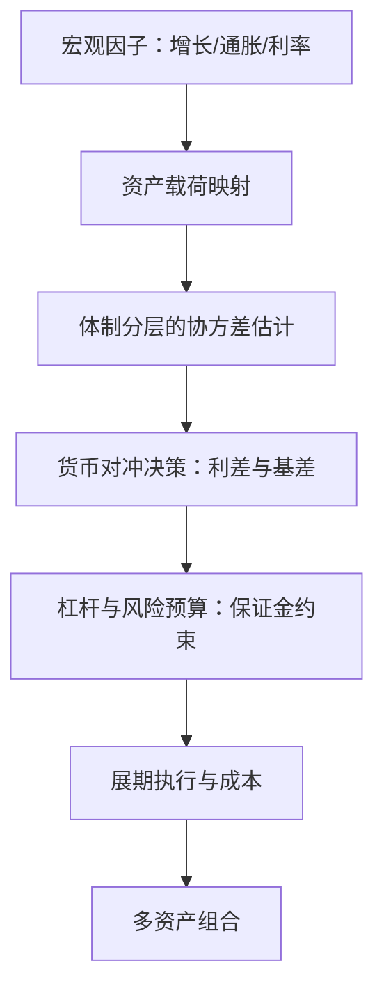
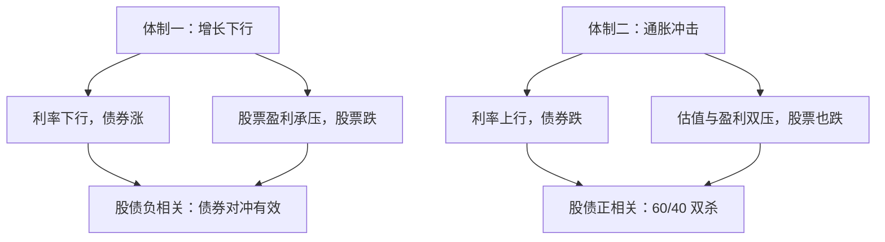

# 多资产组合

跨资产的分散化买的不是「不同的代码」，是不同的宏观环境；当环境只剩一种，多资产的相关矩阵会集体投降。

<footer>—— 据 Ilmanen, Expected Returns, Wiley, 2011；对照 Markowitz, Journal of Finance, 1952 整理</footer>

[上一课](/quant/pf-tax-aware)把税写进目标与状态：税后终值、（持仓、税基）增广、不对称带宽。前几课的机器都跑在单一资产池上；缺口是资产类别本身——股票、利率债、信用、商品、外汇的收益生成过程不同，工具与资金形态也不同。本课写多资产组合构建的四件事：结构化估计、货币、杠杆、展期。不重讲[Markowitz](/quant/markowitz)的选择问题，也不重写[风险平价](/quant/risk-parity)的求解。

## 问题

把资产名单加长不等于多资产组合。新问题有三类。其一，收益的含义不同：债券的收益大头在久期与凸性（[久期与凸性](/quant/duration-convexity)），商品的现货之外有[展期收益](/quant/roll-yield)与[期货贴水升水](/quant/contango-backwardation)，外汇现金有利差（[carry-everywhere](/quant/carry-everywhere)）——「均值」对不同类别的生成机制不同，统一当成一个收益率向量会把这些结构抹平。其二，相关是体制的函数：股债相关在增长驱动的年代为负、在通胀冲击下转正，平滑估计的相关矩阵在体制切换时给出完全错误的对冲比。「体制」就是市场所处的宏观环境状态，如「增长上行+低通胀」或「滞胀」。直觉类比：同样的船和帆，顺风与逆风是两种状态；相关矩阵就是帆的用法——只在一种风里校准过的帆，换风时会把船掀翻。其三，低波动资产的分散化贡献大而收益低：不加杠杆的配置会退化成隐蔽的股票基金——分散化的名义与风险的真实不符。

## 方法

方法是按「资产类别收益的生成机制不同」重建构建流程：估计层先立宏观因子、把资产写成载荷，协方差按体制分层；执行层把货币对冲、杠杆与展期三笔摩擦各自写清成本来源，全部送进同一个优化器，而不是留在归因里等事后发现。四件事的次序不可换：估计错了，后面的对冲比与杠杆都是精确的错误。

### 四件事

结构化估计：先宏观后资产——增长、通胀、实际利率这套低维宏观因子（[宏观因子集](/quant/macro-factor-set)）之上，资产是载荷不同的组合；协方差按体制分层估计，动态相关用 [DCC 动态相关入组合](/quant/dcc-portfolio)，高频场合接[多元已实现协方差](/quant/realized-covariance)。货币：本币收益等于当地收益乘汇率，对冲与否是逐类别的成本收益决策，对冲成本由利差与互换基差决定（[xccy-basis](/quant/xccy-basis)），不是默认动作。货币对冲不是免费的：成本约等于两种货币的利差。数字实例：用美元对冲欧元资产，若美元利率比欧元高 2%，持有人每年大约付出 2% 的对冲成本，本币收益被持续侵蚀——是否对冲因此是逐类别的计算题，不是默认开关。杠杆：低波动资产的配置靠杠杆放大到目标风险——风险平价与[管理期货风险平价](/quant/mfd-risk-parity)是系统化的做法；杠杆用期货保证金实现而不是融资买券，保证金占用与追缴是真实约束（[期货保证金](/quant/futures-margin)），必须进优化器而不是进脚注。展期：期货组合有永续的换月成本与日历选择（[期货展期日历](/quant/futures-roll-calendar)），长期持有的「资产」实际是一串带摩擦的滚动头寸。

## 机制

为什么体制分层不可省：2022 年的通胀冲击里股债相关转正，传统股六债四组合录得数十年间最差的年份之一——用平滑历史相关的优化器，没有一格世界里装得下这个输入；它配置的「对冲」在唯一需要兑现的年份失灵。这与上一课讲的政策负债同构：平滑估计便宜了样本内，把凸性风险推迟到危机日结算。杠杆为什么是特性而非缺陷：资本效率的论证是把「安全的资产」放大到与股票同等风险，而不是把股票放大到爆仓——风险预算约束下的杠杆有明确的边界与追缴时间表，把它当洪水猛兽与当免费午餐是同一种错误的两面。展期成本为什么必须进构建：对长期策略，年化几十个基点的展期摩擦复利二十年就是数个百分点的终值差，它应该出现在目标函数里，而不是在事后归因里被「发现」。

常见误区：以为杠杆爆仓要等「价格归零」。实际上期货杠杆的死法通常是保证金追缴：浮亏把保证金消耗到维持线以下，必须立刻补钱，否则被强制平仓——价格远没到零，仓位已经没了。所以保证金占用与现金储备必须写进优化器的约束，而不是脚注。

股债负相关是特定宏观体制的礼物：增长下行时利率下行、债券涨、股票跌；通胀驱动的下行里两者一起跌。多资产组合的分散化，买的是「环境集合」的宽度，不是资产代码的数量。

## 边界

本课不进入类别内部的选券与轮动（前面课序的对象），不展开管理期货策略本身（[管理期货风险平价](/quant/mfd-risk-parity)与 CTA 课序），不重推风险平价的解。与尾部防御的接口留白：多资产组合在左尾面前的最后一道防线——对冲预算与凸性菜单——是下一课的对象。商品展期的期限结构策略、外汇的套息拥挤，各有专课，此处只进组合层。

## 小结

- 多资产构建的四件事：结构化估计（宏观因子、体制分层）、货币对冲、杠杆与保证金、展期成本。
- 相关是体制的函数：平滑相关在体制切换时集体失效，2022 股债双杀是标准教材。
- 低波动资产的杠杆是资本效率工具，约束是保证金与追缴时间表，不是道德判断。
- 展期摩擦进目标函数：长期复利下它是构建参数，不是归因发现。
- 出处：Ilmanen, *Expected Returns*, 2011；Markowitz, *Journal of Finance*, 1952；体制与相关的实证口径据 DCC 与相关性崩溃两课整理。
