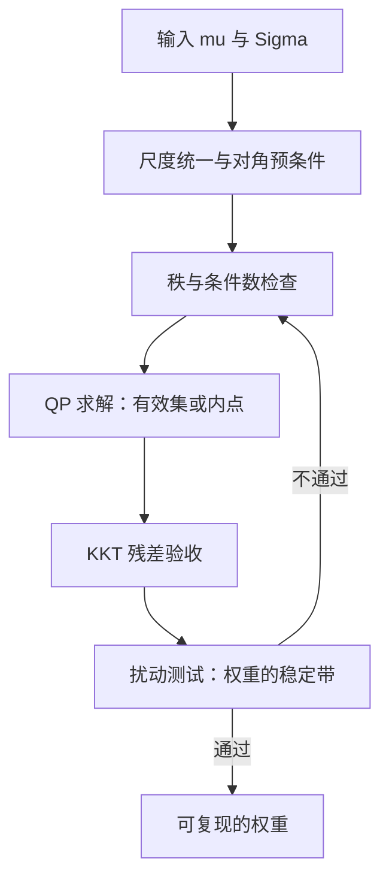

# 优化器的数值稳定性

优化器从不同情输入：它把病态的协方差矩阵变成一个自信满满的角点解；权重的大幅跳动常常不是观点变了，是条件数变了。

<footer>—— 据 Michaud, The Markowitz Optimization Enigma, Financial Analysts Journal, 1989；Markowitz, Journal of Finance, 1952 整理</footer>

[上一课](/quant/fz-map)把因子研究深化收束：从构造、正交化、拥挤、生命周期到报告与复现的十环流水线，每一环的结论都声明「相对什么成立」，并留下接口——因子确定之后的权重与优化，交给组合构建的课程。本课就是那门课的第一课。在讨论任何聪明的目标函数之前，先把最底下一层钉住：同一个二次规划，换一台机器、多一天数据，权重为什么面目全非。后课的正则化、黑盒与再平衡，都默认你已能把组合问题写成数值上站得住的形式。

## 问题

[Markowitz](/quant/markowitz) 的选择问题写下来只有一行：给定 $\mu$ 与 $\Sigma$，在预算与收益约束下最小化 $w^\top\Sigma w$。数学上良定，数值上未必。输入的每一项都带误差：$N$ 只资产只有 $T$ 个观测，样本协方差的秩至多 $T-1$，$N \gt T$ 时直接奇异；即便满秩，特征值谱也能横跨多个数量级。优化器拿到条件数 $10^8$ 量级的 $\Sigma$，算出的权重就带着假精度：沿小特征值方向移动权重，目标值几乎不变，解的唯一性丢失，求解器停在哪一点由舍入误差与初值决定。不这么做的错法很具体：把权重跳变解读为信号变化照单执行；把求解器报错当成「无解」；两台机器跑出两份仓位，对不上账。

## 方法

方法是把数值稳定性当成求解前的一道固定工序：数据进来先过尺度与谱的体检，体检通过才许进求解器；解出来再过 KKT 残差与扰动两道验收，任何一道不过就退回上游修输入，而不是解读权重。四步各有可判定的判据，全部可脚本化——同一份数据在任何一台机器上都该给出同一组权重。

### 从输入到验收

做法分四步。其一，尺度统一：收益与协方差用同一频率、同一年化口径，$\mu$ 与 $\Sigma$ 的时间尺度错配是无声的放大器；再对 $\Sigma$ 做对角预条件 $D^{-1/2}\Sigma D^{-1/2}$，解出 $v$ 后回乘 $w=D^{-1/2}v$，数值行为立改，解不变。其二，秩与谱检查：数一数 $N$ 与 $T$，看特征值谱的尾部；接近奇异就先收缩或降维——[估计误差与收缩](/quant/cov-shrinkage)、[Ledoit-Wolf 收缩](/quant/ledoit-wolf)与[因子协方差 vs 样本](/quant/factor-vs-sample-cov)已写满工具箱，这里要把它们当数值前置步骤执行，而不是统计学装饰。其三，求解器与容差：有效集法与内点法在退化方向上可以给出不同解，容差应与输入的不确定度相称——报出小数点后十二位的权重是自我欺骗。其四，验收用 KKT 加扰动：对偶可行性残差要过线；再对数据扰动——重抽日期、增删一天、把 $\mu$ 推动一个标准误——量一量权重跳多少。

## 机制

条件数为什么能杀死 Markowitz：有效前沿沿小特征值方向几乎平坦，目标函数分辨不出这条方向上的权重差别，「最优解」成了一片平坦谷底上的集合。约束再把它推向顶点：非负与暴露上限让活跃集变化成为离散事件，数据的微小扰动可以翻转哪些名字被顶在边界上——权重从 $3\%$ 跳到 $0$，与从 $3\%$ 跳到 $2.9\%$，是两种完全不同的运营事件。Michaud 在 1989 年把这层病说得最狠：无约束的优化器把估计误差当信息放大，样本内「最优」恰是样本外最脆的。数值不稳定是这句话的表层症状：连同一份数据都给不出同一组权重的东西，谈不上统计稳健；而两份稳定但不同的解，往往提示该把活跃集与退化方向写进报告。

$N$ 只资产、$T$ 个观测，样本协方差的秩至多 $T-1$：500 只股票配一年日频（$T=250$），$w^\top\Sigma w$ 沿一半以上的方向没有任何数据证据——优化器在那里自由发挥。

## 边界

本课不重推收缩公式，不进入约束的语义学：多空、净毛暴露与章程如何改写可行集，见[多空与多头约束](/quant/long-short-constraints)与[组合约束](/quant/portfolio-constraints)。数值稳定不等于统计稳健——解可以稳定地错，扰动验收只证明「对输入敏感度低」，不证明输入正确。整数约束、基数限制与凸不起来的目标，凸求解器无能为力，是下一课黑盒优化器的对象。

## 小结

- 组合优化先过数值关：尺度统一、预条件、秩与条件数检查是求解的前置步骤，不是可选卫生。
- $N \gt T$ 或病态谱让解不唯一；顶点解对数据扰动离散跳变，权重跳变要先查数值再解读信号。
- 验收标准是 KKT 残差加扰动测试：报告权重的同时报告它的稳定带。
- 数值稳定与统计稳健是两件事：收缩与降维解决后者，求解器容差只解决前者。
- 出处：据 Markowitz, *Journal of Finance*, 1952；Michaud, *Financial Analysts Journal*, 1989 的口径整理。
