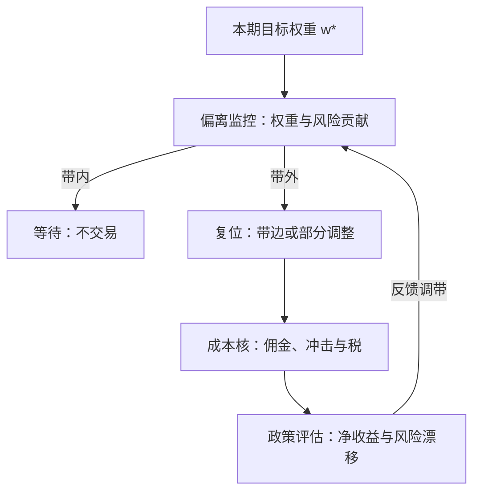

# 再平衡策略学

再平衡不是维护费，是一张卖出波动率的保单：震荡市里它持续收租，单边市里它把凸性赔付出去。

<footer>—— 据 Perold and Sharpe, Dynamic Strategies for Asset Allocation, Financial Analysts Journal, 1988；Constantinides, Journal of Economic Theory, 1986 整理</footer>

[上一课](/quant/pf-blackbox-optimizers)把非凸目标的求解收口：先凸化外围，黑盒只碰真正的核，搜索次数进台账。到此为止，优化器每期输出一个目标权重；缺口是目标点之间的路——何时动、动多少、动的时候付什么。本课进入策略维度，把再平衡当作政策来设计与评估。主干课的[再平衡规则](/quant/rebalance-rules)已写日历、阈值与禁交易带的机制，[风险预算再平衡](/quant/rb-rebalance)写了贡献空间的监控；本课不重复规则清单，写的是把这些规则当作一个联合设计问题来选。

## 问题

目标权重每期重算，把它实现成持仓却是一套独立政策：按日历推回、按带宽触发、推到带边还是完全复位、部分调整还是一次到位。政策选错错在哪：带太紧，佣金、冲击与[换手惩罚](/quant/turnover-penalty)把 alpha 吃光；带太松，风险漂移——波动翻倍而仓位未动，政策目标早已落空。更根本地，再平衡本身有收益结构：恒定混合是卖赢买输，在均值回复的震荡市里持续收获[再平衡溢价](/quant/rebalancing-premium)，在单边趋势市里把凸性赔付出去（Perold 与 Sharpe 1988 的经典对照）。把它当中性维护费，就会在趋势行情里把亏损归咎于「运气」，而那笔亏损是政策自带的负债。

### 政策的参数化

把再平衡政策写成一个对象：$(\tau,\delta,\kappa)$——触发（日历 $\tau$ 或带宽 $\delta$）、复位方式（推到带边或完全复位）、成本核 $\kappa$（佣金、冲击与税）。三个方向的设计资源：其一，动态规划的语言把「何时动」写成带费用的最优停时，比例成本下的无交易区是自由边界问题（Constantinides 1986；[动态规划与再平衡](/quant/dynamic-programming-rebalance)）；其二，Gârleanu 与 Pedersen（2013，见 [Gârleanu–Pedersen 动态交易](/quant/garleanu-pedersen)）把复位方式写成部分调整：$w_{t+1}-w_t=\kappa\,(w_t^{\ast}-w_t)$，调整速度由信号可预测性与成本之比决定——目标与路径合并成一个策略；其三，风险预算的场合，推回的对象是欧拉贡献而不是名义权重（[风险预算再平衡](/quant/rb-rebalance)），两套带宽不能混用。

## 机制

凸性的价格是这门课的核心会计。恒定混合在每次偏离后卖强买弱，等价于持续向市场卖出趋势保险；[组合保险 CPPI / TIPP](/quant/cppi-tipp) 是它的镜像——买凸性的一方在趋势市获利、在震荡市被磨损。所以「再平衡有溢价」不是免费午餐的承诺，是波动与均值回复的报酬，且符号随体制翻转。为什么带宽是政策而非细节：两只基金持有同样的目标权重、不同的带，收益分布可以差出一个风格；带还决定了与其它规则的拥挤——当大量纪律化资金共享相似的日历与带宽时，执行时点聚集，成本自我抬高（[指数调仓套利](/quant/index-rebalance-arb)写的是同一机制的指数版）。带宽与波动目标的交互也在此：波动上升时目标仓位下降，若带太松，降仓被延迟到风险已经兑现之后——[波动目标](/quant/vol-targeting)的风险控制就被再平衡政策抵消了一半。

比例交易成本下，最优无交易区宽度按成本的立方根缩放（Davis–Norman 1990 的自由边界）：成本减半，带宽只收窄到约 $2^{-1/3}\approx 0.79$——带宽对成本不敏感的直觉，常常让人把带设得太紧。

## 边界

本课不重写日历/阈值机制的条目（[再平衡规则](/quant/rebalance-rules)），不重推风险预算的监控量（[风险预算再平衡](/quant/rb-rebalance)），不展开动态规划的完整形式（[动态规划与再平衡](/quant/dynamic-programming-rebalance)）。信号半衰期与持有期的匹配在[因子衰减与换手](/quant/factor-decay-turnover)，那是目标权重的生产端；本课只管目标之后的路。税的维度进入成本核之后完全改变政策形状——无交易区会变得不对称，这是下一课的对象。政策回测若不带真实摩擦与税，得出的「最优带」只是另一个样本内最优。

## 小结

- 再平衡是政策不是维护：触发、复位方式、成本核三件联合设计，收益结构自带凸性敞口。
- 再平衡溢价是波动收割，趋势市中符号翻转；把它当免费午餐会误配带宽。
- 无交易区宽度按成本立方根缩放；部分调整把目标与路径合并成一个策略。
- 带宽决定与波动目标、风险预算及其它纪律化资金的交互，是风格变量。
- 出处：Perold & Sharpe, *FAJ*, 1988；Constantinides, *JET*, 1986；Gârleanu & Pedersen, *RFS*, 2013；Davis & Norman, *Mathematical Finance*, 1990。
