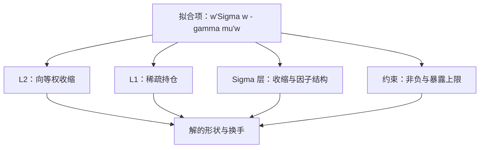

# 正则化组合

正则化是对自己估计能力的不信任，明码标价地写进目标函数；约束与罚项是同一枚硬币的两面，差别只在记账科目。

<footer>—— 据 Jagannathan and Ma, Journal of Finance, 2003；Brodie, Daubechies, De Mol, Giannone and Loris, PNAS, 2009 整理</footer>

[上一课](/quant/pf-optimizer-numerics)把数值层钉住：尺度与预条件、秩与条件数、KKT 与扰动验收——扰动测试不过关的解，说明目标函数对输入过敏。缺口在上一层：与其等病态解出来再收拾，不如先把不信任声明进目标。本课把组合问题的正则化谱系一次排清：罚在权重上、罚在协方差上、罚在结构上，以及约束与罚项的对偶关系。后课的黑盒与策略维度都默认这套词汇。

## 问题

[Markowitz](/quant/markowitz) 的无约束解在估计误差面前是放大器——上一课的平坦谷底与顶点跳变就是症状。对策有两族：事后修输入（对 $\Sigma$ 收缩），事前修目标（加罚项或约束）。都不做，错法自然：误差被放大成角点仓位；反过来做歪了也错——把正则强度 $\lambda$ 当玄学，挑到样本内回测最亮为止，等于把多重检验从信号层原样搬到权重层，[多重检验与 p-hacking](/quant/multiple-testing-factors) 的账单照收不误。

## 方法

方法是把「不信任」逐层写进目标函数：权重层加罚、协方差层换估计、可行层加约束——三层的数学身份不同，起到的作用同源。每层给出代表文献与实现口径，约束与罚项的对偶关系留到机制一节对账。挑层的次序从便宜到贵：约束与收缩先上，稀疏罚按需再加；上一课的扰动验收在加了罚项之后照跑不误。

### 三层罚项

罚在权重上：$\min_w\; w^\top\Sigma w-\gamma\,\mu^\top w+\lambda_2\lVert w\rVert_2^2+\lambda_1\lVert w\rVert_1$。$\ell_2$ 把解往等权方向收，$\ell_1$ 直接产生稀疏组合；Brodie 等（2009）把 $\ell_1$ 稀疏性同时读作正则与成本控制——持有的名字少了，监督与换手都轻。这个对照的极端是 $1/N$：DeMiguel、Garlappi 与 Uppal（2009）的系统比较显示，等权在样本外方差与夏普上常常不输优化组合——正则化不足的 Markowitz，输给最笨的正则。罚在协方差上：[Ledoit-Wolf 收缩](/quant/ledoit-wolf)把 $\Sigma$ 拉向结构化目标，是估计层的正则，[估计误差与收缩](/quant/cov-shrinkage)写了机制。罚在结构上：严格因子结构 $\Sigma=BFB^\top+\Delta$ 用低维载荷换掉满矩阵的自由度，选择逻辑见[因子协方差 vs 样本](/quant/factor-vs-sample-cov)。约束即正则：Jagannathan 与 Ma（2003）证明，非负约束在总体层面等价于对 $\Sigma$ 的一种收缩，「错误」的约束反而降低样本外方差——制度通过可行集完成了统计收缩，细节见[多空与多头约束](/quant/long-short-constraints)。

## 机制

偏差–方差的交换在组合语境里换了名字：正则化引入的「偏差」其实是政策——不押单一名字、不满仓单一因子，是章程本来就想要的东西。两种实现的接口由拉格朗日对偶给出：约束的影子价格就是罚系数，$\lambda$ 变动等价于可行集伸缩；实现上可以互换，报告时必须写清用了哪种，因为等价依赖特定的 $\lambda$ 映射与问题数据，审计口径不能两套混着讲。$\lambda$ 本身的纪律只有两条路：按样本外风险用滚动验证挑，或按等效约束的政策值反推——唯独不能按样本内收益挑，否则下一课黑盒搜索的过拟合机制会提前在 $\lambda$ 这一根轴上发生。还有一层工程红利：稀疏解换手少，与[换手惩罚](/quant/turnover-penalty)的成本口径天然咬合。

Jagannathan–Ma 的反直觉量级：非负约束隐含的收缩幅度，与专门设计的收缩估计同数量级——制度里「错」的约束，在总体层面买到了「对」的稳健。

## 边界

本课不重讲收缩公式的推导；不展开风险平价那一族「不逆满 $\Sigma$」的配置器——[ERC 与边际风险贡献](/quant/erc-mrc)与[HRP 联结与准对角化](/quant/hrp-linkage)是同一不信任思想的另外两条路，此处只点名。$\ell_1$ 带来的稀疏解对特征选择敏感，删掉一只名字解可能重排，扰动验收（上一课）照样适用。基数约束、手数取整与固定成本这类凸化失败的目标，罚项救不了，是下一课黑盒优化器的地盘。

## 小结

- 正则化的三层：罚权重（$\ell_1$ 稀疏、$\ell_2$ 收缩）、罚协方差（收缩、因子结构）、约束当正则（Jagannathan–Ma）。
- 约束与罚项由对偶等价；实现可互换，报告口径要唯一。
- $1/N$ 是天然的对照基线：优化组合赢不了等权，说明正则化没做够或 $\Sigma$ 太糟。
- $\lambda$ 按样本外风险或政策值定，不按样本内收益定；稀疏解的红利之一是成本链上的低换手。
- 出处：Jagannathan & Ma, *JF*, 2003；Brodie 等, *PNAS*, 2009；DeMiguel, Garlappi & Uppal, *RFS*, 2009；Ledoit & Wolf, 2004。
