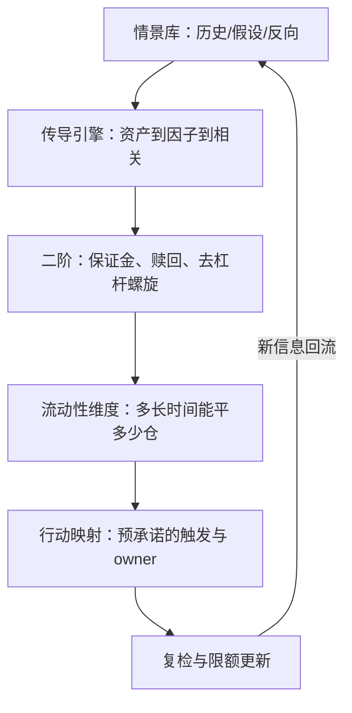

# 组合压力测试

VaR 告诉你在正常的日子里会丢多少；压力测试告诉你，你的组合在哪个故事里死掉——以及那个故事是不是早已写在你的持仓里。

<footer>—— 据 Basel Committee on Banking Supervision, Principles for Sound Stress Testing Practices and Supervision, 2009（2018 年修订）整理</footer>

[上一课](/quant/pf-tail-hedging)把尾部预算写进组合，验收的三道里留了一道「情景库打分」。本课把情景库这一层写全：压力测试是组合的反事实体检，从 [VaR：历史、参数、MC](/quant/var-methods) 的正常日推进到故事的极端日。机构侧的条目已有——[压力 VaR 与 FRTB](/quant/stressed-var-frtb)、[反向压力测试](/quant/reverse-stress-test)、[流动性调整 VaR](/quant/liquidity-adjusted-var)；本课写组合管理者视角：设计、传导、行动、复检。

## 问题

压力测试最容易退化成合规仪式。典型死法：情景只用历史重放，而资产名单早已换代——重放 2008 对今天的组合是错位的考题；冲击只打到一阶资产价格，不打因子与相关——而危机的第一特征恰是[相关性崩溃](/quant/correlation-breakdown)：分散化假设在最需要它的一天集体失效；只测市场风险，不测流动性与资金——[流动性调整 VaR](/quant/liquidity-adjusted-var) 的平仓成本与[期货保证金](/quant/futures-margin)的追缴时间表才是压力里真正的死亡路径；最后一条：测完不接行动，报告归档、仓位照旧，压力测试变成一年一度的自欺。

## 方法

方法是把压力测试装成一条有工序的流水线：先建情景库，再把情景送进分层传导引擎，最后把输出钉到预承诺的行动与 owner 上。三段各有各的死法，也各有各的验收：情景看来源与覆盖度，传导看因子、相关与二阶效应，行动看有没有复检日期与去向。下面按这条工序走一遍。

### 情景、传导、行动

情景三族：历史重放（2008、2020、2022，按当年路径而非单日快照）；假设宏观（滞胀、利率跳升三百基点、信用利差翻倍、股票波动翻倍同时相关趋一）；组合特异——用[反向压力测试](/quant/reverse-stress-test)的口径反解：让本组合亏损超过容忍线的最小冲击集是什么，那个集子里的方向就是组合真正的隐藏集中度。传导分层：资产冲击之上打因子冲击——用本课程前面的因子语言与协方差机器重算各因子的贡献；相关矩阵按压力体制重估（[Copula VaR](/quant/copula-var) 的工具箱在此）；再往下是二阶效应：追加保证金、赎回压力、被迫去杠杆的螺旋（[流动性螺旋风险](/quant/liquidity-spiral-risk)），以及上一课的现金流时序——对冲赔付与保证金追缴是否撞在同一天。行动闭环：每个情景有 owner、有预承诺的触发行动（减哪些仓、动用哪条授信、对冲腿加多少）、有复检日期；结果进限额体系，不进抽屉。

## 机制

压力测试与 VaR 为什么互补而非重复：VaR 用样本期内的分布高分位说话，样本外没有承诺；压力测试显式引入样本里没有的故事，本质是把「分布之外」变成可讨论的对象。[回测 VaR：Kupiec / Christoffersen](/quant/var-backtest) 管 VaR 的违约率，压力测试没有真值可回测——所以它的质量标准不是统计显著性，而是情景的现实性、覆盖度与行动接续，这正是它容易被做成形式的原因：形式化的成本极低，收益却要等到危机日才结算。巴塞尔委员会 2009 年金融危机后的检讨把这条写成原则：压力测试应当独立于 VaR 的假设、贯穿全机构、且结果必须映射到可执行的风险缓释。对组合管理者的版本更朴素：每年至少一条情景必须来自组合存续期之外的历史，每条情景必须能回答「明天早上我们做什么」。

监管的先例可借：FRTB 的压力 VaR 用固定的危机窗口重校波动与相关，等于把「最坏时期」钉进资本要求——组合侧的对应物，是把至少一条固定危机情景写进每次调仓的预检，而不是临时起意。

## 边界

本课不写银行监管资本的计量细节（[压力 VaR 与 FRTB](/quant/stressed-var-frtb)），不展开限额体系与资本配置（风险体系深化课程的对象）。压力测试的输出有三个去向：对冲预算的输入（上一课）、限额的输入、以及估值与流动性假设的输入；做成独立报告是它最常见的死法。情景的现实性没有上限检验——过于离谱的情景会消耗组织注意力，过近的情景又只覆盖上一个危机；这个权衡靠制度化的情景评审而不是靠算力。

## 小结

- 情景三族：历史重放、假设宏观、反向压力测试；反向那条找出的是组合真正的隐藏集中度。
- 传导要分层：资产、因子、相关、二阶效应（保证金、赎回、螺旋），并带时钟。
- 压力测试没有可回测的真值，质量标准是现实性、覆盖度与行动接续。
- 每条情景要有 owner 与预承诺行动；测完不改仓位的压力测试是仪式。
- 出处：Basel Committee on Banking Supervision, Principles for Sound Stress Testing Practices and Supervision, 2009（2018 修订）。
