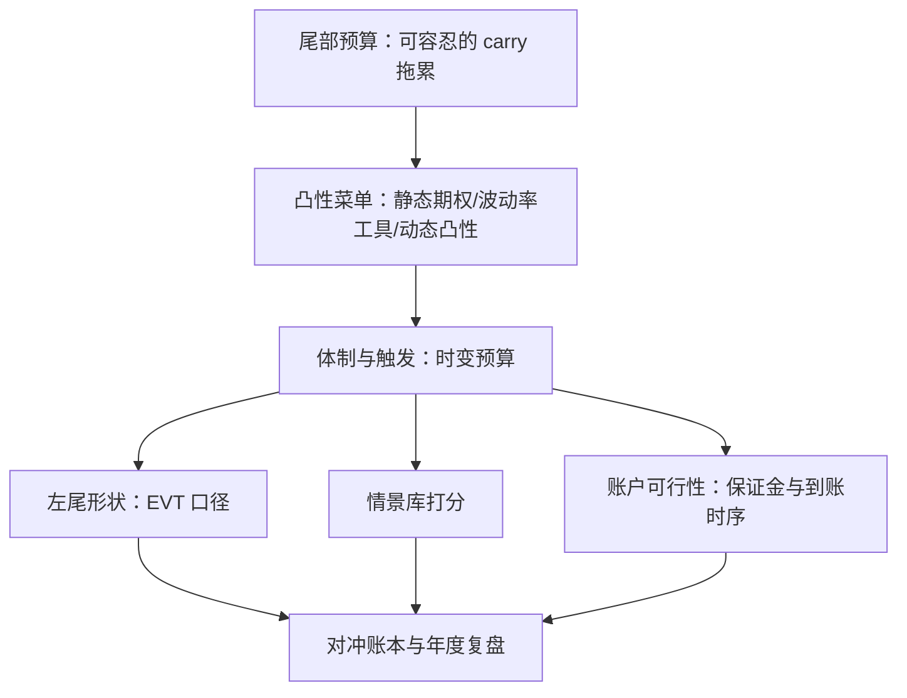
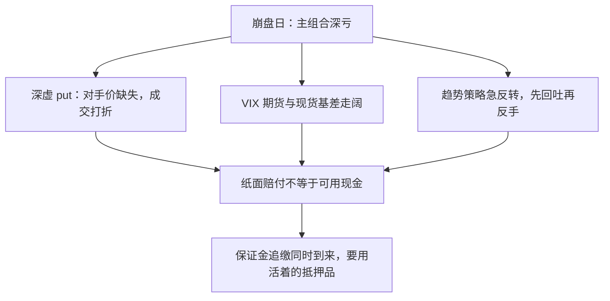

# 尾部对冲的组合

尾部对冲是用确定的负 carry 去买一份或有的大额赔付；它的会计期不是季度，是危机日。

<footer>—— 据 Daniel and Moskowitz, Momentum Crashes, Journal of Financial Economics, 2016；Taleb, The Black Swan, 2007 整理</footer>

[上一课](/quant/pf-multiasset)把多资产写成分散宏观环境的组合；但有一类风险分散不掉——所有风险资产共享的左尾。组件的课已有：[尾部风险因子](/quant/tail-risk-factor)、[波动率卖方与尾部](/quant/short-vol-tail)、[缺口风险](/quant/gap-risk)、[动量崩溃](/quant/momentum-crash)。本课写它们如何进组合：预算多少、买哪种凸性、以及怎么验收「对冲了」。

## 问题

尾部对冲是三个决定，每个都有对称的死法。其一，预算：每年烧多少 carry？carry 在这里指持有对冲仓位的持续成本：虚值 put 每年付的保费、VIX 期货展期的损耗，平时像漏水一样把收益滴走。直觉类比：给房子买的火险——绝大多数年份保费白白交出去，换的是火灾那天的大额赔付。太少，危机日对冲抵不掉左尾，徒增复杂度；太多，保费把长期收益吃穿，组合变成对冲卖方的补贴客户。其二，工具：静态期权（虚值 put 及其价差）、波动率工具（VIX 期货与期权，带展期损耗，见 [Vol ETP 每日再平衡流](/quant/vol-etp-rebalance-flow)）、动态凸性（趋势与波动目标）——三者的凸性形状、基差与容量都不同，混在「对冲」一个词下会算错账。其三，验收：历史回测里「恰好」覆盖 2008 与 2020 的对冲组合，大概率是对那两次危机的过拟合——对冲的历史样本太薄，不足以支撑一次普通的样本外声明。

## 方法

方法是把尾部对冲做成一个三段的预算问题：先把可容忍的 carry 拖累写成硬约束、交给优化器反解对冲腿规模；再按凸性性质把工具菜单分组、各组单独记 carry 的账；最后用三道互不替代的检验验收。预算随体制时变，但调整规则必须事先写定并与压力测试联测。全过程的纪律是一句话：对冲的每个数字都要同时出现在保费表与赔付表上。

### 预算与菜单

预算当政策变量：把尾部损失容忍写成约束——[CVaR 优化](/quant/cvar-opt)或[回撤约束优化](/quant/drawdown-constrained-opt)——让优化器反解对冲腿的规模，而不是拍脑袋一个百分比。菜单按性质分组：静态期权凸性成本明确（premium 与到期），行权价与期限是设计参数；动态凸性（[cta-tsmom](/quant/cta-tsmom) 的危机 alpha、[波动目标](/quant/vol-targeting)的自动减仓）不付保费、付的是震荡市里的磨损与换手；「动态凸性」就是不花钱买保险、而用规则制造凸性：波动从 15% 升到 30% 时，波动目标自动把仓位砍半，等于跌势里自动轻仓。它不付保费，付的是震荡市里反复进出被磨损——保险费换了一种形式，照样在支付。波动率工具介于两者之间，展期损耗是固定负 carry。验收走三道：极值口径检查左尾形状（[极值理论 EVT](/quant/evt)）；情景库打分（下一课的对象）；以及最容易被略过的一道——账户可行性：对冲赔付与主组合的保证金追缴是否同时发生、赔付到账时你是否还有抵押品活着用它（[缺口风险](/quant/gap-risk)的时间维度）。

## 机制

为什么对冲在危机日要打折算账：赔付与亏损的同时性会被结算与保证金打断——深虚 put 在崩盘当天未必有对手价，VIX 期货与现货在极端时刻基差走阔，趋势策略的仓位可能在急反转中先回吐再反手（[动量崩溃](/quant/momentum-crash)写的正是收益来源自身的左尾）。所以对冲预算要覆盖**策略的尾部**而不只是资产的尾部：连趋势这种「危机 alpha」也是统计性的，多数危机中有效、快反转型危机中失灵（[危机 alpha](/quant/crisis-alpha)），它没有合同义务赔付，也就不该按保险的会计来记。时变预算的另一面是择时风险：按体制调对冲预算（波动与相关的先行指标）能省保费，但调整错误的成本正好落在最痛的时刻——预算的时变规则要与压力测试（下一课）联测，而不是独立微调。

常见误区：以为「组合有对冲」就等于崩盘时对冲腿一定赚钱接得住。实际上深虚 put 可能在最需要流动性的一刻没有买方报价，赔付到账可能比保证金追缴晚一周——验收对冲，验的是这套现金时序，不只是收益曲线。

量级锚点：虚值两成的股指 put 单年保费常在名义的百分之几量级，而危机日组合回撤可达三至五成——预算不足的对冲等于没对冲；「历年烧掉的保费」必须与其买到的左尾截断幅度写在同一张表上。

## 边界

本课不写波动率产品的定价与对冲细节（波动率交易深化课程的对象），不给「必买清单」；[波动率卖方与尾部](/quant/short-vol-tail)的另一面——通过卖尾部收保费——是预算的对手盘，不在本课的买入侧。对冲的会计（保证金、结算、抵押品）是约束不是细节：一份纸面完美、现金流程走不通的对冲方案等于零。历史样本稀薄决定了尾部对冲的验收永远是「情景 + 极值 + 账户」三件套，回测夏普在这里没有发言权。

## 小结

- 尾部对冲的三个决定：预算、凸性菜单、验收；每个都有对称的死法（太少无用，太多蚀本）。
- 预算写成约束由优化器反解；工具按静态期权、波动率工具、动态凸性分账，carry 性质不同。
- 危机日要打折算账：基差、结算与保证金让纸面赔付与可用现金不同时。
- 趋势是统计性凸性而非保险；对冲预算要覆盖策略自身的左尾。
- 出处：Daniel & Moskowitz, *JFE*, 2016；Taleb, *The Black Swan*, 2007；危机 alpha 口径据 CTA 文献整理。
