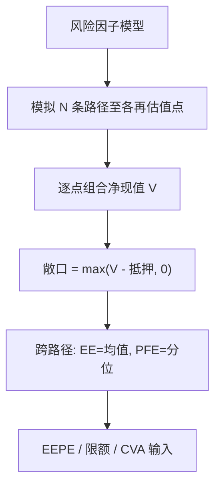
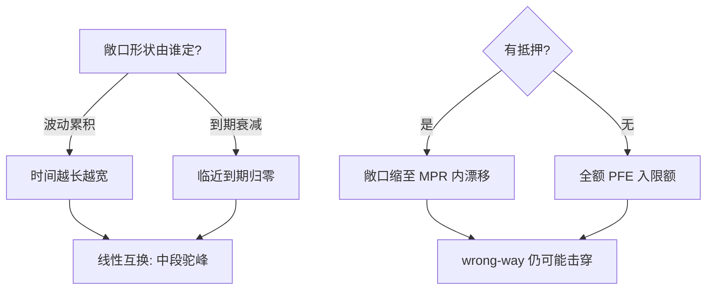

# PFE 与 EE 敞口曲线

对手方风险不在「现在欠多少」，而在「将来可能欠多少」——PFE 把这条未来敞口曲线画出来，监管资本与 CVA 都挂在上头。

<footer>—— 据 Basel III SA-CCR 框架；Gregory《The xVA Challenge》</footer>

[风险率模型](/quant/hazard-rate-model)给的是「对手方会不会违约」，本课补另一半：「违约时我们暴露多少」。净额结算与抵押品让敞口随市场漂移，缺口是**敞口轮廓**：期望敞口 EE、分位数敞口 PFE 随时间 $t$ 的曲线。本课只做单笔与净额组合的敞口，不进 CVA 的定价离散化。

## 问题

一笔 10 年期利率互换今天市值为零，不等于对手方风险为零——利率上行后我方变成被欠方，敞口先升后降（「驼峰」）。监管要求按 **EEPE（有效期望敞口）**计资本，交易台需要 PFE 95% 曲线管理限额。缺口：**从交易类型与市场波动推敞口曲线**。本课不做错向抵押假设。

术语翻译：EE（Expected Exposure）= $t$ 时刻敞口的期望；PFE（Potential Future Exposure）= 敞口的 $q$ 分位数（常用 95%）；EEPE = 有效 EE 对时间加权平均，是 Basel 资本公式里的主角。

数字实例：1 亿美元名义、5 年期、利率互换年化波动 $\sigma=1\%$（绝对利率）。简化模型下 EE 峰值出现在约 $T/3$ 处，量级 $\approx 0.4\,\sigma\sqrt{T/3}\cdot N\approx 0.4\times1\%\times1.29\times10^8\approx 500$ 万美元；PFE 95% 再乘 1.645 倍分位因子。

## 方法

蒙特卡洛为主干：模拟风险因子路径（利率、汇率、信用利差）到每个再估值点；对每条路径、每个时点计算组合净现值，取正部（对手方违约只在我们被欠时伤到我们）；跨路径取期望得 EE、取分位数得 PFE。简化替代：SA-CCR 监管公式用名义、久期与乘数一步给出有效名义敞口，适合无算力场景。

直觉类比：EE 曲线像「每天平均欠款」，PFE 像「最倒霉的 5% 日子里欠多少」。互换的驼峰来自两个力：时间越长波动累积越狠（往上推），剩余期限越短未来波动折损越多（往下压）——先爬坡后下山。

## 机制

敞口曲线形状由「波动累积 vs 到期衰减」的赛跑决定：线性互换峰值在中间，期权类（买方）敞口单调升到期满，远期起始的驼峰右移。净额结算协议把同对手方正负市值相抵，抵押品把敞口从「市值」缩到「保证金变动期」（MPR，常 5–10 天）内的漂移——抵押越多，曲线整体被压得越低，但 MPR 段的尖峰仍在。_wrong-way risk_（敞口与违约概率同向恶化，如对手方是石油商而敞口挂钩油价）让「EE × 违约概率」的乘法假设失真，CVA 要加相关项。

常见误区：用名义当敞口——10 亿名义的平价互换当期敞口为零；另一个是忽略再估值点密度：三年后敞口高峰若落在两个再估值点之间会被系统性低估，月度网格对 30 年互换过粗，业界用期限分段的非均匀网格。

## 边界

蒙特卡洛敞口机器的诚实成本是「因子模型 + 全组合再估值」两套系统的耦合，再估值贵时用代理函数（delta-gamma 近似）会在线性组合上失真。PFE 分位数对尾部模型敏感，正态假设低估 95% 分位——利率利差双跳时差 30% 不稀奇。监管口径（SA-CCR 的乘数与资产类别相关性）与内部模型口径不同，同笔交易两套数字都合法。CVA/VaR 的下游敏感性：EE 曲线错 10%，CVA 资本同幅偏移。

直觉类比：EE/PFE 像给对手方风险画「潮汐预报」——均值潮位（EE）安排日常，风暴潮位（PFE）决定堤坝（限额与抵押）；净额结算是先抽掉两船相抵的水位，抵押是临时沙袋，wrong-way 是风暴恰逢大潮。

## 小结

- 敞口 = max(净市值 − 抵押， 0)；EE 是均值曲线，PFE 是分位曲线。
- 驼峰 = 波动累积与到期衰减的赛跑；期权买方单调升，互换中段峰。
- SA-CCR 是监管捷径，蒙特卡洛是内部口径；wrong-way 让乘法假设失效。
- 出处：Basel III SA-CCR (2014)；Gregory《The xVA Challenge》第 4 版；Sorensen–Bollier 敞口定价 (1994)。
