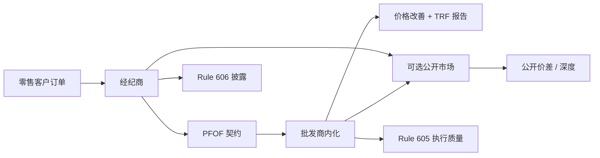

# PFOF 订单流支付

    
经纪商把客户的可立即成交订单送到批发商，批发商为获得这批流而支付费用，并通常以价格改善完成内化——公开辩论的是：零售客户得到的改善，与市场整体的价格发现之间，如何权衡。

    <footer>—— 据 SEC 对 Payment for Order Flow 的规则与市场结构讨论；Rule 605/606 披露框架</footer>

Payment for Order Flow（PFOF）是美国零售股票与期权路由里的现金与非现金补偿：执行场所或批发商向引流的经纪商支付，以获得订单流。它与公开市场的 maker-taker 费用不同，关键交易发生在场外内化，成交再报告到 TRF。Boehmer 等人的零售识别，正是这一契约留在亚美分价格上的统计痕迹，见 [零售流识别](/quant/boehmer-retail-flow)。本篇写 PFOF 的经济学对象、SEC 披露所允许看见的量、以及它与价差、毒性、价格发现的平均关系。它是市场结构与监管计量，不是路由技巧，也不指导如何把订单「卖」得更贵或如何绕过最佳执行义务。

## 问题

零售市价单到达经纪商时，经纪商是客户的代理人，负有最佳执行一类的义务；同时经纪商可以选择把单子送到谁家。批发商看到的是经过筛选的零售流：平均上较少与公开市场里的知情流混在一起，因此内化的期望利润可以高于在公开簿上做市，见 [Glosten–Milgrom](/quant/glosten-milgrom) 与 [毒性](/quant/toxic-flow)。PFOF 是把这一期望利润的一部分，以支付形式还给引流方。客户看到的常常是零佣金与亚美分改善；看不见的是：若同一订单被送到公开竞价，是否会改善全国价差、是否会改变价格发现。

问题于是有三层。第一，客户层：价格改善与执行速度是否补偿了未去公开市场竞价的机会。第二，市场层：零售流被抽离后，公开簿的价差与深度如何变。第三，披露层：Rule 606 的路由与支付报告、Rule 605 的执行质量统计，能支持哪些可复现的研究，不能支持哪些因果断言。SEC 在包括 meme 事件在内的市场结构检讨中反复触及这三层，但检讨本身不是「PFOF 非法」或「PFOF 无害」的判决书——计量仍要靠披露与公开带。

### 与 maker-taker 的差别

公开交易所的 maker-taker 是对提供与消耗可见流动性的价目表，费用发生在匹配引擎里，所有参与该场所的人面对同一费率表（再加分层回扣等变体）。PFOF 是双边契约：支付依赖流的性质与谈判，不经过公开簿的价格优先时间优先。因此同一「零售市价买」，在公开市场会改变 NBBO 档量，在内化里可能只改变 TRF 上的一笔亚美分成交。比较两种费用时，对象不是一个数字谁大，而是流动性被记录在哪里。把 PFOF 叫成「回扣」而不声明场外，会与 [maker-taker](/quant/maker-taker) 文献混名。

最佳执行不是「必须去公开市场」，也不是「可以忽略价格改善」。它是一个以客户利益为中心的过程义务，披露与监督是过程的可见部分。本篇讨论平均结构，不提供对任何经纪商是否满足该义务的判断。

## 方法

可公开研究的输入主要是：Rule 606 报告中的路由目的地、支付或收到的费用、非市价单与市价单的拆分；Rule 605 中的有效价差、实现价差、价格改善比例；TAQ 上的场外占比与亚美分频率；交易所公开的价差与深度。因果识别几乎总是不完整：零佣金、碎片化、批发商集中，同时发生。差分应尽量找制度或合同变更的日期，而不是把「PFOF 收入高的经纪商」与客户收益做简单横截面——选择与广告会污染。

Battalio、Corwin、Jennings 等对零售执行质量与路由的研究，提供了「支付与执行质量可能冲突」的经验模板：当路由被费用牵引时，客户的有效价差不一定最优。复制此类研究应固定证券样本、市值分组与波动分组，因为改善的绝对美分在高价股与低价股之间不可比。期权 PFOF 与股票 PFOF 应分开：期权的价差更宽、内化逻辑不同，混在一个回归里会得到无法解释的系数。

### 披露能看见与看不见的

能看见：某经纪商把多大比例的市价单送到哪些批发商；收到的支付数量级；605 统计的平均改善。看不见：单笔订单的真实排队对策、批发商内部的择单、客户是否本可以在中点暗池得到另一种改善。因此研究应停留在经纪商-证券-月的聚合，与 BJZZ 一样避免再识别。把 606 PDF 里的数字爬下来做论文，用的是监管要求的公共披露，不是泄露。

与 [智能路由](/quant/smart-order-routing) 文献的连接：机构 SOR 优化的是公开与暗池之间的冲击与机会成本；零售 PFOF 路由优化的是经纪商的契约与平均执行统计。两者都叫路由，目标函数不同。用机构 SOR 的框架去「解释」零售经纪商，会把代理人问题写成一个执行算法问题。

## 机制

机制链条是：零售流的平均毒性较低 → 内化有期望价差捕获 → 部分捕获以 PFOF 支付给经纪商 → 经纪商用支付补贴佣金或营销 → 客户得到零佣金与部分价格改善 → 公开市场少掉这批流。价格发现是否受损，取决于被抽走的流里有多少信息、以及公开做市商是否用剩余流重新定价。若零售主要是非知情的流动性需求，抽走会让公开簿更毒、价差更宽；若公开市场的信息交易足够多，价差变化可能很小。经验上这是样本与年份的函数，需要用 605/价差与场外占比一起报告，而不是用单一轶事。

对批发商，择单与存货把内化变成与公开做市类似的问题，只是对手方分布不同。对交易所，零售流减少影响交易量与做市激励。对发行人与长线投资者，关心的是公司信息进入价格的速度。SEC 文件把这些主体的利益并列，正是因为 PFOF 不是单一福利数字。计量应声明福利口径：客户有效价差、NBBO 宽度、还是价格对盈利公告的调整速度。

### 事件窗口里的 PFOF 叙事

[meme 事件](/quant/meme-short-squeeze) 期间，零售量、期权量与 PFOF 收入同时进入公众视野。这提供的是压力样本：披露数字变大，不等于机制在该周被「发明」。分析应把 PFOF 当作平时就存在的路由契约，观察它在极端不平衡下是否仍提供改善、批发商是否更频繁地把单子吐回公开市场、公开价差如何反应。不要把事件当成操作模板，也不要把 PFOF 说成事件的充分原因——同时发生的还有空头回补、期权对冲与注意力冲击。

费用数字的符号对经纪商是收入，对批发商是成本，对客户是间接的。把三张表加总成「市场被抽走多少钱」而不声明口径，得到的是宣传数字。研究应分主体报，并承认转移与效率损失不是同一个量。

## 边界

PFOF 主要是美国零售股票与期权的制度。其他法域用禁止、限制或不同的佣金结构，系数不可外推。披露是滞后、聚合、且格式不完美的。批发商集中度高，样本里的「场所」很少。不要用 PFOF 解释 A 股佣金或内地柜台的任何费用。不要从本篇推出路由建议。不要把某家公司的名字当作毒性的同义词——毒性是流的统计性质，随客户结构变。

不要把 Rule 605 的平均改善当成每一客户都得到该改善。不要把零佣金当成免费：成本可以出现在价差、证券借贷、现金管理与其他产品。监管辩论会改变契约，序列有断点，应分段估计。

本篇对象是可公开观测的支付与执行质量。任何教人如何设计订单以获取支付、如何伪装流的性质以通过批发商筛选的内容，都不属于市场结构研究，这里也不提供。

## 小结

- PFOF 是批发商为零售可成交流支付、并多在场外内化的契约，与公开 maker-taker 不是同一张价目表。
- 经济学核心是零售流平均毒性与价差捕获的分配：客户改善、经纪商收入、公开市场价格发现。
- 可复现证据来自 Rule 605/606、TAQ 场外占比与价差，因果须找制度断点。
- 与 BJZZ 亚美分代理、meme 压力样本兼容，但事件不是机制的定义。
- 不提供路由或「出售订单流」的操作建议；停留在聚合披露。
- 出处：SEC 关于 PFOF 与市场结构的规则、Rule 605/606；执行质量与路由的学术文献（如 Battalio, Corwin, Jennings 等）。
