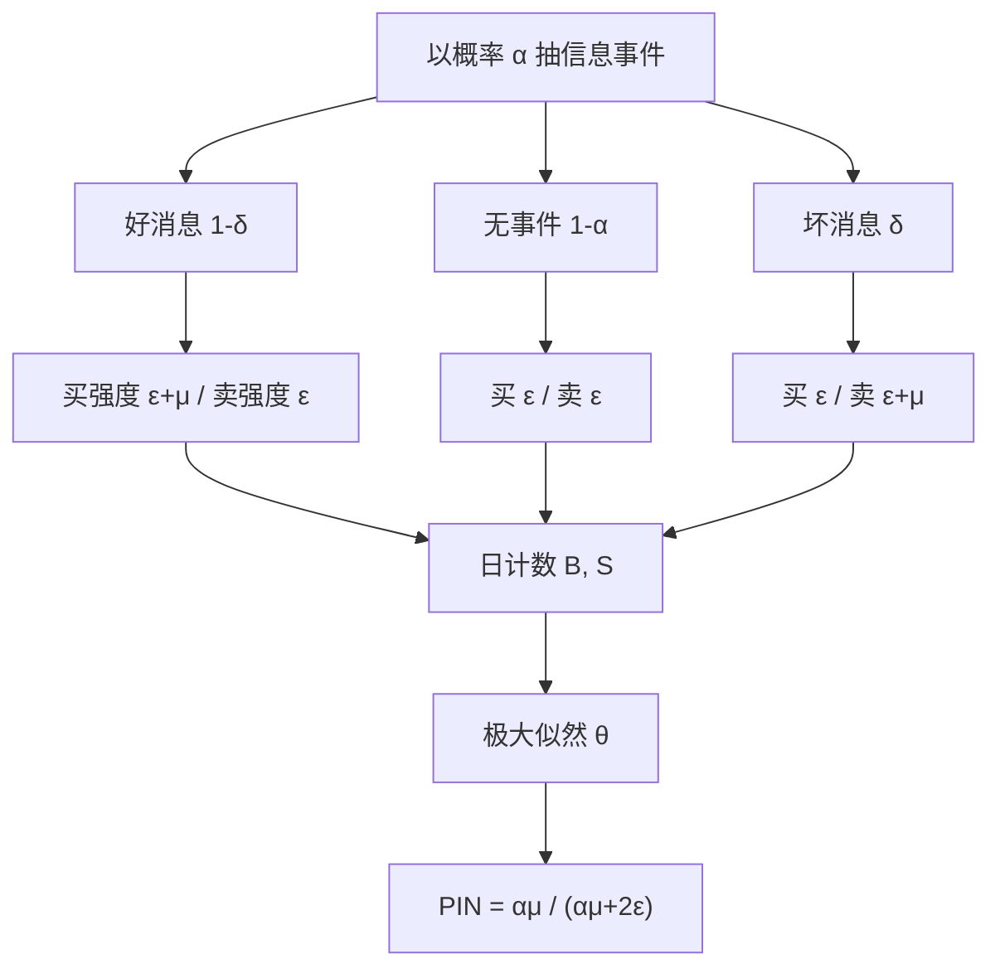

# 信息交易概率 PIN

    
把一天里的买单与卖单计数当成泊松过程的实现，就可以从买卖不平衡里读出「这笔成交有多大概率来自知情交易者」。

    <footer>—— Easley, Kiefer, O'Hara, Paperman, Liquidity, Information, and Infrequently Traded Stocks, Journal of Finance 1996</footer>

[Glosten-Milgrom](/quant/glosten-milgrom) 与 [Kyle](/quant/kyle-model) 把逆向选择写成了理论对象，还没有可估计的数字。本课把序贯交易收到一组泊松到达率上：Easley、Kiefer、O'Hara 与 Paperman 用每日买、卖笔数做极大似然，合成 PIN。它不是高频里的毒性仪表，那是 [下一课](/quant/vpin)；PIN 按交易日、用方向计数来估信息不对称。

## 问题

做市商无法事先看见谁知情。他只看见一串主动买、主动卖。若某日买单异常多，可能是好消息来了，也可能只是流动性需求碰巧偏向一侧。要把「信息不对称有多严重」从「方向碰巧不平衡」里分开，需要一个生成过程：先抽有没有私有信息，再抽消息好坏，再让两类交易者按不同强度到达。没有这层结构，买卖比只是描述统计，不能叫信息交易概率。

低频股票尤其尖锐。成交稀疏时，价差里的逆向选择成分很难用高频报价冲击去估；但一整天的买、卖计数仍然可得。EKOP 正是为交易不频繁的股票写的：用日度计数，而不是用逐笔中点收益。问题于是变成：在一个可识别的参数集上，日度 $(B,S)$ 的似然能否把「有信息的日子」与「没信息、只有噪声交易」分开。

### 序贯交易里的三个未观测层

模型按交易日独立重复。每个交易日开始，以概率 $\alpha$ 发生一次信息事件；若发生，坏消息的概率是 $\delta$，好消息是 $1-\delta$。知情交易者只在有事件的日子到达，强度 $\mu$：好消息时只买，坏消息时只卖。非知情买家、卖家始终到达，强度各为 $\varepsilon_b$、$\varepsilon_s$，常取对称 $\varepsilon_b=\varepsilon_s=\varepsilon$。做市商看到的是泊松计数，看不到 $\alpha$、$\delta$、$\mu$。

PIN 里的「一天」是信息事件的生命周期，不是日历的任意切片。若私有信息在盘中几分钟就释放完，把整日买卖加总会把知情到达稀释进噪声到达。估计窗口与信息衰减必须同一量级，否则 $\alpha$ 会被估成「几乎天天有事件」的边界解。

## 方法

观测是每个交易日的买单数 $B$、卖单数 $S$（方向通常用 Lee–Ready：成交价相对当时中点，或用报价检验法）。参数 $\theta=(\alpha,\delta,\mu,\varepsilon_b,\varepsilon_s)$。无事件日，$(B,S)$ 是两路独立泊松；好消息日，买的强度变成 $\varepsilon_b+\mu$；坏消息日，卖的强度变成 $\varepsilon_s+\mu$。日似然是三种体制的混合：

$$
\begin{aligned}
L(\theta\mid B,S)
&= (1-\alpha) e^{-\varepsilon_b-\varepsilon_s}\frac{\varepsilon_b^{B}\varepsilon_s^{S}}{B!S!}
+ \alpha(1-\delta) e^{-(\mu+\varepsilon_b+\varepsilon_s)}\frac{(\mu+\varepsilon_b)^{B}\varepsilon_s^{S}}{B!S!} \\
&\quad + \alpha\delta\, e^{-(\mu+\varepsilon_b+\varepsilon_s)}\frac{\varepsilon_b^{B}(\mu+\varepsilon_s)^{S}}{B!S!}.
\end{aligned}
$$

$T$ 个交易日独立，总似然是日似然的乘积。极大似然给出 $\hat\theta$，再定义

$$
\mathrm{PIN}=\frac{\alpha\mu}{\alpha\mu+2\varepsilon},
$$

分母是总到达率（对称非知情时），分子是知情到达的期望。直觉：随机抽到的一笔成交，来自知情者的概率。Easley、Hvidkjaer、O'Hara（2002）用滚动窗口的 PIN 作为个股信息风险，放进横截面收益回归，问它能否解释收益率——这是 PIN 从微观结构度量走进资产定价的那一步。

### 方向分类先于似然

似然吃的是 $(B,S)$，不是原始成交价。Lee–Ready 把成交价高于中点标成买、低于中点标成卖，等于中点时用tick 检验。分类错误会把知情造成的真实不平衡抹平，使 PIN 偏低；在买卖价差只有一两个最小报价单位、中点频繁被跨越的股票上，这个偏差不是小修正。工程上应固定一套分类规则、一套开盘集合竞价是否计入的口径，再谈 PIN 的时间序列。不要把不同数据商的「主动买」字段当成已经校准过的 $B$。

## 机制

识别来自混合分布的形状，而不是来自某一日的买卖比。无事件日，$B$ 与 $S$ 都集中在 $\varepsilon$ 附近；有事件日，一侧会被 $\mu$ 拉到远处。样本里若既有「买卖都中等」的日子，又有「一侧极端」的日子，似然就能把 $\alpha$ 从 $\mu$ 里分开：极端日的频率帮着认 $\alpha$，极端的幅度帮着认 $\mu$。若所有日子都轻度不平衡，$\alpha$ 与 $\mu$ 会沿着 $\alpha\mu$ 近似不可分，PIN 仍可能稳住，分项不稳。

做市商的报价在模型里由贝叶斯更新给出：看到一笔买，后验里好消息的权重上升，卖价上调。PIN 高意味着逆向选择严重，价差应更宽——这是 EKOP 用来对照低频股流动性的通道。它不描述盘中的瞬时毒性，也不对成交量时钟负责。

$\mathrm{PIN}=\alpha\mu/(\alpha\mu+2\varepsilon)$ 对 $\varepsilon$ 的水平很敏感。成交量长期上涨时，若知情强度跟不上噪声交易的膨胀，$\varepsilon$ 变大，PIN 机械下降。这不是信息不对称消失了，是分母被流动性交易撑大了。跨年代比较 PIN 水平，必须先处理交易频率的非平稳。

### 边界解与数值似然

$\alpha$ 或 $\delta$ 经常撞到 0 或 1。对数似然里有阶乘与很大的泊松均值，直接算 $e^{-\lambda}\lambda^{B}/B!$ 会溢出；应在对数空间用 Stirling 或库函数的泊松概率。多起点优化是常规，因为混合模型的似然非凹。报告 PIN 时应同时报告撞边界的窗口比例：若一半窗口 $\hat\alpha=1$，那条 PIN 时间序列不能当连续的信息风险因子用。

## 边界与工程取舍

PIN 假定信息事件按日开关、日内强度为常数、买卖方向可观测、日与日独立。连续竞价、隐藏单、中午休市、开收盘集合竞价，都会破坏「一天一个泊松实验」的口径。高频下逐笔到达远不是泊松，日度加总只是让中心极限把计数推回可处理的形状，并不证明数据生成过程正确。

不要把 PIN 当成实时风控指标：一天结束才能更新一次完整似然（或至少要攒够一个估计窗）。不要与 [VPIN](/quant/vpin) 互换：后者用成交量桶和批量分类，连似然都可以不做。不要在最小报价单位变动、拆股、停牌复牌的日子上硬跑同一套 $(B,S)$。资产定价用途上，PIN 与流动性、换手高度相关，横截面里要说清它是信息风险还是流动性的代理；Easley–Hvidkjaer–O'Hara 的结论依赖样本期与控制变量，后续文献并不一致。

中国 A 股的集合竞价、涨跌停与 T+1 会改变「知情者一天内能下多少单」。把 EKOP 的美股日历直接套到沪深，先要定义：集合竞价的成交算不算进 $B,S$，涨停只剩买时 $\mu$ 是否还可识别。PIN 公式没变，实验设计已经变了。

## 小结

- PIN 来自 EKOP 序贯交易模型：信息事件概率 $\alpha$、知情到达 $\mu$、非知情到达 $\varepsilon$，用日度买卖计数做混合泊松极大似然。
- $\mathrm{PIN}=\alpha\mu/(\alpha\mu+2\varepsilon)$ 是随机一笔成交来自知情者的概率，不是盘中实时毒性。
- 方向分类误差、成交量非平稳、边界解，都会让水平不可比；应固定口径并报告撞边界比例。
- 它解释价差里的逆向选择，也被拿到横截面收益里当信息风险，但与流动性代理高度纠缠。
- 不要与 VPIN 混用：一个是日度似然，一个是成交量时钟上的不平衡。
- 出处：Easley, Kiefer, O'Hara, Paperman, *Liquidity, Information, and Infrequently Traded Stocks*, Journal of Finance 1996；定价应用见 Easley, Hvidkjaer, O'Hara, *Is Information Risk a Determinant of Asset Returns?*, Journal of Finance 2002。
