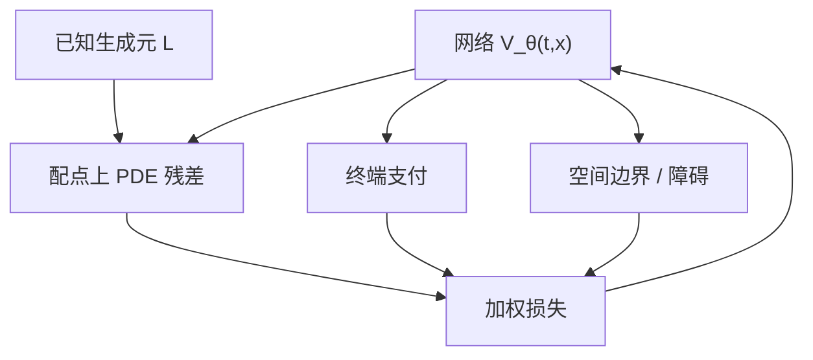

# PINN 期权定价

    
把微分方程残差当作损失函数的一部分：配点上满足 PDE，边界与终端满足定价条件，于是网络学的是方程的解，而不是一组标价的插值表。

    <footer>—— Raissi, Perdikaris and Karniadakis, Physics-informed neural networks, JCP 2019；金融差分传统见 Brennan–Schwartz</footer>

期权价格在马尔可夫扩散下满足抛物 PDE，工程默认是 [有限差分](/quant/option-pde) 与 [Crank–Nicolson](/quant/crank-nicolson)。物理信息神经网络（PINN）用一个对 $(t,S)$（或更多状态）的网络 $V_\theta$，在随机配点上惩罚

$$
\partial_t V + \mathcal{L}V - rV
$$

一类残差，并惩罚终端支付与边界渐近。动机是无网格、易加参数、可把校准与求解写进同一损失。本篇写残差损失与终端条件如何权衡、美式障碍如何变成不等式，以及它与 [Deep BSDE](/quant/deep-bsde)、差分法各自擅长的维数与精度区间；不把 Black–Scholes 闭式再推一遍，也不把 PINN 写成已经替换生产网格。

## 问题

差分法在低维上有几十年的稳定性理论：CFL、单调性、远场边界。PINN 把同一 PDE 写成优化问题

$$
\min_\theta\; w_{\mathrm{pde}}\|\mathcal{R}(V_\theta)\|^2_{\mathrm{collocation}}
+ w_{\mathrm{term}}\|V_\theta(T,\cdot)-g\|^2
+ w_{\mathrm{bdry}}\|B(V_\theta)\|^2.
$$

权重 $w$ 不是美学：终端条件弱了，网络会学一个满足齐次方程但支付不对的函数；PDE 残差弱了，网络变成支付插值，希腊值振荡。金融里 $V$ 的量级跨行权价变化很大，不加权的 $L^2$ 会忽略虚值，而虚值正是密度与蝶式敏感处。问题是配点设计与加权，不是「用了神经网络所以更物理」。

相对纯数据拟合，PINN 的归纳偏置是生成元 $\mathcal{L}$ 已知。生成元错，残差最小的函数是错方程的解。相对 Deep BSDE，PINN 不模拟布朗，梯度来自配点上的微分；高维时配点稀疏，残差可以在未采样的区域很大却不被损失看见。两种方法都在用抽样对抗维数，抽样对象不同。

### 配点、奇异与近到期

看涨的 Gamma 在到期近且近价时变尖。均匀随机配点很少打中这一薄层，残差损失会报「已收敛」，而 ATM 短到期的 $V$ 与 $\Delta$ 仍差。应在近到期、近行权加密，或对时间做坐标变换把 $T-t$ 拉长。障碍附近同样。数字支付的终端不连续，PINN 的平滑网络会把跳抹成陡坡，价格或许可用，数字的 theta 不能信。这与差分法要在障碍上对齐网格是同一类几何问题，只是从「节点」换成了「配点密度」。

自动微分给出的 $\partial_S V$ 看起来像希腊，但其误差分布与差分希腊不同：它随网络高频振荡，而不是随网格扩散。风控限额不能直接把 PINN 的 $\Delta$ 当交易所对冲比，除非在验证集上与差分或闭式对照过。

## 方法

**方程与坐标。** 对 Black–Scholes，常用 $x=\log S$ 把变系数变常系数，残差尺度更匀。随机波动要加方差坐标，配点在 $(t,S,v)$ 立方里，Heston 的 Feller 边界还要处理 $v=0$。局部波动的 $\sigma(S,t)$ 若来自 Dupire 表，PINN 是在插值后的系数上求解，系数噪声会被残差放大。

**损失加权与课程。** 先加大终端权重让支付就位，再抬 PDE 权重把内部拉到方程上，是常见课程。反向则可能卡在平凡解。相对误差、按价格量级归一的残差，比原始 $L^2$ 更适合跨货币性。把少量差分或闭式点当作「锚数据」加进损失，能稳住尺度，但锚点若来自同一错误系数，只是加速收敛到错误解。

**美式。** 自由边界使 PDE 变成变分不等式：$V\ge g$，残差在继续区内为零。实现上用惩罚 $\|(g-V)_+\|$ 或互补条件 $\mathcal{R}(V)\cdot(V-g)=0$。惩罚系数又是一对与 $w_{\mathrm{pde}}$ 对拉的超参。没有互补，所谓美式 PINN 只是欧式。提前行权区的识别应报告行权边界形状，并与树方法或 LSM 对照，而不是只报一个价格点。

### 与 DGM、Deep BSDE 的关系

Sirignano 与 Spiliopoulos 的 Deep Galerkin（DGM）同样在配点上惩罚 PDE 残差，比 Raissi 等人的 PINN 名称更早进入金融数值圈。实践差异多在网络结构与采样，而不是原理。Deep BSDE 走概率表示，线性情形对应 Feynman–Kac；PINN/DGM 走微分残差，对非散度、带复杂边界的方程更直。高维欧式线性，蒙特卡洛通常更干净。PINN 的相对优势在：低维但几何复杂的边界、系数依赖参数且要对参数求导、以及想要全域连续希腊而不是单点价格。

## 机制

PINN 把求解器变成非凸优化。差分法的截断误差有阶，PINN 的逼近误差依赖网络能否表示真解（有折点、有薄层时很差）以及优化能否找到它。残差小是必要条件不是充分：存在高频函数使残差在配点上小、在配点间大，希腊值会抖。谱偏置使网络先学低频，这有时有助于价格，有害于短到期的尖 Gamma。

把模型参数（波动、相关）与 $\theta$ 联合训练，等于用 PINN 做校准：市场价作为额外数据项。此时 PDE 残差扮演正则，防止纯插值。若市场价本身有蝶式套利，残差与数据项冲突，优化会折中出一个既不完全满足无套利 PDE、也不完全穿过报价的函数——必须事先清洗曲面，见无套利插值，而不是指望 PINN 仲裁。

### 计算图与二阶导数

Black–Scholes 残差含 $V_{SS}$。自动微分的二阶在深网络上贵且噪。有人用混合：空间低阶用有限差、时间用网络，或对 $V$ 做因子分解只学修正。生产若只需要低维香草，差分法在毫秒内给出带保证的精度，PINN 的训练开销没有对等收益。PINN 更合理的场景是：参数一变就要重解的家族、或与物理约束耦合的混合契约，且允许离线训练、在线只前向。

「物理信息」在此的物理就是无套利 PDE。它不包含微观结构、跳跃补偿（除非写进 $\mathcal{L}$）或交易摩擦。摩擦下的定价不是这个残差的解，见 Deep Hedging。

## 边界与工程取舍

PINN 对超参敏感，复现实验必须记录配点生成器种子、权重日程和归一化。不要用单一 ATM 价格误差宣称优于差分：应报沿货币性与到期的最大误差、希腊的最大误差、以及美式边界的位移。跳跃、路径依赖（亚式状态要升维）、粗糙波动的非半鞅算子，都超出标准抛物 PINN 的舒适区。

与 Neural SDE 拼接时，系数网络冻结后再训 PINN，避免两个损失互相追逐。Deep BSDE 在高维线性或半线性、要 $Y_0$ 单点时更自然；PINN 在低维要全域 $V$ 与边界控制时更自然。两者都不是默认替换 [COS](/quant/cos-method) 或仿射特征函数：有特征函数时，那些方法的误差可控得多。

配点随训练移动（残差自适应采样）能改善薄层，但使损失曲线不可比。应在固定的验证配点集上报告残差，自适应只用于训练采样。

Raissi–Perdikaris–Karniadakis 的经典例子是低维物理方程。金融生产引用该文时，要补上支付奇异、远场与测度——这些在原论文里不是一等对象。

## 小结

- PINN 用配点 PDE 残差加终端、边界条件训练 $V_\theta$，求解已知生成元的定价方程。
- 权重、配点密度与近到期几何决定虚值与希腊是否可信；残差小不是充分。
- 美式必须进互补或惩罚；否则仍是欧式。
- 低维高精度仍属差分与谱方法；PINN 适合无网格、参数化家族与复杂边界，而非默认生产定价器。
- 与 Deep BSDE 分工：一个微分配点，一个路径终端匹配；摩擦市场都不覆盖。
- 出处：Raissi, Perdikaris and Karniadakis, *Journal of Computational Physics*, 2019；对照 Sirignano and Spiliopoulos, DGM, 2018；差分传统 Brennan–Schwartz。
