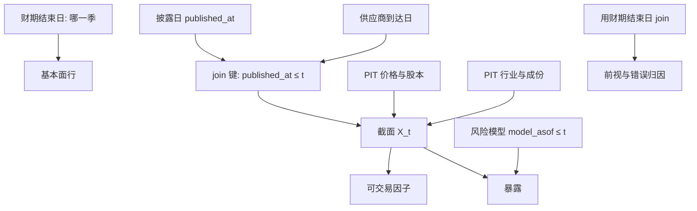

# 点-in-time 基本面对齐

基本面因子与基本面风险模型要的不是「这一季的净资产是多少」，而是「在交易日 t，市场已经公开的、当时版本的净资产，能否与当日价格、股本、行业和成份对齐成同一条信息集」。

<footer>—— 对照 Ljungqvist, Malloy and Marston, Rewriting History, Journal of Finance, 2009；Fama–French 账面滞后与 Asness–Frazzini 对 HML 时点的处理</footer>

[时点基本面](/quant/point-in-time) 把单个字段的版本链说清：查询 $(t,i)$ 应返回截至 $t$ 已发布的最新版本，而不是 latest-available 回写到财期结束日的数字。对齐（alignment）是下一步，也是风险系统更常翻车的一步：价格、股本、行业、指数成份、分析师共识、风险模型暴露与会计字段，往往来自不同供应商、不同日历、不同修订政策。把它们 join 在「财期结束日」或「报表编号」上，等于用三套互不相等的信息集去算同一个 $t$ 的因子与暴露。本篇写 join 键、三套日历、以及错位如何同时污染 alpha 与 [基本面风险模型](/quant/fundamental-risk-model) 的归因。它是 [前视偏差](/quant/look-ahead-bias) 在多表合并上的专用条款。

## 问题

一张可用的基本面观测至少有三个不相等的日期：**财期结束日**（这是哪一季）、**首次披露日**（file date / 公告日）、**数据库可下载日**（vendor available，常晚于交易所公告）。价格有交易日与成交时点；股本有除权日与登记日；行业有 GICS 生效日；成份有宣布日与生效日。合法的截面是：在调仓时点 $t$，所有输入都属于 $\mathcal{F}_t$。错误的对齐通常不是缺 PIT 库，而是有 PIT 字段却用错了键——用 `fiscal_period_end` 去对 `trade_date`，于是 12 月 31 日的账面在 1 月 2 日就进了因子，而 10-K 要到三月才存在。

风险模型把问题放大。基本面暴露（账面市值、盈利、杠杆）若用事后更正的报表重算历史暴露，再拿去解释当时的收益，归因里会出现「当时市场不可能看到的因子」。Barra 一类模型的 vintage 必须与收益的起点对齐：用 $t$ 日已知暴露解释 $[t,t+h]$ 的收益。用最终重述去拟合历史因子收益，样本内 $R^2$ 会好看，组合的可交易残差却被说成特异风险。

### 三套日历必须分开存、分开 join

不要把三个日期压成一列 `asof`。财期结束日只用于知道「这是 2022 年报还是 2023 一季报」；披露日用于可交易；供应商到达日用于生产回放（研究若用公告日、生产用供应商到达日，两边会系统性不一致）。分析师共识另有 vintage：公告前最后一个快照，不是月度文件里被事后改过的共识。Ljungqvist、Malloy 与 Marston（2009）表明推荐历史会被改写；没有快照，盈利意外的分母与分子都不在 $\mathcal{F}_t$。

Worldscope、Compustat、国内研究库对「最新报表」的默认 join 不同。同一价值因子在 A 库显著、B 库不显著，经常是对齐键与更正政策不同，而不是市场不同。比较因子之前先比较 join。

## 方法

**以披露日（或供应商到达日）为唯一 join 键。** 回测日 $t$ 的基本面行满足 `published_at ≤ t`，并取该约束下最新的一条。价格、股本用同一 $t$ 的 PIT 快照。市值 $= $ 当时价 $\times$ 当时股本，分子用当时已知账面；拆股调整必须与当时已知的公司行为一致，不能把未来的复权因子提前除到历史上，否则低价过滤与每股指标会错，见 [公司行为](/quant/corporate-actions)。

**统一滞后作为没有更正链时的下界。** 没有 file date 时，季度数据至少滞后法定披露窗口（美股季报量级 40–60 天，年报更长；A 股年报多在 4 月 30 日前），Fama–French 把 $t-1$ 年账面放到 $t$ 年 6 月底，是对所有公司相同的可交易时点。Asness–Frazzini 主张每次新账面到达就更新 HML，仍然拒绝未公布数字。两种都是合法 PIT 规则；「数据库默认合并表」两条都不是。Hou、Xue 与 Zhang 的异象复制把滞后会计当成可投资性过滤，许多异象变弱——应读成对齐过滤，而不是单纯多重检验。

**风险模型 vintage。** 每日（或每月）固化一套暴露：行业、风格、残差波动，全部带 `model_asof`。归因日 $t$ 只用 `model_asof ≤ t` 的最近一套，去乘随后的收益。不得用期末重估的因子载荷回放全年。若供应商提供 restated 与 original 两套，研究与生产必须同一套；混合会让「风险模型解释力」变成修订过程的函数。

### 公告日、交易时段与时区

美股常在盘前发布，A 股在非交易时段发布。PIT 的 $t$ 应是「该信息可进入委托」的第一个时点，通常是下一撮合日开盘或收盘调仓点，而不是公告时间戳本身。财报与年报挤在同一窗口（A 股四月）会造成截面上大量名字同一天更新；对齐正确时这是真实的信息到达，不是 bug。错误的是用财期结束日把更新均匀摊到过去一个季度，让回测以为一月份已经有年报。

「用当时市值、用最新账面」是不对称泄漏：价格合法，分子非法。价值与盈利因子会被更正后的困境信息加强。两边都必须当时可知，join 才能叫对齐。

## 机制

错位通过两条通道进入损益。alpha 通道：latest-available 或财期键把未来减值、未来盈利提前写进「滞后」特征，样本内 IC 上升，实盘没有这些信息。风险通道：暴露用了未来报表，历史因子收益被错误归因，今日限额按一张不会在实盘出现的因子结构来切。两条通道可以同时发生：一个「低账面市值」组合既吃了前视的账面，又在风险模型里被当成价值暴露过小或过大，对冲比失真。

会计更正不是均值回归噪声。它往往在诉讼、审计变更、业绩变脸之后到来，与后续收益同向。因此错位不是随机测量误差，不能靠多一个因子、多一年样本平均掉。行业分类若用今天的 GICS 往回套，等于让过去的排序享受未来的行业地图；指数成份若用最终名单，见 [幸存者偏差](/quant/survivorship-bias)。对齐的经济学含义是：因子与暴露必须是可交易信息的函数，否则测量的是数据库修订，不是风险补偿。

### 点-in-time 对齐清单

每次构建截面，至少核对：$(1)$ 会计字段的 `published_at`；$(2)$ 价格与股本的交易日；$(3)$ 行业与成份的生效日是否 $\le t$；$(4)$ 共识与实际 EPS 是否首次公布；$(5)$ 风险模型 `model_asof`；$(6)$ 研究与生产是否同一查询函数。缺任何一项，IC、IR、因子暴露与 [VaR](/quant/var-methods) 的映射剩余都会被污染。映射若用错误时点的 beta 或基本面，基础风险看起来很小，只是因为泄漏把残差吸进了「因子」。

## 边界与工程取舍

商业 PIT 库贵、早期更正链不完整、供应商到达日与交易所公告日可能差若干小时到若干天。用统一滞后是可发表的近似，应在能买到 PIT 的子样本上校准偏差方向：通常错误对齐让基本面因子更好看、让风险模型 $R^2$ 更高。早期样本 file date 质量差时，宁可缩短样本，不要用财期结束日冒充披露日。

不要在对齐完成后，用全样本分位数把历史重新切成「当时的贵贱」——断点若用了未来截面，前视从字段层面回到排序层面。也不要在 NLP 文本、管理层指引上放弃时间戳：修订与转载同样会改写 $\mathcal{F}_t$。生产若接「今日全量覆盖」接口、研究接 PIT，两边必须用 as-of 回放对齐，否则实盘暴露与回测暴露不是同一个随机向量。

对齐测试可以自动化：随机抽 $t$，把当日权重的全部依赖列成表，问每个字段在 $t$ 是否可下载。凡是只能用 `fiscal_period_end` 对上的行，视为缺陷，而不是「数据不够所以将就」。

## 小结

- 点-in-time 对齐是多表在同一信息集 $\mathcal{F}_t$ 上的 join，键是披露日或供应商到达日，不是财期结束日。
- 价格、股本、行业、成份、共识与风险模型 vintage 必须与会计字段同一 as-of。
- Fama–French 的六月滞后与 Asness–Frazzini 的及时更新是两种合法规则；数据库默认合并表不是。
- 错位同时抬高样本内 IC 与风险模型解释力，实盘两边都会坏。
- 出处：Ljungqvist, Malloy and Marston, *Journal of Finance*, 2009；Asness and Frazzini, *The Devil in HML’s Details*, 2013；Fama and French 账面滞后构造；Hou, Xue and Zhang, *Review of Financial Studies*, 2020。
